****​​​Managed Services for the European Open Science Cloud (EOSC) Platform​****

**Architecture Overview**

**Table of Contents**

<!-- TOC tocDepth:2..3 chapterDepth:2..6 -->

- [1. Introduction](#1-introduction)
  - [1.1 Purpose](#11-purpose)
  - [1.2 Scope](#12-scope)
  - [1.3 Intended Audience](#13-intended-audience)
  - [1.4 Document Overview](#14-document-overview)
  - [1.5 Definitions, Acronyms, and Abbreviations](#15-definitions-acronyms-and-abbreviations)
- [2. Business Architecture](#2-business-architecture)
  - [2.1 Business Scope and Perspective](#21-business-scope-and-perspective)
  - [2.2 Business Actors and Stakeholders](#22-business-actors-and-stakeholders)
  - [2.3 Stakeholder Needs and Use Cases](#23-stakeholder-needs-and-use-cases)
  - [2.4 Supported Business Capabilities](#24-supported-business-capabilities)
    - [2.4.1 Core Federating Services](#241-core-federating-services)
    - [2.4.2 Exchange Services](#242-exchange-services)
    - [2.4.3 Service Integration Model](#243-service-integration-model)
- [3. Data Architecture](#3-data-architecture)
  - [3.1 Data Assets](#31-data-assets)
    - [3.1.1 Minimum Harvested Data Sources](#311-minimum-harvested-data-sources)
  - [3.2 Data Governance](#32-data-governance)
  - [3.3 Open Data Policy](#33-open-data-policy)
  - [3.4 Personal Data Handling](#34-personal-data-handling)
  - [3.5 Data Preservation and Records Management](#35-data-preservation-and-records-management)
  - [3.6 Data Interoperability and Standards](#36-data-interoperability-and-standards)
  - [3.7 Data Quality Management](#37-data-quality-management)
  - [3.8 Data Protection and Security](#38-data-protection-and-security)
  - [3.9 Data Retention](#39-data-retention)
  - [3.10 Data Outputs](#310-data-outputs)
  - [3.11 Data Processing and Transformation](#311-data-processing-and-transformation)
  - [3.12 Data Decisions and Rationale](#312-data-decisions-and-rationale)
- [4. Application Architecture](#4-application-architecture)
  - [4.1 Information System Description](#41-information-system-description)
  - [4.2 Core Value Propositions](#42-core-value-propositions)
  - [4.3 Supported Technical Capabilities - Core Services](#43-supported-technical-capabilities---core-services)
  - [4.4 Reusability](#44-reusability)
  - [4.5 Availability](#45-availability)
  - [4.6 Usability](#46-usability)
  - [4.7 Maintenance](#47-maintenance)
  - [4.8 Performance Requirements](#48-performance-requirements)
  - [4.9 Constraints](#49-constraints)
  - [4.10 Interoperability Constraints](#410-interoperability-constraints)
- [5. Compliance, Technology Architecture, and Architectural Goals](#5-compliance-technology-architecture-and-architectural-goals)
  - [5.1. Compliance](#51-compliance)
    - [5.1.1 Alignment with EU Digital and NGDS Principles](#511-alignment-with-eu-digital-and-ngds-principles)
    - [5.1.2. Interoperability and Cross-Border Enablement](#512-interoperability-and-cross-border-enablement)
    - [5.1.3 User-Centric and Data-Driven Approach](#513-user-centric-and-data-driven-approach)
    - [5.1.4 Security Compliance](#514-security-compliance)
    - [5.1.5 Data Protection Compliance](#515-data-protection-compliance)
- [6. Technology Architecture and Infrastructure](#6-technology-architecture-and-infrastructure)
  - [6.1 Technology Deployment](#61-technology-deployment)
  - [6.2 Infrastructure and Hosting Requirements](#62-infrastructure-and-hosting-requirements)
  - [6.3 Exchange Service Components Architecture Overview](#63-exchange-service-components-architecture-overview)
    - [6.3.1 Exchange Infrastructure Services Components](#631-exchange-infrastructure-services-components)
    - [6.3.2 Integration of Compute Infrastructure and Container Platform](#632-integration-of-compute-infrastructure-and-container-platform)
    - [6.3.3 Exchange Application Services Components](#633-exchange-application-services-components)
    - [6.3.4 Exchange Application Services Components Integrations](#634-exchange-application-services-components-integrations)
- [7. Architectural Goals and Decisions](#7-architectural-goals-and-decisions)
  - [7.1 Architectural Goals](#71-architectural-goals)
  - [7.2 Key Architectural Design Considerations](#72-key-architectural-design-considerations)
  - [7.3 Architectural Decisions](#73-architectural-decisions)
- [8. EOSC EU Node Key Architecture Artefacts](#8-eosc-eu-node-key-architecture-artefacts)
  - [8.1 Architecture Overview Diagrams](#81-architecture-overview-diagrams)
  - [8.2 User Resource Allocation Flow](#82-user-resource-allocation-flow)
  - [8.3 Application Structure Diagram](#83-application-structure-diagram)
  - [8.4 Data and Information Flow](#84-data-and-information-flow)
  - [8.5 Additional Architectural Details](#85-additional-architectural-details)
    - [8.5.1 Exchange Services Component Views](#851-exchange-services-component-views)
    - [8.5.2 Architecture Highlights](#852-architecture-highlights)
    - [8.5.3 Cross-Layer Integrations and Interactions](#853-cross-layer-integrations-and-interactions)
    - [8.5.4 Exchange Services Workflows](#854-exchange-services-workflows)
    - [8.5.5 End-User Workflows](#855-end-user-workflows)
    - [8.5.6 Service Administration Workflows](#856-service-administration-workflows)
  - [8.6 Exchange Services in the Context of the EOSC EU Node](#86-exchange-services-in-the-context-of-the-eosc-eu-node)
    - [8.6.1 Conceptual View of the Exchange Services Architecture](#861-conceptual-view-of-the-exchange-services-architecture)
    - [8.6.2 Exchange Managed Integrations](#862-exchange-managed-integrations)
    - [8.6.3 Logical and Physical View of the Exchange Services Architecture](#863-logical-and-physical-view-of-the-exchange-services-architecture)
- [ANNEX 1: CORE SERVICE COMPONENTS - ARCHITECTURE DETAILS](#annex-1-core-service-components---architecture-details)
  - [A1.1 Managed Service 1 - Web Portal Front Office (FO)](#a11-managed-service-1---web-portal-front-office-fo)
    - [A1.1.1 Web Front-Office](#a111-web-front-office)
    - [A1.1.2 Admin Dashboard](#a112-admin-dashboard)
    - [A1.1.3 Web Front-Office Technology Stack (Drupal 10)](#a113-web-front-office-technology-stack-drupal-10)
    - [A1.1.4 Learning Management System (LMS)](#a114-learning-management-system-lms)
  - [A1.2 Managed Service 2: Multifaceted Resource Catalogues and Registry Services](#a12-managed-service-2-multifaceted-resource-catalogues-and-registry-services)
    - [A1.2.1 Metadata Knowledge Graph (MKG)](#a121-metadata-knowledge-graph-mkg)
    - [A1.2.2 Core Concepts and Architectural Principles](#a122-core-concepts-and-architectural-principles)
    - [A1.2.3 Inclusion Policies and Source Governance](#a123-inclusion-policies-and-source-governance)
    - [A1.2.4 Recommendation System](#a124-recommendation-system)
    - [A1.2.5 Multifaceted Resource Catalogues and Registry Services](#a125-multifaceted-resource-catalogues-and-registry-services)
    - [A1.2.6 Persistent Identifier (PID) Service](#a126-persistent-identifier-pid-service)
  - [A1.3. Managed Service 3: Application Workflow Management](#a13-managed-service-3-application-workflow-management)
    - [A1.3.1 Application Management Layer](#a131-application-management-layer)
    - [A1.3.2 Tools Market](#a132-tools-market)
    - [A1.3.3. Configuration Management System](#a133-configuration-management-system)
  - [A1.4. Managed Service 4: Identity Management](#a14-managed-service-4-identity-management)
    - [A1.4.1. Architecture Overview - User Authentication and Registration](#a141-architecture-overview---user-authentication-and-registration)
    - [A1.4.2. Key Concepts](#a142-key-concepts)
  - [A1.5. Managed Service 5: Monitoring and Accounting](#a15-managed-service-5-monitoring-and-accounting)
    - [A1.5.1. Accounting for Research Products](#a151-accounting-for-research-products)
    - [A1.5.2. Accounting for Services](#a152-accounting-for-services)
    - [A1.5.3. Messaging Service](#a153-messaging-service)
    - [A1.5.4. Monitoring Service](#a154-monitoring-service)
    - [A1.5.6. Order Management System](#a156-order-management-system)
  - [A1.6 Managed Service 6: Service Management System](#a16-managed-service-6-service-management-system)
    - [A1.6.1. Service Management System](#a161-service-management-system)
    - [A1.6.2. Helpdesk](#a162-helpdesk)
  - [A1.7 Software Products in use](#a17-software-products-in-use)
- [ANNEX 2: EXCHANE SERVICE COMPONENTS - ARCHITECTURE DETAILS](#annex-2-exchane-service-components---architecture-details)
  - [A2.1. Managed Compute (Virtual Machine) Infrastructure Service](#a21-managed-compute-virtual-machine-infrastructure-service)
  - [A2.2 Managed Container Platform Service](#a22-managed-container-platform-service)
  - [A2.3 Bulk Data Transfer Service](#a23-bulk-data-transfer-service)
  - [A2.4 Managed File Synchronisation and Sharing Service](#a24-managed-file-synchronisation-and-sharing-service)
  - [A2.5 Managed Interactive Notebook Service](#a25-managed-interactive-notebook-service)
  - [A2.6 Managed Large File Transfer Service](#a26-managed-large-file-transfer-service)
  - [A2.7 Software Products in use](#a27-software-products-in-use)
- [Copyright Notice](#copyright-notice)

<!-- /TOC -->

<table>
<colgroup>
<col style="width: 27%" />
<col style="width: 72%" />
</colgroup>
<thead>
<tr>
<th></th>
<th><h5
id="directorate-general-for-communications-networks-content-and-technology">Directorate-General
for Communications Networks, Content and Technology</h5>

Digital Excellence and Science Infrastructure

High
Performance Computing and Applications
</th>
</tr>
</thead>
<tbody>
</tbody>
</table>

**Document Control Information**

| **Settings** | **Value** |
|----|----|
| **Document Title:** | Managed Services for the European Open Science Cloud (EOSC) Platform |
| **Document Name:** | Architecture_Overview_Document_10_03_2026-v1.0 |
| **Project Title:** | EOSC EU Node |
| **Document Author:** | DG CNECT |
| **Doc. Version:** | 1.0 |
| **Sensitivity:** | Limited |
| **Date:** | 10/03/2026 |

**Document history:** 

Changes to this document are summarized in the following table in
reverse chronological order (latest version first). 

| **Revision**  | **Date**  | **Created by**  | **Short Description of Changes**  |
|----|----|----|----|
|  1.0 | 10 March 2026 |  DG CNECT | First version – Submitted for Acceptance |

## 1. Introduction

### 1.1 Purpose

The European Open Science Cloud (EOSC) is an initiative aimed at
establishing a federated ecosystem of research infrastructures that
enables seamless, standards-based access to interoperable research
objects and value-added services across the full research data lifecycle
— including discovery, storage, management, analysis, and reuse. Further
conceptual, governance, and organisational details are documented in the
[EOSC Federation
Handbook](https://eosc.eu/building-the-eosc-federation/eosc-federation-handbook).

This document defines the architectural design principles, requirements,
logical building blocks, and deployment decisions for an operational,
secure, cloud-native EOSC EU Node platform. The platform — procured by
the European Commission — represents the first reference implementation
of the EOSC ecosystem and is hereafter referred to as the **EOSC EU
Node**.

The EOSC EU Node comprises:

- A federated **EOSC Core Platform**

- A set of **EOSC Exchange applications and services**

The platform is engineered to deliver high-availability, professionally
managed services with continuous (24/7) operational capability and a
consistent, high-quality user experience at scale. Its design is
grounded in federation principles, interoperability standards, and Open
Science processes, including the EOSC Interoperability Framework,
FAIR-by-design data management, and composable service architectures as
stipulated by the EOSC Federation Handbook.

### 1.2 Scope

EOSC represents both a policy-driven transformation programme and a
technical federation of infrastructures intended to accelerate Open
Science adoption, FAIR data management, and the use of advanced digital
methods and services. The initiative seeks to stimulate scientific
collaboration, innovation, research productivity, and reproducibility
across the [European Research
Area](https://european-research-area.ec.europa.eu/).

From a technical and operational perspective, EOSC constitutes a trusted
and open federation of distributed research infrastructures that enables
approximately two million European researchers to store, share, process,
analyse, and reuse digital research artefacts such as datasets,
publications, and software. The ecosystem is continuously evolving and
is co-created by the European Commission, national governments, and a
broad spectrum of research and innovation stakeholders at European,
national, and institutional levels.

The design, implementation, and deployment of the EOSC EU Node — as the
first reference service instance of the EOSC ecosystem — establishes the
foundational architectural baseline for infrastructure federation. This
Architecture Overview document serves as:

- A **blueprint** for prospective EOSC Node operators

- A **reference architecture** for interoperability enablement

- A **federation model** supporting semi-autonomous and decentralised
  node participation

The document further details cross-service integration mechanisms
required to deliver a unified end-to-end user experience. This includes
centralised Authentication and Authorization Infrastructure (AAI),
entitlement management, quota enforcement, and transparent access to
services hosted both within the EOSC EU Node and across other federated
nodes.

The EOSC EU Node is expected to contribute to the following strategic
objectives:

- Deployment of a fully operational, secure, cloud-based EOSC
  infrastructure delivering federated Core and Exchange capabilities
  with enterprise-grade service quality and 24/7 availability.

- Onboarding and population of EOSC with modular, interoperable, and
  composable services addressing diverse research community
  requirements.

- Alignment and consolidation of data and service communities around
  shared standards at sub-domain, domain, and interdisciplinary levels.

- Interoperability and integration with European Common Data Spaces and
  alignment with broader European Cloud Federation initiatives where
  feasible.

- Increased discoverability, accessibility, and reuse of European
  research outputs through FAIR-compliant data and service provision.

### 1.3 Intended Audience

This document targets technical and organisational stakeholders involved
in, or impacted by, the EOSC ecosystem, including but not limited to:

- Prospective EOSC Node operators

- Research-performing and research-funding organisations

- Service and infrastructure providers

- Governmental and public sector bodies

- Commercial entities and SMEs

- European Commission institutions and agencies

- Broader research and citizen communities

The primary readership is expected to consist of enterprise architects,
solution architects, platform engineers, technical programme managers,
and governance bodies responsible for designing, deploying, or
integrating EOSC-compliant infrastructures.

### 1.4 Document Overview

This Architecture Overview document provides a comprehensive description
of the EOSC EU Node design and implementation. It outlines both the
managed Core and Exchange service architectures and the technical
integration patterns that enable cohesive, interoperable, and scalable
platform operation.

The document structure is organised as follows:

- **Section 2 – Business Architecture**\
  Defines business capabilities, stakeholder roles, and core operational
  processes.

- **Section 3 – Data Architecture**\
  Describes data assets, governance models, protection mechanisms,
  retention policies, and overall data lifecycle management.

- **Section 4 – Application and Logical Architecture Overview**\
  Presents the platform’s functional capabilities, external interfaces,
  value propositions, architectural assumptions, dependencies,
  requirements, and design constraints, including interoperability and
  reuse considerations.

- **Section 5 – Compliance and Regulatory Alignment**\
  Details conformity with European Commission digital platform
  strategies, security requirements, procurement obligations, and data
  protection regulations.

- **Section 6 – Technology and Infrastructure Architecture**\
  Summarises the underlying infrastructure stack, deployment topology,
  and enabling technologies.

- **Section 7 – Architectural Goals and Decisions**\
  Documents key architectural drivers, trade-offs, and decision
  rationales.

- **Section 8 – Platform Architecture Overview**\
  Provides high-level architectural diagrams and conceptual models
  describing the EOSC EU Node at the platform abstraction layer.

- **Annexes**\
  Contain service-specific architectural views, detailed diagrams, and
  component-level design documentation for each managed EOSC EU Node
  service.

### 1.5 Definitions, Acronyms, and Abbreviations

This section enumerates the terminology, acronyms, and abbreviations
required for consistent interpretation of the document. The definitions
align with established EOSC governance, interoperability, and service
management frameworks and are intended to ensure semantic consistency
across architectural, operational, and policy domains.

**Table 1 – Terminology**

<table style="width:100%;">
<colgroup>
<col style="width: 31%" />
<col style="width: 68%" />
</colgroup>
<thead>
<tr>
<th>Terminology/Acronym </th>
<th>Definition </th>
</tr>
</thead>
<tbody>
<tr>
<td>AAI </td>
<td>Authentication and Authorization Infrastructure </td>
</tr>
<tr>
<td>CISO </td>
<td>Chief Information Security Officer </td>
</tr>
<tr>
<td>CMDB </td>
<td>Configuration Management Database </td>
</tr>
<tr>
<td>CONFM </td>
<td>Configuration Management </td>
</tr>
<tr>
<td>
Customer 

 
</td>
<td>Applies to the EC as customers of the procurement contract or to end
users of EOSC Core Platform or EOSC Exchange services. </td>
</tr>
<tr>
<td>
Service provider 

 
</td>
<td>Organisation or federation (or part of an organisation or
federation) that manages and delivers a service or services to customers
and users.</td>
</tr>
<tr>
<td>ECP </td>
<td>EOSC Core Platform </td>
</tr>
<tr>
<td>
European

Open Science

Cloud (EOSC)
</td>
<td>The generic term for the envisioned federation of research (data)
infrastructures that will enable the Web of FAIR Data and Services and
help researchers to perform Open Science and open up and exploit their
data, publications, and code. As a reference: The Strategic Research
&amp; Innovation Agenda and its Multi-Annual Roadmap <a
href="https://eosc.eu/eosc-about/sria-mar">https://eosc.eu/eosc-about/sria-mar</a></td>
</tr>
<tr>
<td>EOSC EU Node Exchange Services </td>
<td>Common horizontal services provided by for end-users to benefit from
(i.e., EOSC Exchange services such as compute, containers, data
transfer, notebooks, file sharing, open research data).</td>
</tr>
<tr>
<td>EOT </td>
<td>EOSC Onboarding Team </td>
</tr>
<tr>
<td>
Exchange services 

 
</td>
<td>Services provided by third-party providers that will be onboarded on
the EOSC EU Node Exchange. </td>
</tr>
<tr>
<td>FitSM </td>
<td>ITSM Family of standards </td>
</tr>
<tr>
<td>Integrated Exchange Service </td>
<td>An exchange service which is integrated and interoperable with at
least one EU Node Core Service.  </td>
</tr>
<tr>
<td>ISM </td>
<td>Information Security Management </td>
</tr>
<tr>
<td>ISRM </td>
<td>Incident and Service Request Management </td>
</tr>
<tr>
<td>IT </td>
<td>Information Technology </td>
</tr>
<tr>
<td>ITSM </td>
<td>Information Technology Service Management </td>
</tr>
<tr>
<td>ITSMS </td>
<td>Information Technology Service Management System </td>
</tr>
<tr>
<td>ITSRM </td>
<td>IT Security Risk Management </td>
</tr>
<tr>
<td>KEDB </td>
<td>Known Errors Database </td>
</tr>
<tr>
<td>EOSC EU Node Core Platform Services </td>
<td>Managed Services for the Development, Integration, Deployment and
Operations of the Federated EOSC Core Platform </td>
</tr>
<tr>
<td>
EOSC EU Node Exchange Infrastructure Services

 
</td>
<td>Managed Container Platform and Virtual Machine Services for the EOSC
Exchange (Infrastructure Services) </td>
</tr>
<tr>
<td>
EOSC EU Node Exchange Application Services

 
</td>
<td>Managed Collaborative Data Platform, Interactive Data Analytics
Platform and Visualization Services for the EOSC Exchange (Application
Services) </td>
</tr>
<tr>
<td>SACM </td>
<td>Service Availability and Continuity Management </td>
</tr>
<tr>
<td>SLA </td>
<td>Service Level Agreements </td>
</tr>
<tr>
<td>SMS </td>
<td>Service Management System </td>
</tr>
<tr>
<td>Baseline</td>
<td>A fixed point of reference that is used for comparison purposes. It
is seen as the value of a performance indicator before the
implementation of activities, against which progress can be assessed or
comparisons made.</td>
</tr>
<tr>
<td>DPMS</td>
<td>Data Protection Management System</td>
</tr>
<tr>
<td>DPO</td>
<td>Data Protection Officer</td>
</tr>
<tr>
<td>SLR</td>
<td>Service Level Requirement</td>
</tr>
<tr>
<td>Data provider</td>
<td>The organization or entity responsible for the collection and
aggregation of data from their initial source. The data provider is
accountable to provide the reporting organization with the required
information.</td>
</tr>
<tr>
<td>Data source</td>
<td>A specific data set, metadata set, database or metadata repository
from where data or metadata are available.</td>
</tr>
<tr>
<td>Data</td>
<td>An encompassing term used in the EOSC context for all digital
outputs of research including datasets, metadata, publications and
software code.</td>
</tr>
<tr>
<td>
European Open Science Cloud

Association (EOSC-A)
</td>
<td>International Non-Profit Association (AISBL) founded in Brussels on
29 July 2020 to represent those (eligible) stakeholders wishing to
formalise their role in EOSC. In July 2022 the Association signed a
Memorandum of Understanding (MoU) with the European Commission and thus
form a Co-programmed European Partnership on EOSC.</td>
</tr>
<tr>
<td>European Common Data Spaces</td>
<td>Ten data commons that will incentivise the sharing of data and
facilitate the use of data across the areas of manufacturing, mobility,
health, finance, energy, agriculture, public administration, skills, and
the Green Deal.</td>
</tr>
<tr>
<td>
EOSC Interoperability

Framework
</td>
<td>A set of principles (technical, semantic, organisational, and legal
principles) and a model for the organisation of FAIR digital objects
into EOSC.</td>
</tr>
<tr>
<td>EOSC Ecosystem</td>
<td>The encompassing set of federated (e-)infrastructures, research
infrastructures, stakeholder organisations and projects that contribute
to and/or use EOSC.</td>
</tr>
<tr>
<td>FAIR (principles)</td>
<td>The set of guidelines for making research (meta)data findable,
accessible, interoperable, and reusable that ultimately ensures
standardized machine actionability. See: FAIR Principles - GO FAIR
(go-fair.org)</td>
</tr>
<tr>
<td>Metadata</td>
<td>Information that is provided with data to explain the nature of the
data and how the data could and should be exploited.</td>
</tr>
<tr>
<td>Open Access (OA)</td>
<td>Possibility to access and re-use digital research outputs with as
few restrictions as possible.</td>
</tr>
<tr>
<td>Open Science (OS)</td>
<td>Approach to the scientific process based on cooperative work and
ways of disseminating knowledge, improving accessibility to
and-reusability of research outputs by using digital technologies and
collaborative tools.</td>
</tr>
<tr>
<td>Open data</td>
<td>Data in an open format that can be freely used, reused, and shared
by anyone for any purpose.</td>
</tr>
<tr>
<td>Personal Identifier (PID)</td>
<td>A digital description that uniquely and persistently identifies an
individual so that the correct digital object of research output can be
linked to the correct researcher responsible for its creation.</td>
</tr>
<tr>
<td>EOSC EU Node Resources</td>
<td>Services, catalogues, research products, training resources,
interoperability guidelines and other resources. In the context of EOSC,
these are understood to be both digital and produced or operated by or
of potential use to scientists and researchers. Services include data
sources, computational resources and data storage resources.</td>
</tr>
<tr>
<td>EOSC EU Node Providers</td>
<td>An organization operating an onboarded resource, whether operating a
service or providing access to research artefacts for use or access by
users not affiliated with the organization itself.</td>
</tr>
<tr>
<td>EOSC EU Node Services</td>
<td>Services onboarded in EOSC as part of the EOSC-Exchange.</td>
</tr>
<tr>
<td>EOSC EU Node Research Products</td>
<td>Datasets, publications, software and other types of scientific
artefact A scientific or research output (classified as publication
(literature), research data, research software, and "other kinds of
products"), accessible or linked from an EOSC Data Source (e.g.
repository, scientific database, publisher archive aggregator, CRIS
system), whose metadata might be "harvested from" the linking EOSC Data
Source using a defined protocol (e.g. OAI-PMH).</td>
</tr>
<tr>
<td>EOSC EU Node Data Sources</td>
<td>A service that links to collections of research products (see
Research Product) as well as services that provide data in response to
queries.</td>
</tr>
<tr>
<td>EOSC EU Node Service Catalogue</td>
<td>A catalogue containing all the Services onboarded in EOSC, together
with their Providers.</td>
</tr>
<tr>
<td>EOSC EU Node MKG</td>
<td>EOSC EU Node Metadata Knowledge Graph containing all EOSC EU Node
Resources</td>
</tr>
<tr>
<td>EOSC Profiles</td>
<td>Metadata schema for the description of services, research products
or other research artefacts that their providers choose to share with
the EOSC user community through the EOSC-Exchange, as well as for
describing the organizations offering to provide these resources to
EOSC. EOSC Profiles are specified by the EOSC Profile Interoperability
Guideline, which defines the entities for which Profiles have been
defined and their logical relationships as part of a larger data
model.</td>
</tr>
</tbody>
</table>

 

## 2. Business Architecture

### 2.1 Business Scope and Perspective

The EOSC EU Node platform services, procured by the European Commission,
enable the establishment of a federated Web of FAIR Data and
Interoperable Services that operationalises Open Science principles at
European scale. The platform is designed as a secure, cloud-based,
continuously operated production environment that is made available to
multidisciplinary and multinational research communities across EU
Member States and Associated Countries, and, where applicable,
authorised external stakeholders.

Its primary objective is to federate existing research and data
infrastructures, scientific clusters, and digital research services
within the broader European Common Data Space for Research and
Innovation. From a business architecture perspective, the EOSC EU Node
constitutes the first reference service instance of the EOSC federated
ecosystem and simultaneously fulfils several complementary roles.

It operates as a service delivery platform that provides direct value to
researchers and contributors through access to interoperable tools,
datasets, and workflows. At the same time, it functions as a reference
implementation for national or thematic EOSC Nodes by demonstrating
governance-aligned architectural and operational patterns. In addition,
it serves as a federation enabler that supports cross-border and
cross-disciplinary collaboration while also acting as a policy execution
vehicle through which Open Science and FAIR data strategies are
technically realised and operationally sustained.

### 2.2 Business Actors and Stakeholders

The EOSC EU Node ecosystem involves multiple stakeholder categories that
participate in governance, contribution, consumption, and operational
support activities. These stakeholder groups collectively shape the
federation’s sustainability and adoption.

**Table 2 – Business Actors / Stakeholders**

<table style="width:99%;">
<colgroup>
<col style="width: 27%" />
<col style="width: 71%" />
</colgroup>
<thead>
<tr>
<th>Group</th>
<th>Instance</th>
</tr>
</thead>
<tbody>
<tr>
<td>Administration and Tripartite Governance</td>
<td>
European Commission (Service Owner)

Member States and Associated Countries

EOSC Association
</td>
</tr>
<tr>
<td>Citizens</td>
<td>Citizen scientists</td>
</tr>
<tr>
<td>Research Community</td>
<td>
Researchers

Research Infrastructures

Research-Support IT Staff
</td>
</tr>
<tr>
<td>Contributors</td>
<td>
Publishers

Research Data Providers

Software / Tool Providers

eInfrastructure Service Providers

Science Clusters
</td>
</tr>
</tbody>
</table>

Administrative and tripartite governance actors define strategic
direction, policy alignment, and funding mechanisms that ensure
long-term continuity. Citizen scientists participate as
non-institutional users who benefit from open access to data and tools,
thereby broadening the societal reach of scientific output. The research
community represents the principal consumer base and includes both
individual researchers and institutional infrastructures, as well as
technical staff responsible for operational support and integration.
Contributors, including publishers, software developers, data providers,
and infrastructure operators, enrich the ecosystem by supplying
services, tools, and content that increase platform value and diversity.

### 2.3 Stakeholder Needs and Use Cases

Each stakeholder category exhibits distinct yet interrelated needs that
the EOSC EU Node architecture is designed to address through technical
capabilities and governance-aligned service models.

**Table 3 – Stakeholder Needs**

<table style="width:99%;">
<colgroup>
<col style="width: 37%" />
<col style="width: 61%" />
</colgroup>
<thead>
<tr>
<th style="text-align: left;">Business actor/ stakeholder</th>
<th>Need / Use case</th>
</tr>
</thead>
<tbody>
<tr>
<td>European Commission represented by DG CONNECT and DG RTD</td>
<td>Promote the formation of the EOSC Federation, implement and support
Open Science and related/complementary policies, gain insights on Open
Science practices and related needs across the EU, promote
complementarity and added value from related European Research Area
(ERA) policy actions</td>
</tr>
<tr>
<td>Member States and Associated Countries</td>
<td>Member States are defining their open science policies and
facilitating their domestic research communities to open up the
scientific workflows and outcomes. The EOSC EU Node provides a blueprint
architecture and reference implementation for interested MS/AC to define
and deploy their national EOSC Nodes and join the EOSC Federation
mainstreaming open science principles across Europe and beyond</td>
</tr>
<tr>
<td>Citizen scientists</td>
<td>The long tail of research users includes citizen scientist willing
to experiment with publicly available FAIR data sets and benefiting from
interoperable scientific services, tools and applications hosted on
sovereign cloud environment for curiosity-based research subjects.
Currently citizen scientists have difficulties to find trusted data
sources and execute research workflows on dedicated research
infrastructure. EOSC EU Node is these to provide a neutral place to any
citizen scientist to engage with muti-disciplinary experiments</td>
</tr>
<tr>
<td>Researchers</td>
<td>Principal investigators of publicly funded research projects
affiliated with academic institutions and research labs. They need to
access FAIR data and interoperable services in order to design, execute,
disseminate and assess research in a collaborative environment fostering
Open Science principles. Researchers are typically funded in national
context or disciplinary communities lacking multi-national and
multi-disciplinary collaborations. EOSC is there to break the silos and
onboard the key stakeholders into the EOSC federation</td>
</tr>
<tr>
<td>Research Infrastructures</td>
<td>Research Infrastructures are primarily funded to serve a particular
need of their core researchers working on a given filed of science.
These are often specialized in a given instrumentation and generating
huge volume of data. Making these data FAIR resulted in an increasing
number of data visitations by alien researchers of other fields. RIs are
not funded to accommodate the growing demands. EOSC EU Node is there for
RIs to connect to and to burst out scientific workflows generated by
data visitation of multi-disciplinary scientific use cases.</td>
</tr>
<tr>
<td>Research-support IT staff</td>
<td>Not all researchers are experts of digital tools and IT systems
needed to execute research workflows often in a complex hybrid cloud
environment. IT administration staff is often tasked to support
researchers making the right infrastructure and application choices
available to them. EOSC is there to provide a catalogue of these
infrastructure and application services that are interoperable and
generating FAIR research outputs by design.</td>
</tr>
<tr>
<td>
Contributors

<ul>
<li>
Publishers
</li>
<li>
Research Data Providers
</li>
<li>
Software/Tool Providers
</li>
<li>
eInfrastructure Service Providers
</li>
</ul></td>
<td>
Contributors is a broad term encompassing all actors contributing
with research output, services, and related content to the EOSC EU Node
and the EOSC Federation in general:

<ul>
<li>
Publishers: Today, researchers directly or indirectly by their
institutions pay significant amount of money for publishing in
scientific journals dominated by strong publishers. The Open Research
Europe publishing platform of the Commission is addressing this problem
by offering a free alternative. EOSC is there to integrate the open
publishing service with the rest to the research lifecycle making the
design, execution, dissemination and assessment phases of research
seamlessly coupled in a simple workflow.
</li>
<li>
Research Data Providers: Research data is stored in the plethora
of repositories with various levels of FAIR-ness implanted in them. Some
research data often remains with scientific instruments or the
researcher themselves not being able to be shared or reused in any ways.
EOSC is there to harmonize schemas and harvest metadata from
repositories making their data sets findable and accessible. EOSC also
helps researchers to deposit their data sets in repositories ensuring
FAIR treatment by design
</li>
<li>
Software/Tool Providers: Opensource software tools are developed
and made available under various opensource license schemes that are
often not backward compatible and preexisting rights are undocumented.
Tools developed by researchers are typically not mature and sustainable
enough to be mainstreamed in any major distributions of scientific
software or code. EOSC is there to share and reuse opensource software
in a trusted and reproducible environment
</li>
<li>
eInfrastructure Service Providers: eInfrastructure service
providers are offering horizontal services commonly available to all
researchers such as compute, storage, network, data analytics,
publications, etc. These horizontal services are currently often siloed
with various access policies, engagement models, funding options. EOSC
is there to harmonize and federate these eInfrastructure services under
common service delivery workflows that are data-driven and
user-friendly
</li>
</ul></td>
</tr>
<tr>
<td>Science Clusters</td>
<td>Science clusters are serving thematic research communities that are
typically already multi-national across Europe. Having issues with the
growing demand of cross-disciplinary use of secondary data, science
clusters – primary those incorporated into ERICs already – can define
their own thematic EOSC nodes and join the EOSC federation facilitating
multi-disciplinary scientific user scenarios</td>
</tr>
</tbody>
</table>

These needs collectively emphasise interoperability, transparency,
sustainability, and scalability as primary business drivers.

### 2.4 Supported Business Capabilities

The EOSC EU Node supports a layered service model that distinguishes
between Core Federating Services and Exchange Services. Core services
provide governance, orchestration, and federation-level coordination
capabilities, whereas Exchange services deliver direct functional value
to end users through infrastructure and application services.

#### 2.4.1 Core Federating Services

Core services provide the foundational technical and organisational
capabilities required to operate the federation. These services include
a web portal and front-office interface that enables unified access and
discovery, multifaceted resource catalogues and registry services that
aggregate and curate metadata, an application workflow management engine
that enables automation and reproducibility, and a federated Identity
and Access Management infrastructure that ensures secure and seamless
authentication and authorisation.

Additional capabilities include monitoring, accounting, and usage
analytics that provide operational transparency and sustainability
oversight, as well as an integrated IT Service Management framework
aligned with recognised standards. Core coordination functions encompass
service and provider onboarding workflows, security coordination and
compliance oversight, and governance support mechanisms that ensure
policy adherence and federation coherence.

#### 2.4.2 Exchange Services

Exchange services represent the user-facing service portfolio
contributed by providers and consumed by research communities. These
services are categorised as horizontal services that are domain-agnostic
and thematic or regional services that address discipline-specific or
geographic requirements.

Exchange infrastructure services include container platform services
that enable scalable orchestration, compute services that deliver
virtualised processing capacity, and bulk data transfer services that
facilitate high-volume dataset mobility. Exchange application services
encompass enterprise file synchronisation and sharing, interactive
notebook environments for data science, and large file transfer services
that support collaborative workflows and distributed research teams.

#### 2.4.3 Service Integration Model

Exchange services are tightly integrated with Core services through
multiple operational layers that ensure cohesive user experience and
governance consistency. Authentication and authorisation are centralised
through the Core AAI infrastructure, monitoring and accounting functions
operate at both Core and service levels, and a multi-tier support model
is implemented whereby the Core helpdesk provides first-line support
while specialised providers deliver advanced assistance.

Access interfaces include web user interfaces, command-line tools, REST
APIs, and dedicated clients, thereby supporting diverse usage patterns.
Quota and credit management are implemented and enforced by Core
services, and portal-based discovery and provisioning ensure unified
lifecycle management. The architectural requirement of bidirectional
interoperability ensures that Exchange services expose standardised
interfaces compatible with federation mechanisms.

 

## 3. Data Architecture

### 3.1 Data Assets

The EOSC EU Node manages and exposes several key data assets that
collectively enable discovery, interoperability, and reuse across the
research lifecycle.

**Table 4 – Data Assets**

| Name | Description | Domain | User population | High-value justification | Purpose |
|----|----|----|----|----|----|
| EOSC EU Node Metadata Knowledge Graph | Aggregated knowledge graph of research artefacts including publications, datasets, software, services, and training material | Open Science | Scientists | N/A | Scholarly Communication and Discovery |
| EOSC EU Node Research Products | Service descriptions, workflows, and training artefacts | Open Science | Scientists | N/A | Open Science Enablement |

These assets serve as foundational enablers of metadata
interoperability, semantic discovery, and cross-disciplinary research
reuse.

#### 3.1.1 Minimum Harvested Data Sources

The Core Platform aggregates and curates metadata from a defined
baseline of authoritative catalogues and repositories that include
European research project repositories, open data portals, scholarly
publication platforms, and major software heritage repositories.

- CORDIS, including all deliverables of the Horizon Europe funding
  instrument.

- European Open Data Portal (data.europa.eu) for open data sets.

- Open Research Europe (ORE) for open publications workflow.

- The actual version of OpenAIRE, for all types of research artefacts.
  Alternatively, the list must contain the current list of repositories
  and catalogues that are being harvested by OpenAIRE.

- Software Heritage for software, or alternatively, other major software
  repositories.

Harvested data undergoes persistent identifier-level deduplication,
automated and manual curation, quality assurance procedures, and
enrichment processes before ingestion into the Metadata Knowledge Graph
to ensure FAIR-compliant discoverability.

### 3.2 Data Governance

Data governance roles are clearly defined to ensure accountability,
stewardship, and transparency across the data lifecycle.

**Table 5 – Data Governance Roles**

|         Role          |      Responsible Entity       |
|:---------------------:|:-----------------------------:|
|      Daat Owner       | Open Science Agora Consortium |
|     Data steward      | Open Science Agora Consortium |
|      Data users       |   Public / Federated Users    |
|  Data Contact Point   | Open Science Agora Consortium |
| Controller/ Processor | Open Science Agora Consortium |

These roles collectively ensure structured oversight, responsible data
handling, and alignment with governance and policy frameworks.

### 3.3 Open Data Policy

The EOSC EU Node adheres to an “Open by Default, Closed When Necessary”
(aka. “Open as Possible, Closed as Necessary”) principle that aligns
with FAIR and Open Science policies. All non-restricted data assets are
designed to be openly accessible and machine-actionable unless legal,
ethical, or security constraints explicitly require restricted access.

### 3.4 Personal Data Handling

The platform processes limited end-user identity and entitlement data
strictly for operational purposes such as authentication, authorisation,
and service provisioning. All personal data handling complies with
European Commission data protection frameworks and internal Data
Protection Management Systems, ensuring privacy preservation and lawful
processing.

- DPMS Record: <https://ec.europa.eu/dpo-register/detail/DPR-EC-26549.2>

- Privacy Statement:
  <https://open-science-cloud.ec.europa.eu/privacy-statement>

### 3.5 Data Preservation and Records Management

The system does not categorise processed artefacts as formal
institutional records and therefore does not impose independent
long-term preservation obligations. Responsibility for archival and
preservation is delegated to originating repositories and content
providers.

### 3.6 Data Interoperability and Standards

The architecture aligns with the EOSC Interoperability Framework, FAIR
data lifecycle practices, European Interoperability Framework
recommendations, and the EU Open-Source Software Strategy ([Open
Science](https://research-and-innovation.ec.europa.eu/strategy/strategy-research-and-innovation/our-digital-future/open-science_en)).
Technical interoperability is achieved through secure HTTPS-based
service exposure, REST-compliant API design, federated authentication
and delegated authorisation, industry-standard virtualisation and
container orchestration platforms, and support for multiple storage and
data access protocols. The system operation and quality assurance
follows the ISO 9001:2015 and ISO 27001:2017 standards for IT services
delivery, management, operation, security, monitoring, continuity, risk
management, disaster recovery, asset management and service delivery
performance monitoring.

### 3.7 Data Quality Management

Data quality assurance is implemented as a continuous and iterative
process that combines automated enrichment, deduplication, and
interlinking techniques with semi-automated anomaly detection and manual
curation. Alignment with international scholarly metadata standards
ensures consistency and semantic accuracy.

### 3.8 Data Protection and Security

Data classification and handling follow the
Confidentiality–Integrity–Availability model, and enforcement is
achieved through both technical safeguards and organisational controls
aligned with European Commission internal security policies.

### 3.9 Data Retention

No persistent user data records are retained beyond operational
necessity. Personal data retention strictly follows European Commission
privacy policies and legally mandated retention schedules.

### 3.10 Data Outputs

**Table 6 – Data Outputs**

| Output mode | Data entity | Data Consumer |
|:--:|:--:|:--:|
| Resource Hub/Search (search engine, API) | EOSC EU Node Metadata Knowledge Graphs | Open data |

Outputs are designed to be machine-readable, searchable, and reusable
across multiple integration scenarios.

### 3.11 Data Processing and Transformation

The platform does not apply statistical transformations, artificial
intelligence models, or large language model processing to harvested
data assets. Processing activities are limited to aggregation,
deduplication, curation, and metadata enrichment functions.

### 3.12 Data Decisions and Rationale

**Table 7 – Data Decisions**

| Area | Decision | Rationale |
|----|----|----|
| Data capture | Data harvested by the scholarly communication data sources prescribed earlier or provided by end-users (scientists, contributors) | Alignment with Open Science policies |
| Data storage | All data stored in the cloud and in the engines presented in the corresponding architecture diagrams | Scalability and contractual requirements |
| Data quality | Harvest, aggregate and present open research resources | FAIR compliance |
| Data usage | Support Open Science practices (open by default) | Policy alignment |
| Data interoperability and standards | Apply EOSC IF | Federation consistency |

These decisions collectively ensure policy alignment, technical
scalability, and long-term interoperability sustainability across the
EOSC federation.

 

## 4. Application Architecture

### 4.1 Information System Description

The EOSC EU Node constitutes a fully operational reference
infrastructure designed to enable the EOSC federation by providing
access to a comprehensive portfolio of FAIR (Findable, Accessible,
Interoperable, Reusable) data assets and interoperable, production-grade
services spanning the full research data lifecycle. This lifecycle
includes storage, transfer, computation, processing, analysis,
collaboration, and dissemination capabilities delivered through a
cohesive and secure platform environment.

### 4.2 Core Value Propositions

The EOSC EU Node delivers several strategic and architectural value
propositions.

- It enables federation by establishing and operationalising the “Web of
  FAIR Data and Interoperable Services” as the technical realisation of
  the EOSC Federation under the Open Science policy framework.

- It represents the first officially recognised European-level EOSC Node
  and therefore provides an initial operational baseline and
  implementation reference for subsequent nodes.

- It delivers a dual service layer composed of Core Federating Services
  — such as Single Sign-On, catalogues, knowledge graphs, workflow
  discovery, monitoring, accounting, and helpdesk capabilities — and
  Exchange Services, including compute, container orchestration, data
  transfer, notebook environments, file synchronisation and sharing, and
  open research data services.

- The platform acts as a blueprint for replication by defining
  architectural patterns, interoperability models, and
  governance-aligned standards that enable national, regional, and
  thematic nodes to join the federation with minimal architectural
  divergence.

- The EOSC EU Node follows a system-of-systems architectural paradigm
  that ensures autonomy and independence of individual resource
  providers while enabling interoperability across heterogeneous
  infrastructures, legal frameworks, and disciplinary domains.

EOSC is therefore not conceived as a monolithic infrastructure, but
rather as a federated system-of-systems composed of semi-autonomous
service providers distributed across jurisdictions and scientific
domains. For this reason, the architectural principles prioritise
openness and inclusiveness over exclusivity, support for multiple
interoperability standards rather than single-vendor solutions,
community-driven metadata and service framework acceptance, and explicit
architectural boundary definition through selected standards, APIs, and
deployment options.

The EOSC EU Node is intentionally designed as an open and extensible
node that is capable of integrating additional national, regional, and
thematic nodes through established interoperability frameworks and
policy alignment mechanisms. Connectivity to industrial and cross-sector
data spaces is supported through middleware proxy mechanisms that
preserve sovereignty while enabling controlled interoperability.

### 4.3 Supported Technical Capabilities - Core Services

The Core Services layer provides foundational platform capabilities that
enable governance, orchestration, discovery, and operational control
across the entire EOSC ecosystem. They consist of 6 Managed Services
(MS1 to MS6).

- **Web Portal Front Office (MS1)**

The Web Portal Front Office serves as the primary user entry point to
the EOSC EU Node platform and provides a unified, domain-agnostic
interface for discovery, provisioning, access management, and service
interaction. Architecturally, it functions as an integration façade that
orchestrates multiple back-end components into a cohesive and consistent
user experience.

The portal enables centralised discovery and navigation of services,
datasets, and training material while exposing cross-disciplinary
research outputs in a structured and searchable manner. It also supports
provider onboarding workflows and service advertisement capabilities,
thereby contributing to ecosystem growth. In addition, the portal
embodies a blueprint model for future nodes, demonstrating recommended
integration and usability practices. Seamless Single Sign-On and
entitlement-based access control are embedded into the interaction
model, and both embedded and API-driven integration patterns are
supported to accommodate diverse client environments.

- **Multifaceted Resource Catalogues and Registry Services (MS2)**

This component aggregates and interlinks metadata originating from
authoritative European catalogues, scholarly communication graphs, and
directly contributed platform content into a consolidated Metadata
Knowledge Graph. It enables semantic discovery, provider registration,
and the delivery of API-based value-added services to internal and
external consumers.

Its primary functions include metadata harvesting, interlinking, and
deduplication processes that ensure data consistency and reduce
redundancy. It also supports provider and service registration
workflows, quality assurance procedures, lifecycle curation mechanisms,
and the exposure of dedicated APIs that enable ecosystem-wide
integration and reuse.

- **Application Workflow Management (MS3)**

The Application Workflow Management component enables the composition,
execution, and lifecycle management of complex infrastructure and
application workflows across the Exchange infrastructure. It abstracts
infrastructure complexity through reusable deployment recipes such as
Infrastructure-as-Code templates and configuration scripts.

Its capabilities include workflow composition and orchestration, support
for user-contributed and validated deployment recipes, infrastructure
abstraction and automation, and tight integration with catalogues and
the portal user interface. This component therefore serves as a key
enabler of reproducibility and operational efficiency.

- **Identity Management / Federated AAI (MS4)**

The Identity Management component provides Single Sign-On functionality,
federated authentication, cross-domain authorisation, and comprehensive
role and entitlement management. It supports institutional identity
federation and reduces credential fragmentation while ensuring
regulatory compliance and privacy protection.

Its core functions include federated authentication and delegated
authorisation, identity lifecycle management, automated role and group
assignment, and the enforcement of both fine-grained and coarse-grained
access control policies across services.

- **Monitoring and Accounting (MS5)**

This component provides operational observability and usage governance
across all Core and Exchange services. Monitoring functions include
infrastructure, application, and service-level agreement tracking, log
aggregation, anomaly detection, and integration with collaboration and
configuration management systems.

Accounting functions encompass resource usage tracking, virtual credit
and quota enforcement, and verification of provider commitments, thereby
ensuring transparency and sustainability within the federation.

- **Service Management System (MS6)**

The Service Management System structures and governs service delivery
processes in alignment with federated IT Service Management standards.
It incorporates onboarding workflows, helpdesk operations, information
security coordination, and continuous improvement cycles.

Key attributes include policy-driven service lifecycle management,
adherence to FitSM-aligned federated ITSM frameworks, and systematic
continuous review and iterative optimisation practices that ensure
service quality and operational maturity.

### 4.4 Reusability

Reusability is a primary architectural driver that influences technology
selection, interface design, and deployment models throughout the
platform. The architecture emphasises the adoption of Free and
Open-Source Software, mandates open APIs for licensed components, avoids
vendor lock-in, and ensures blueprint suitability for future nodes
through modular and replaceable functional blocks.

Reusability is supported in two complementary dimensions. Component
reuse enables the upgrade or replacement of integrated products without
requiring architectural redesign, while architectural reuse enables the
replication of the federated software stack for national or thematic
nodes. Commission-provided reusable digital solutions were evaluated and
selectively adopted where technical and functional alignment existed.

### 4.5 Availability

The availability targets are defined as 99.5% monthly availability for
Core Services, 99.5% for Exchange Infrastructure Services, and 99.0% for
Exchange Application Services. These availability targets are from the
EOSC EU Node contractors to the European Commission as the service
owner, they are not exposed to end-users.

These targets are supported through multiple architectural enablers,
including multi-site geographic redundancy, cluster-based compute,
storage, and networking configurations, multi-layer virtualisation and
containerisation strategies, active-passive application configurations,
local and geo-replicated storage redundancy, open and pluggable
high-availability and backup mechanisms, and strict separation of
logical layers with clearly defined single sources of truth.

### 4.6 Usability

Usability requirements address both expert and non-expert users and aim
to provide intuitive, low-friction interaction models supported by
integrated search and helpdesk capabilities. The platform maintains a
domain-agnostic focus to accommodate diverse scientific communities and
incorporates formal usability testing and iterative refinement
processes.

Multiple access interfaces are supported, including Web User Interfaces,
APIs, Command Line Interfaces, and dedicated clients. Browser
compatibility and localisation readiness are considered integral design
aspects, and both deep and loose portal integration modes are available
to external services.

### 4.7 Maintenance

Maintenance encompasses full lifecycle support activities, including
corrective, preventive, adaptive, and perfective maintenance processes.
It also covers technical and end-user support, structured training and
knowledge transfer initiatives, continuous monitoring and reporting, and
proactive risk and incident management practices designed to preserve
service reliability and performance.

### 4.8 Performance Requirements

Baseline operational performance targets include the ability to support
at least 100.000 daily guest portal visits, at least 10.000
authenticated daily users, a minimum of 500 concurrent users, and static
page response times of two seconds or less for at least eighty percent
of requests.

The architecture supports both horizontal and vertical scalability
through modular infrastructure expansion, integrated performance
monitoring probes, and continuous tuning mechanisms that allow capacity
adjustments without architectural disruption.

### 4.9 Constraints

The platform is subject to governance and policy constraints that
include tripartite EOSC governance alignment, compliance with European
Commission IT governance frameworks, and alignment with ERA and SRIA
strategic objectives. Regulatory and standards constraints encompass
data protection regulations, European Commission internal policies, ISO
27000-series security standards, ISO 9001 quality assurance
requirements, and ITIL or FitSM service management methodologies.

Technical and economic constraints include open platform requirements,
data-centric workload characteristics, low overbooking tolerance for CPU
and memory resources, high-throughput storage and networking demands,
and strict security, sovereignty, and GDPR compliance obligations.

### 4.10 Interoperability Constraints

Interoperability is treated as a foundational requirement and is
addressed through the systematic adoption of de-facto industry and
research community standards, RESTful APIs, open protocols, federated
AAI and Single Sign-On mechanisms, and a layered architecture with
standardised interfaces. Compatibility with both on-premise and cloud
environments is ensured, and extensibility provisions are included to
accommodate future services and integrations.

The layered, API-driven design ensures that new services and platforms
can be incorporated without systemic redesign, thereby preserving
federation scalability, vendor neutrality, and long-term architectural
sustainability.

 

## 5. Compliance, Technology Architecture, and Architectural Goals

### 5.1. Compliance

#### 5.1.1 Alignment with EU Digital and NGDS Principles

The EOSC EU Node platform is designed in alignment with the European
Commission’s digital principles and the Next Generation Digital Strategy
(NGDS) guidelines. The solution adheres to the principle of **digital by
default and once-only**, as it operates as a fully digital platform that
supports the creation and operation of a federated Web of FAIR Data and
interoperable services for the scientific research community and citizen
scientists. Within the federated EOSC Nodes ecosystem, users are able to
access services from any participating node by relying on a common
information model and interconnected infrastructure, thereby avoiding
duplication of effort and redundant data entry.

The platform is also aligned with the principles of **security and
privacy by design**. The EOSC EU Node digital platform complies with the
European Commission’s security and data-protection requirements through
the implementation of organisational, procedural, and technical
safeguards embedded into both infrastructure and service layers.

**Openness and transparency** constitute additional guiding principles.
The EOSC ecosystem facilitates Open Science by aggregating scientific
data and metadata from multiple repositories, including European open
data portals, and by providing a Metadata Knowledge Graph that enables
federated search, findability, and discoverability. These mechanisms
increase transparency and accessibility of information for all
stakeholders and foster reproducibility and collaboration.

Data-centric services contribute directly to open access to research and
educational datasets and enable the practical implementation of FAIR
principles. These services support the creation, collection, curation,
management, processing, and transfer of digital content, research
artefacts, documents, instrument data, and derived results. Potential
future service extensions — such as the integration of repository
deposit functionality into enterprise file synchronisation and sharing
services — are anticipated to further enhance FAIR compliance and
lifecycle continuity.

The underlying system architecture enables extensibility through open
modularity, layered architectural design, reuse of industry-standard and
community-standard components, adoption of standard protocols between
system modules, and extensive use of Web APIs. This approach ensures
that transparency and openness are not only policy objectives but are
also technically enforceable characteristics.

#### 5.1.2. Interoperability and Cross-Border Enablement

The EOSC EU Node is explicitly designed to support both multinational
and multidisciplinary research scenarios by federating national,
regional, and thematic EOSC Nodes into a coherent ecosystem. The EOSC
Interoperability Framework, which is derived from the European
Interoperability Framework, provides industry best practices and
consensus-based protocols, interfaces, schemas, and vocabularies that
foster cross-border and cross-disciplinary research engagement. This
framework supports the seamless sharing of data, publications, software,
and services across the federation.

The services delivered by the EOSC EU Node are intended for stakeholders
across the European Union and across diverse scientific disciplines.
From a technical standpoint, the platform provides user-friendly and
community-standard applications and services for data handling,
including synchronisation and sharing tools, data science transfer
services for end users, and cloud computing capabilities such as virtual
infrastructure, container platforms, and bulk data transfer facilities
for application and platform builders. These interoperable applications
and infrastructure components function as ready-to-use building blocks
that enable efficient cross-border collaboration and reduce entry
barriers for new participants.

#### 5.1.3 User-Centric and Data-Driven Approach

The EOSC ecosystem operates as a fundamentally data-driven environment,
and the EOSC EU Node is intentionally designed to be user-centric while
maintaining high levels of technical robustness. The platform seeks to
provide a superior user experience across diverse scientific workflows
by combining intuitive interfaces, integrated discovery capabilities,
and scalable backend services. EOSC occupies a central role within the
European Data Strategy and is recognised as the European Common Data
Space for Research and Innovation, thereby reinforcing its strategic
importance and policy alignment.

#### 5.1.4 Security Compliance

Security services within the EOSC EU Node are fully compliant with the
Governance, Risk, and Controls (GRC) policies of the European
Commission. Compliance is ensured through clearly defined roles,
responsibilities, workflows, and processes, as well as the systematic
application of security controls across operational layers. Situations
of non-compliance with European Commission security policies or
applicable regulations are formally handled, documented, and reported
through established governance channels.

Risk management activities are based on the European Commission’s IT
Security Risk Management Methodology (ITSRM), which provides structured
procedures for risk identification, assessment, mitigation, and
continuous monitoring. This methodology ensures that security
considerations are embedded into operational decision-making rather than
treated as isolated compliance exercises. European Commission IT
Governance
<https://commission.europa.eu/about/departments-and-executive-agencies/digital-services/it-governance_en>

#### 5.1.5 Data Protection Compliance

With regard to data confidentiality, security, and protection, the EOSC
EU Node predominantly processes open data as part of its primary mission
to support scientific research and Open Science principles. The
platform’s main purpose is to function as a node for openly accessible
FAIR datasets and interoperable services rather than to host sensitive
non-classified data. However, the service management and operational
layers may process limited sensitive information, such as provider
contact details, user behaviour metrics, and identity attributes
required for authentication and authorisation.

The EOSC EU Node declares its commitment to privacy and lawful data
processing through formal privacy statements and alignment with the
European Commission’s Data Protection Officer public register. The
platform complies with the General Data Protection Regulation (GDPR) and
all relevant European Union laws and regulations governing the
processing of personal data, ensuring that personal information is
processed only for legitimate operational purposes and within clearly
defined retention boundaries.

 

## 6. Technology Architecture and Infrastructure

### 6.1 Technology Deployment

The EOSC EU Node Core Services rely on a combination of widely adopted
open-source and industry-standard technology components that
collectively ensure scalability, maintainability, and interoperability.
The application layer leverages a content management system based on
Drupal in conjunction with a MariaDB relational database management
system. Search capabilities are provided through OpenSearch, while
persistent data storage is supported by PostgreSQL. High-performance
in-memory caching is implemented through Redis.

Business workflow orchestration is delivered through the Camunda BPMN
platform, and the application runtime environment is based on a
Kubernetes-native Java stack implemented using Quarkus Messaging and
asynchronous communication are enabled through RabbitMQ, while reverse
proxy and traffic management functions are provided by NGINX. Container
orchestration is performed using Kubernetes, ensuring portability and
scalability of microservice deployments. Service management processes
are supported by JIRA and Confluence tooling, and operational
observability is implemented through the ARGO monitoring framework.

**Table 8 - Technology components**

| Application component | Technology component |
|----|----|
| Content Management System | Drupal (CMS) and MariaDB (RDBMS) |
| Search engine | OpenSearch |
| Database Management System | PostgreSQL RDBMS |
| In-memory DB | Redis |
| Business Workflow Orchestration | Camunda BMPN Process Orchestrator platform |
| Java stack | Quarkus – Kubernetes native Java stack |
| Messaging broker | RabbitMQ |
| Proxy server | NGINX |
| Container Orchestration Framework | Kubernetes |
| Service Management System | JIRA/Confluence |
| Monitoring | ARGO monitoring framework |

### 6.2 Infrastructure and Hosting Requirements

The EOSC EU Node Core Services are primarily hosted within cloud
environments provided by the Open Science Agora Consortium, while
certain reusable components supplied by the European Commission may be
hosted in Commission-managed data centres. The system represents a
distributed and complex deployment of multiple managed services, each
with distinct infrastructure requirements and quality attributes.

Detailed system requirements are maintained at the individual managed
service level and are documented in dedicated annexes. This
decentralised documentation model reflects the modular and federated
nature of the architecture, where infrastructure, platform, and
application layers may evolve independently while remaining
interoperable through defined interfaces and standards.

### 6.3 Exchange Service Components Architecture Overview

The following subsections provide a structured overview of the six
principal technological components that collectively constitute the
Exchange managed services layer of the EOSC EU Node. While the preceding
chapters presented C4-model–based diagrams describing the overall
architectural structure and service relationships, this annex shifts
focus on the underlying technological building blocks that enable the
operational realisation of those services.

These building blocks are not bespoke developments but rather mature,
community-driven open-source platforms that are widely adopted across
both industrial and academic environments. Their selection reflects a
deliberate architectural strategy that prioritises interoperability,
sustainability, vendor neutrality, and long-term maintainability. The
architectural descriptions provided here are partially derived from, and
aligned with, the official technical documentation maintained by the
respective upstream projects.

Detailed application structure views and deployment diagrams that comply
fully with the C4 modelling methodology are provided separately in
**Annex A2**. The present annex concentrates on conceptual overviews,
service-specific architectural highlights, and deployment
characteristics as they apply specifically to the EOSC EU Node context.

#### 6.3.1 Exchange Infrastructure Services Components

- **Managed Compute (Virtual Machine) Infrastructure Service (MS1)**

The Managed Compute Infrastructure Service, which delivers virtual
machine–based computational capabilities, is implemented through the
combination of two foundational technologies: the **OpenStack** cloud
orchestration platform and the **Ceph** distributed storage system.
Together, these components form a cohesive Infrastructure-as-a-Service
(IaaS) layer that provides elastic compute, networking, and persistent
storage resources.

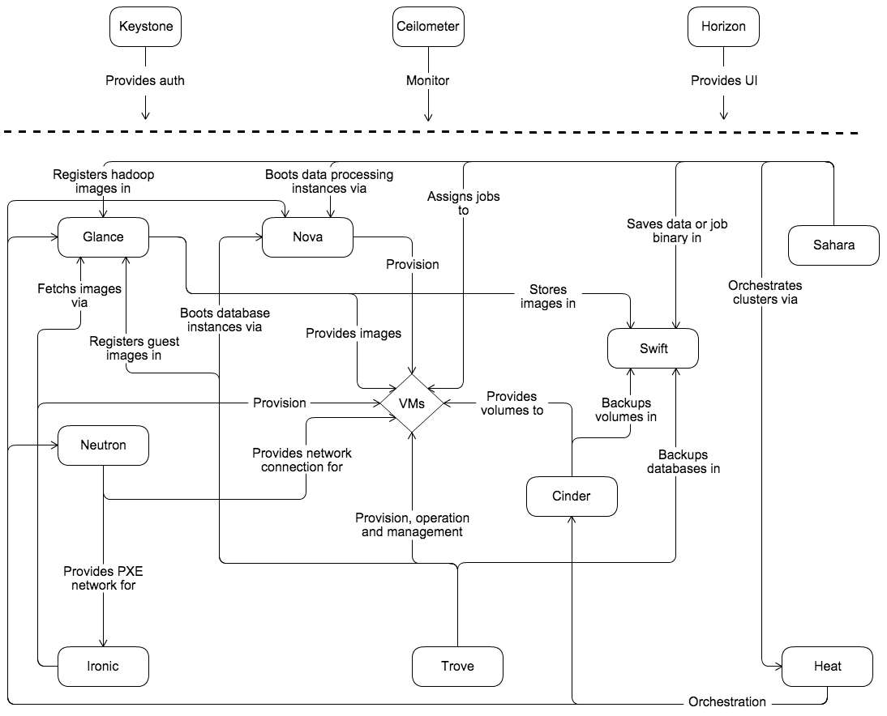

**Figure 1 - OpenStack
conceptual architecture,** [Copyright and source](#Figure_1_Copyright)

OpenStack functions as the orchestration and control plane responsible
for provisioning, scheduling, and lifecycle management of virtual
machines, virtual networks, and associated infrastructure abstractions.
The conceptual OpenStack architecture illustrates a modular design
composed of services dedicated to identity management, image management,
block storage, networking, orchestration, and telemetry. This modularity
enables selective scaling and independent lifecycle management of
individual functional domains while preserving systemic coherence.

Within the EOSC EU Node deployment, OpenStack installations operated by
PSNC and Safespring utilise **Ceph** as the default storage backend.
Ceph is an industry-standard distributed storage platform based on
object, block, and file storage paradigms. It is designed for horizontal
scalability, high availability, and fault tolerance through data
replication and self-healing mechanisms. [Ceph’s
architecture](https://docs.ceph.com/en/latest/architecture/) relies on
autonomous object storage daemons, monitor nodes, and metadata servers
that collectively ensure data integrity and consistent performance under
high-throughput workloads.

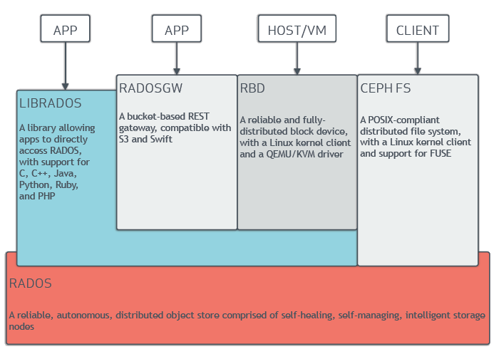

**Figure 2 - Ceph
architecture,** [Copyright and source](#Figure_2_Copyright)

The integration of Ceph with OpenStack establishes a tightly coupled
compute-and-storage environment in which persistent storage volumes,
images, and object repositories are seamlessly accessible to virtual
machine workloads. Both OpenStack and Ceph are supported by extensive
global communities and are widely deployed across commercial and
research cloud infrastructures, thereby reinforcing their suitability
for a federated European research ecosystem.

Comprehensive technical and deployment-level details of the Managed
Compute Infrastructure Service, including cluster topologies and
configuration parameters, are documented in **Annex A2**.

- **Managed Container Platform Service (MS2)**

The Managed Container Platform Service provides Platform-as-a-Service
(PaaS) capabilities through the adoption of **OKD**, the community
distribution of Kubernetes-based container orchestration technologies.
OKD delivers automated container deployment, scaling, and lifecycle
management while abstracting infrastructure complexity from application
developers and research teams.

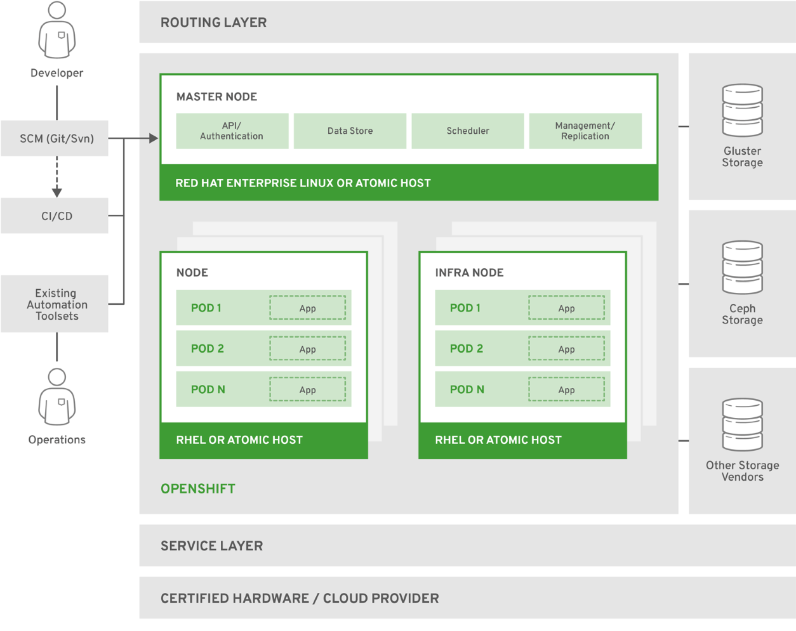

**Figure 3 - OKD architecture
overview,** [Copyright and source](#Figure_3_Copyright)

The OKD architecture encompasses master nodes responsible for scheduling
and control, worker nodes executing container workloads, and integrated
networking, storage, and security subsystems. This layered orchestration
environment enables rapid provisioning of application environments,
supports microservices-oriented architectures, and facilitates
reproducible research workflows through containerisation.

Within the EOSC EU Node, OKD operates as a logical extension of the
infrastructure layer, leveraging compute and storage resources
provisioned through OpenStack and Ceph. This configuration ensures
architectural continuity between infrastructure-level virtualisation and
platform-level container orchestration, thereby enabling efficient
resource utilisation and operational consistency. Detailed structural
and deployment views are provided in **Annex A2**.

- **Bulk Data Transfer Service (MS3)**

The Bulk Data Transfer Service addresses the requirement for reliable,
high-throughput movement of large research datasets between distributed
environments. The service is implemented using the **File Transfer
Service ([FTS](https://pos.sissa.it/239/028/pdf))** platform, which acts
as a centralised orchestration and monitoring component coordinating
large-scale third-party data transfers.

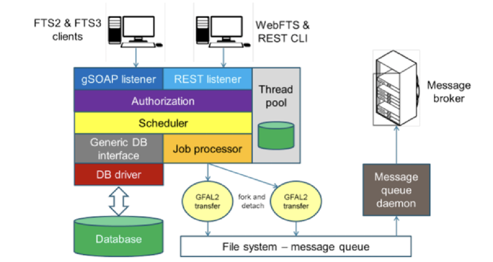

**Figure 4 - FTS architecture
overview,** [Copyright and source](#Figure_4_Copyright)

FTS leverages **GridFTP** as the underlying data transfer protocol,
enabling parallelised, secure, and optimised file movement across
high-bandwidth networks. Transfer operations are managed through the
**GFAL2** library, which provides a generalised abstraction layer for
heterogeneous storage endpoints and protocols. This combination ensures
performance efficiency, transfer reliability, and protocol
interoperability across diverse research infrastructures.

Conceptually, the FTS architecture comprises a central control plane
responsible for scheduling and monitoring transfer jobs, worker nodes
executing data movement tasks, and storage endpoints that interface with
external repositories or internal buffers. The Bulk Data Transfer
Service is therefore positioned as a critical enabler of data-intensive
scientific workflows where input and output datasets may exceed
terabyte-scale thresholds.

Further technical elaboration, including deployment specifics and
performance characteristics, is detailed in **Annex A2**.

#### 6.3.2 Integration of Compute Infrastructure and Container Platform

A vertically aligned integration model has been implemented to unify
infrastructure-level and platform-level virtualisation services. In this
configuration, OKD utilises the compute, networking, and storage
capabilities provided by OpenStack and Ceph, thereby establishing a
layered stack in which container orchestration is directly supported by
virtualised infrastructure resources.

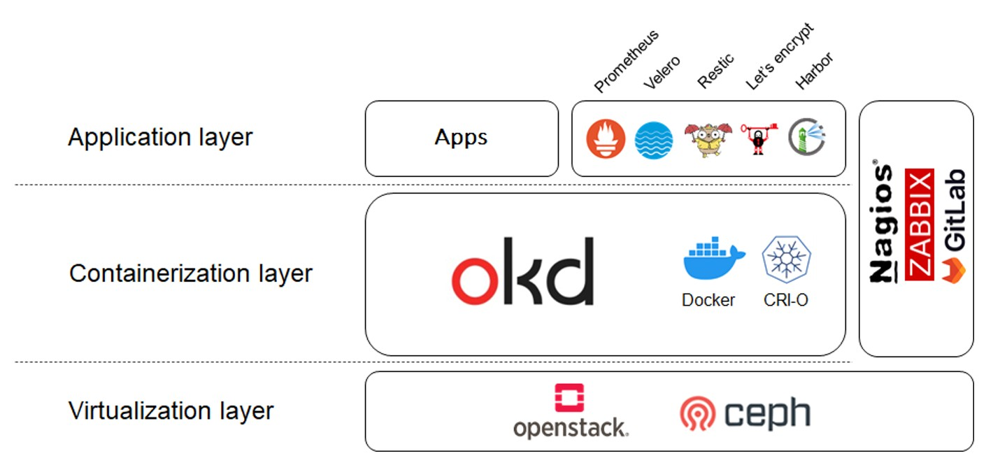

**Figure 5 - Integrated layers of compute, storage and services at data
centres**

This integration reflects established industry best practices and
benefits from the operational expertise of both PSNC and Safespring. By
consolidating infrastructure and platform layers into a coherent
operational model, the architecture achieves improved resource
efficiency, simplified governance, and enhanced scalability while
maintaining separation of concerns between IaaS and PaaS domains.

- **Self-Service API Integration**

To enable secure, automated, and policy-compliant provisioning of
infrastructure and platform resources, a dedicated **Self-Service API**
has been designed and implemented. This component acts as an
intermediary orchestration layer between the Web Portal Front Office and
the underlying infrastructure services.

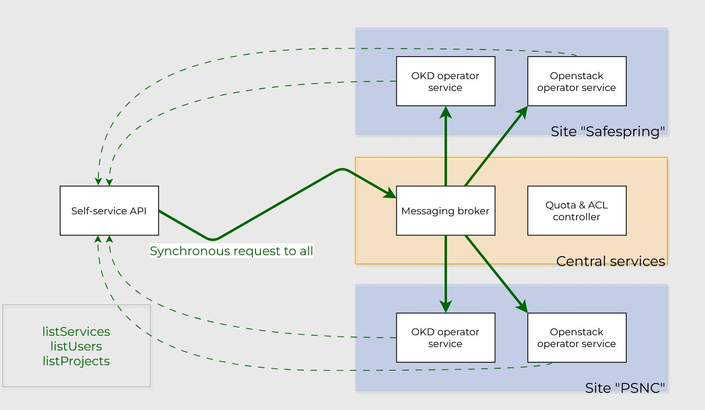

**Figure 6 - Self-service API integration with OpenStack and OKD**

The Self-Service API exposes RESTful endpoints that accept provisioning
and configuration requests originating from portal workflows. Incoming
requests are validated and subsequently forwarded to a **Messaging
Broker**, which functions as a distributed queue system aggregating and
distributing service requests across sites and services. Each request
encapsulates metadata specifying target site, service type, quota
parameters, and access control lists.

**Operator Services**, deployed per site and per service domain,
continuously poll the messaging broker and execute requests that match
their designated scope. Prior to execution, a **Quota and Access Control
Controller** verifies that the requesting entity possesses sufficient
entitlements and resource allowances. This layered orchestration pattern
ensures controlled automation, auditability, and consistent enforcement
of governance policies across distributed infrastructure nodes.

- **Bulk Data Transfer Integration with Compute Services**

The Bulk Data Transfer Service is conceptually integrated as an
extension of the compute ecosystem rather than as an isolated
capability. Its primary role is to facilitate the efficient ingestion
and extraction of large datasets associated with computational and
analytical workloads executed on virtual machines and container
platforms.

To enable this integration, a shared storage buffer is implemented as an
intermediary data layer accessible to both transfer services and compute
environments. Data transferred into the EOSC EU Node is temporarily
staged within this buffer by GridFTP worker nodes and subsequently made
accessible to user project spaces within OpenStack and OKD environments.
Namespace mappings and access control policies ensure that only
authorised users and projects can access designated storage segments.

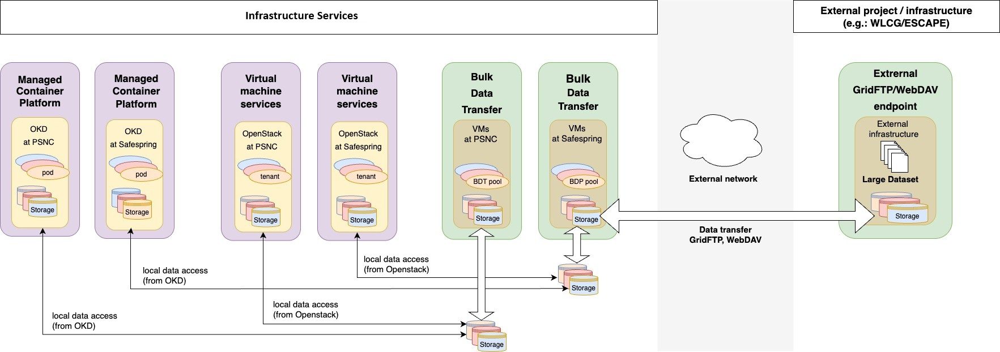

**Figure 7 - The bulk data transfer service integration with back-end
storage of compute services**

This architectural pattern ensures high-throughput data mobility while
preserving isolation, security, and operational predictability across
compute and storage domains.

#### 6.3.3 Exchange Application Services Components

- **Managed File Synchronisation and Sharing Service (MS1)**

The Managed File Synchronisation and Sharing Service is implemented
using **ownCloud Infinite Scale (OCIS)**, a modern, microservices-based
evolution of the earlier ownCloud platform. OCIS introduces a
distributed, horizontally scalable architecture that replaces monolithic
design patterns with modular service components, thereby enhancing
performance, maintainability, and extensibility.

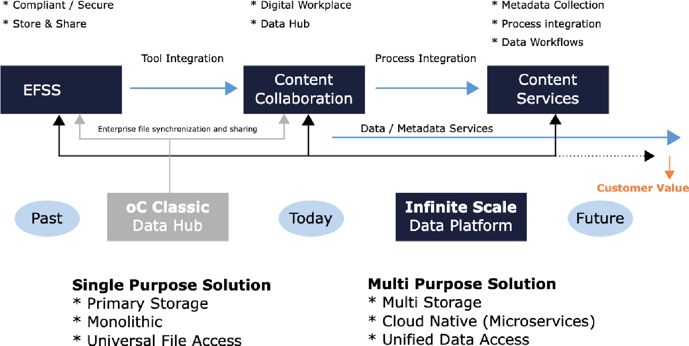

**Figure 8 - ownCloud OCIS
architecture overview - in comparison with OC10,**

[Copyright and source](#Figure_8_Copyright)

The platform provides secure file storage, synchronisation, and sharing
capabilities accessible through web interfaces, desktop clients, and
programmatic APIs. Within the EOSC EU Node, OCIS functions as a
persistent user-centric storage layer supporting collaborative research
workflows and data exchange scenarios. Detailed architectural and
deployment characteristics are elaborated in **Annex A2**.

- **Managed Interactive Notebook Service (MS2)**

The Managed Interactive Notebook Service delivers data analysis and
visualisation capabilities through the **Jupyter Notebooks** ecosystem,
with **JupyterHub** serving as the multi-user orchestration layer.
JupyterHub manages authentication, resource allocation, and session
lifecycle control while enabling isolated execution environments for
individual users.

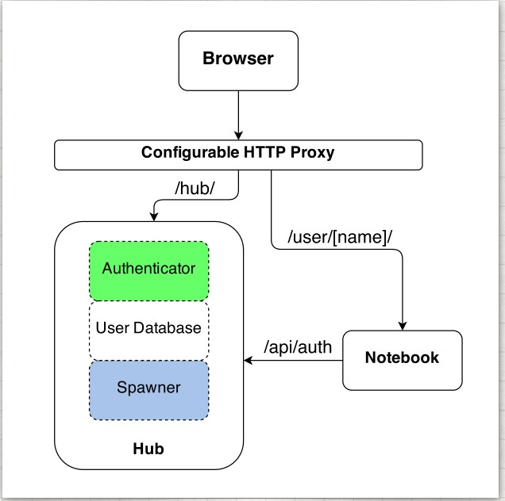

**Figure 9 - Jupyter Hub
architecture overview,** [Copyright and source](#Figure_9_Copyright)

This service enables researchers to perform exploratory data analysis,
computational experiments, and visual analytics directly within
browser-based environments, thereby reducing infrastructure friction and
supporting reproducible research practices. Deployment specifics and
integration patterns are documented in **Annex A2**.

- **Managed Large File Transfer Service (MS3)**

The Managed Large File Transfer Service provides user-oriented
cloud-based data exchange capabilities through the **FileSender**
platform. FileSender is designed for secure, temporary transfer of large
files that exceed conventional email or web upload limits. The service
supports authenticated transfers, time-limited download links, and audit
logging, making it suitable for controlled dissemination of research
artefacts and datasets.

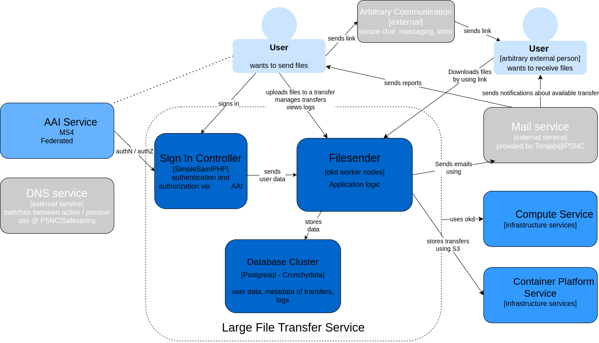

**Figure 10 - Large File Transfer Service overview**

#### 6.3.4 Exchange Application Services Components Integrations

- **Jupyter Notebooks Integration with ownCloud-Based Storage**

An application-level integration has been established between the
Interactive Notebook Service and the File Synchronisation and Sharing
Service in order to provide seamless data persistence and accessibility
for notebook users. Through this integration, Jupyter users are able to
store, retrieve, and manage notebook files, source code, and analytical
datasets directly within their allocated ownCloud storage spaces.

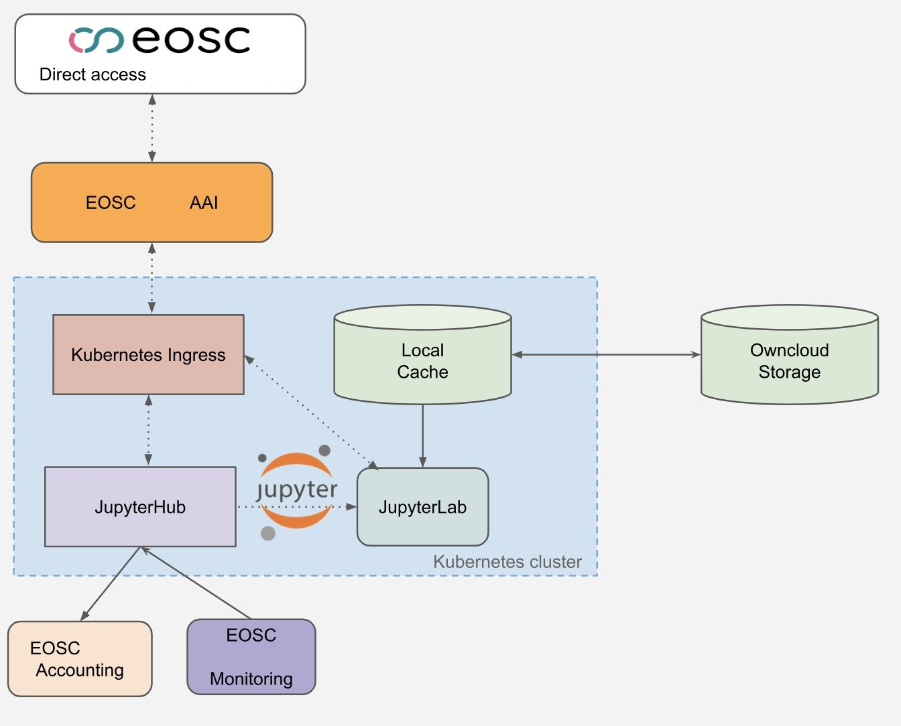

**Figure 11 - Jupyter Notebook service integration with ownCloud-based
storage**

Technically, this integration is achieved by mounting the ownCloud
storage endpoint within the notebook execution environment using
[**rclone**](https://rclone.org/) and the WebDAV protocol. This
configuration enables bidirectional synchronisation between notebook
sessions and persistent cloud storage, ensuring that analytical
artefacts remain durable beyond ephemeral compute sessions. The
integration constitutes a significant value-added feature by bridging
computational and storage domains into a unified user experience that
supports iterative research workflows and collaborative data management
practices.

 

## 7. Architectural Goals and Decisions

### 7.1 Architectural Goals

The European Open Science Cloud functions as a fundamental enabler of
Open Science and the digital transformation of research by providing
cross-disciplinary and cross-border access to publicly funded research
data and related research objects, including publications, software,
services, and analytical tools. By federating existing research
infrastructures, EOSC leverages national investments while adding value
through scale, interdisciplinarity, and accelerated innovation.

The EOSC EU Node is conceived as a platform that facilitates the
creation and maturation of the EOSC Federation by following a
system-of-systems architectural principle. It is intended to provide
both a technical and administrative blueprint for future node candidates
and is recognised as the first European-level node promoted by the
European Commission as an operational production platform.

The guiding philosophy of the EOSC EU Node platform services is shaped
by several fundamental factors. The platform is designed to be robust,
secure, scalable, flexible, data-driven, and user-centric, while
continuously evolving in response to user feedback and technological
advancements. It aims to deliver high-quality service management
compliant with industrial standards and to provide superior usability
and availability for a large and diverse user base operating on a 24/7
basis. The system is engineered to be self-contained and transferable to
alternative legal entities if governance structures evolve. It ensures
transparent integration of Core and Exchange services, mitigates
deployment challenges inherent to distributed infrastructures operated
by multiple entities, and maintains disaster resilience through
compliance with backup, restoration, and continuity service-level
requirements. Compliance with European Commission security and
regulatory requirements, including protection against data breaches,
account hijacking, malware injection, insecure APIs, denial-of-service
attacks, and resource starvation, remains a non-negotiable design
constraint.

### 7.2 Key Architectural Design Considerations

The architecture is designed to ensure openness and flexibility by
allowing integration of diverse service types across infrastructure,
platform, and application layers. It supports the introduction of new
services through reuse of existing architectural components and
processes, enables component replacement to avoid vendor lock-in, and
allows the addition of new service nodes and hosting sites to
accommodate future growth.

Tailoring to data-centric and data-intensive applications is achieved by
prioritising low data access latency, high I/O performance, and high
throughput, which are essential for efficient execution of research
workflows. Deployment models favour on-premise or hybrid configurations
where necessary to optimise performance across European research
networks.

High availability and robustness are ensured through virtualisation,
redundancy of components, replicated storage mechanisms, integrity
controls, and structured backup and recovery strategies. Security and
harmonised access management are supported through encryption of data in
motion and at rest, as well as federated identity and unified access
management systems that reduce complexity and minimise potential attack
vectors.

### 7.3 Architectural Decisions

The architectural decisions described in this section represent
deliberate and traceable design choices that collectively shape the
structural, operational, and governance characteristics of the EOSC EU
Node platform. Each decision reflects a balance between technical
feasibility, policy alignment, interoperability requirements,
operational sustainability, and long-term maintainability. The decisions
are grouped into Core Services Decisions and Exchange Services
Decisions, acknowledging the dual-layer nature of the platform
architecture (all decision are on top of the Final Technical
Specifications of the EOSC EU Node tender).

1.  **Architectural Diagramming Standards**

- The architecture adopts the C4 Model as the primary method for
  visualising system structure at context, container, component, and
  code levels. Business processes are modelled using BPMN, while User
  Flow diagrams are applied to describe frontend interaction sequences.

- This decision ensures consistency of architectural documentation
  across services and teams, reduces interpretational ambiguity, and
  provides a scalable documentation framework that accommodates both
  high-level governance reviews and low-level technical design
  activities. The adoption of widely recognised diagramming standards
  also facilitates knowledge transfer and onboarding of new
  stakeholders.

2.  **Microservices Architectural Style**

- The platform follows a microservices architecture deployed on
  container orchestration infrastructure. Functional capabilities are
  decomposed into independently deployable services that communicate
  through well-defined APIs.

- This decision is motivated by the need for horizontal scalability,
  resilience, independent lifecycle management, and alignment with
  cloud-native design principles. The microservices approach reduces
  systemic coupling, improves fault isolation, and allows selective
  scaling of high-demand components without impacting the entire
  platform.

3.  **Dedicated Message Broker Deployment**

- A dedicated RabbitMQ messaging broker is introduced for Core service
  components rather than relying on externally managed or shared
  brokers. This ensures predictable latency characteristics, message
  durability, and operational control.

- The decision enhances reliability and observability of asynchronous
  communication patterns, while reducing dependency risks and improving
  performance predictability for workflow-driven services.

4.  **Direct Authentication and Authorisation Integration**

- Core and Exchange services are designed to connect directly to the
  federated Identity Hub Infrastructure Proxy instead of introducing
  intermediary identity translation layers.

- This decision reduces network overhead, eliminates architectural
  indirection, and improves authentication performance while preserving
  strong security guarantees. It also simplifies troubleshooting and
  reduces the surface area for configuration inconsistencies.

5.  **Direct Portal–Knowledge Graph Connectivity**

- The Web Portal Front Office establishes a direct API-based connection
  to the Metadata Knowledge Graph through an API gateway layer.

- The motivation behind this decision is to minimise latency and
  architectural complexity while ensuring efficient data retrieval and
  responsiveness of user-facing discovery services. Eliminating
  unnecessary integration layers improves performance and reduces
  maintenance overhead.

6.  **Adoption of EOSC-Profiles Metadata Schemas**

- The platform reuses existing EOSC-Profiles schema definitions for
  catalogue metadata rather than creating new custom schemas.

- This decision promotes interoperability, reduces duplication of
  effort, and accelerates integration with other EOSC ecosystem
  components. Leveraging established schemas also simplifies schema
  governance and long-term evolution.

7.  **Tools Catalogue Schema Extension**

- The Tools Catalogue schema is based on EOSC-Profiles but extended
  where necessary to accommodate blueprint and workflow-specific
  attributes.

- This balanced approach maintains compatibility with federation
  standards while ensuring functional adequacy for specialised service
  scenarios. It avoids fragmentation while preserving extensibility.

8.  **Dedicated Tools Market User Interface**

- A dedicated user interface is developed for the Tools Market rather
  than embedding functionality within the general portal.

- The rationale is to provide a focused and coherent user experience
  tailored to tool discovery, blueprint creation, and credit management
  workflows. Separation of concerns also reduces UI complexity and
  improves usability.

9.  **Knowledge Graph Data Inclusion Policies**

- Data inclusion in the Metadata Knowledge Graph follows predefined
  inclusion policies that define quality thresholds, relevance criteria,
  and provenance requirements.

- This decision safeguards credibility, reduces noise, and ensures that
  federated discovery mechanisms deliver reliable and authoritative
  results.

10. **Push-Based Knowledge Graph Update Workflows**

- Metadata updates are propagated through push-based API mechanisms
  instead of periodic polling or batch synchronisation.

- Push-based workflows reduce latency, enable near-real-time data
  freshness, and decrease computational overhead associated with
  repeated harvesting cycles.

11. **Resource-Specific Schema Design**

- Different resource types are represented using specialised schema
  structures rather than a universal generic schema.

- This approach enhances semantic clarity, improves search precision,
  and enables richer metadata representation without sacrificing
  interoperability.

12. **Language Support Strategy**

- The platform is initially delivered in English only, with potential
  translation limited to static content in future phases.

- This decision balances accessibility with development efficiency,
  recognising English as the dominant language of scientific
  communication while leaving room for incremental localisation.

13. **Responsive User Space Design Constraints**

- The portal adopts a responsive design approach, but certain advanced
  functionalities are intentionally limited on small mobile screens to
  preserve usability and prevent cognitive overload.

- This reflects pragmatic prioritisation of usability over feature
  parity across device categories.

14. **User Space Layout Branding Decision**

- The user dashboard omits heavy institutional branding elements in
  favour of a minimal EC logo and footer, ensuring visual neutrality and
  reduced distraction while maintaining institutional identity.

15. **DNS Redundancy Model**

- Primary DNS services are hosted by Core services while secondary DNS
  services are managed by Exchange infrastructure providers, creating a
  distributed redundancy model that enhances resilience and
  availability.

16. **Access Policy and Credits Alignment**

- Access policies, order management, and credit allocation mechanisms
  are harmonised to ensure transparency, fairness, and predictability of
  resource distribution.

17. **Project-Based Credit Allocation**

- Credits are allocated to projects rather than individuals, aligning
  with collaborative research practices and enabling accountable
  resource management.

18. **Single-Site Project Provisioning**

- Project provisioning occurs at a single designated site through a
  self-service API to reduce administrative complexity and improve
  operational efficiency.

19. **Push-Based Accounting Data Exchange**

- Exchange services push accounting data to Core accounting modules,
  ensuring consistent and timely reporting while reducing integration
  complexity.

20. **Personal and Group Project Model**

- Each user receives a personal project space upon registration, while
  group projects can be created for collaborative research. This
  dual-model approach balances autonomy with collective resource
  governance.

21. **Federated AAI Adoption Across Services**

- All Exchange services utilise a common federated AAI system, ensuring
  Single Sign-On and consistent identity management across the platform.

22. **Self-Service API for Project Provisioning**

- Infrastructure and container services employ self-service APIs that
  separate administrative provisioning from user-level resource
  allocation, strengthening security and governance clarity.

23. **Consistent Cross-Service System Design**

- Exchange services adhere to uniform architectural principles to
  prevent fragmentation and ensure operational predictability.

24. **Unified Accounting Collection Mechanism**

- Accounting information across all services is aggregated through a
  dedicated accounting agent using a push model, enabling unified
  analytics and credit management.

25. **External DNS Delegation for Exchange Domains**

- DNS domains for Exchange services are delegated to an external
  provider to enhance scalability, availability, and operational
  efficiency while maintaining compliance with European Commission
  requirements.

26. **Independent Regional Deployment of Infrastructure Services**

- Infrastructure services are deployed as independent operational
  regions, each maintaining its own orchestration clusters. This ensures
  fault isolation, scalability, and service continuity.

27. **Dual-Region Deployment of Notebook Services**

- Interactive notebook services are deployed in two independent
  infrastructure regions, balancing workloads and improving
  availability.

28. **Active–Passive Deployment of File and Transfer Services**

- File synchronisation and large file transfer services are deployed in
  active–passive configurations across regions, ensuring high
  availability, unified dataset views, and operational resilience.

Collectively, these 28 architectural decisions (on top of the Final
Technical Requirements of the EOSC EU Node tender) provide a coherent
governance and technical framework that enables the EOSC EU Node
platform to achieve scalability, interoperability, resilience, and
long-term sustainability while remaining aligned with European
Commission policy, research community expectations, and cloud-native
architectural best practices.

 

## 8. EOSC EU Node Key Architecture Artefacts

### 8.1 Architecture Overview Diagrams

Figure 12 illustrates a high-level end-to-end user interaction flow
describing how computational or application resources are allocated on
the EOSC EU Node Exchange Services through the User Space while
consuming available credit balances. The diagram represents the typical
lifecycle of a service request from initial discovery to resource
activation and subsequent utilisation.

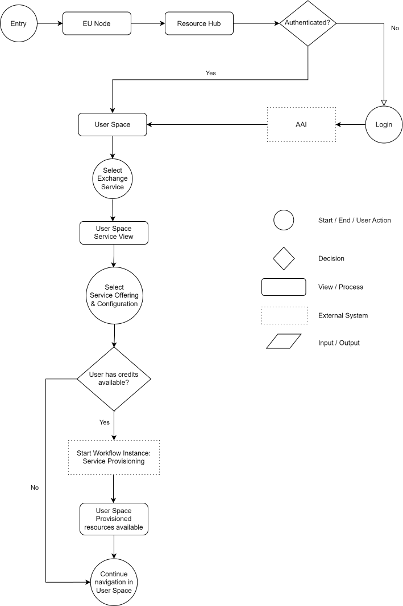

**Figure 12 - High-level overview of the user flow to allocate resources
on the EU Node Exchange Services through the User Space by consuming the
available credits on the EOSC EU Node**

### 8.2 User Resource Allocation Flow

The interaction begins when a user navigates to the EU Node Web Portal
and explores the Resource Hub in order to discover available Exchange
services. Access to the ordering functionality is conditional upon
successful authentication; therefore, unauthenticated users are
redirected to the Authentication and Authorisation Infrastructure (AAI)
service to complete identity verification. Upon successful
authentication, the user is automatically redirected to the
authenticated User Space within the Web Portal Front Office.

Within the User Space, the user is presented with a personalised
dashboard that reflects available permissions, project affiliations, and
credit balances. From this environment, the user may navigate to the
dedicated service view corresponding to the selected Exchange service.
The platform then displays the catalogue of available offerings
associated with that service, filtered according to access policies and
entitlement rules.

For reservation-based services, the user is able to configure parameters
such as reservation duration and resource capacity. Prior to
confirmation, the system presents a summary of the selected
configuration alongside the calculated credit cost that will be deducted
from the user’s available balance. Once the order is confirmed, the
system verifies credit sufficiency and, if validated, initiates an
automated BPMN-based provisioning workflow.

This provisioning workflow performs a sequence of orchestration tasks
including project creation, entitlement assignment, quota allocation,
group membership updates, and infrastructure configuration. Upon
completion of the workflow, the user is redirected back to the User
Space and receives a system notification indicating successful
activation of the requested resources. The user may then proceed to
access the Exchange service directly or continue interacting with other
portal functions.

### 8.3 Application Structure Diagram

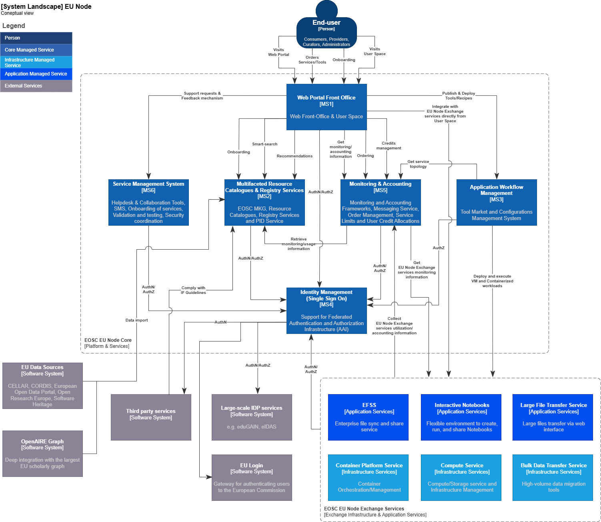

**Figure 13 - Conceptual Architecture of the EOSC EU Node.**

Figure 13 presents the conceptual architecture of the EOSC EU Node,
depicting the primary structural components and their high-level
relationships. This diagram establishes the architectural boundary
between Core and Exchange managed services while also illustrating the
auxiliary services and external integrations that support the ecosystem.
The conceptual model functions as a reference abstraction, enabling
stakeholders to understand the platform composition without exposing
implementation-level details.

### 8.4 Data and Information Flow

Following the conceptual architectural overview, this section describes
the internal data and information exchange mechanisms within the EOSC EU
Node. Due to the complexity and heterogeneity of the platform, a
dependency and integration matrix approach has been adopted as a compact
yet expressive method of documenting system interactions. This
representation allows architectural relationships and data exchange
pathways to be expressed in a structured, traceable, and scalable
manner.

Two complementary matrices have been defined. The first matrix captures
cross-service integrations between Core and Exchange services,
identifying architectural-level interfaces rather than granular API
endpoints. The second matrix focuses exclusively on Core services and
documents internal dependencies among the architectural components that
collectively deliver the EOSC Core capabilities.

These matrices are designed to document only machine-to-machine
interfaces and do not represent human interaction flows. Integration
relationships are denoted using explicit markers indicating either
required ● or potential (●) dependencies. A marked cell located at the
intersection of a row component and a column component signifies that
the row component initiates communication, transmits data, or relies
upon the column component for operational functionality. Detailed
interface specifications and workflow diagrams associated with each
dependency are provided in the Annexes.

**Table 9 - EOSC EU Node Integration Matrix**

<table>
<colgroup>
<col style="width: 8%" />
<col style="width: 4%" />
<col style="width: 4%" />
<col style="width: 5%" />
<col style="width: 6%" />
<col style="width: 4%" />
<col style="width: 4%" />
<col style="width: 4%" />
<col style="width: 4%" />
<col style="width: 4%" />
<col style="width: 5%" />
<col style="width: 4%" />
<col style="width: 5%" />
<col style="width: 5%" />
<col style="width: 5%" />
<col style="width: 4%" />
<col style="width: 5%" />
<col style="width: 4%" />
<col style="width: 5%" />
</colgroup>
<thead>
<tr>
<th>
<strong>Architecture</strong>

<strong>Components</strong>
</th>
<th style="text-align: center;">Web Portal FO</th>
<th style="text-align: center;">Tools Market</th>
<th style="text-align: center;">App. Mgt. Layer</th>
<th style="text-align: center;">Config Mgt. System</th>
<th style="text-align: center;">Credit Mgt.</th>
<th style="text-align: center;">Order Mgt.</th>
<th style="text-align: center;">AAI</th>
<th style="text-align: center;">Monitoring</th>
<th style="text-align: center;">Accounting</th>
<th style="text-align: center;">Helpdesk</th>
<th style="text-align: center;">VMs Service</th>
<th style="text-align: center;">Self-service API</th>
<th style="text-align: center;">Container Service</th>
<th style="text-align: center;">Bulk DTS</th>
<th style="text-align: center;">EFSS</th>
<th style="text-align: center;">Notebooks</th>
<th style="text-align: center;">Large FTS</th>
<th style="text-align: center;">Helpdesk</th>
</tr>
</thead>
<tbody>
<tr>
<td>Web Portal FO</td>
<td style="text-align: center;"></td>
<td style="text-align: center;">●</td>
<td style="text-align: center;">●</td>
<td style="text-align: center;">(●)</td>
<td style="text-align: center;">●</td>
<td style="text-align: center;">●</td>
<td style="text-align: center;">●</td>
<td style="text-align: center;">●</td>
<td style="text-align: center;">●</td>
<td style="text-align: center;">●</td>
<td style="text-align: center;">●</td>
<td style="text-align: center;">●</td>
<td style="text-align: center;">●</td>
<td style="text-align: center;">●</td>
<td style="text-align: center;">●</td>
<td style="text-align: center;">●</td>
<td style="text-align: center;">●</td>
<td style="text-align: center;"></td>
</tr>
<tr>
<td>Tools Market</td>
<td style="text-align: center;"></td>
<td style="text-align: center;"></td>
<td style="text-align: center;">●</td>
<td style="text-align: center;">(●)</td>
<td style="text-align: center;">●</td>
<td style="text-align: center;"></td>
<td style="text-align: center;">●</td>
<td style="text-align: center;"></td>
<td style="text-align: center;"></td>
<td style="text-align: center;"></td>
<td style="text-align: center;"></td>
<td style="text-align: center;"></td>
<td style="text-align: center;"></td>
<td style="text-align: center;"></td>
<td style="text-align: center;"></td>
<td style="text-align: center;"></td>
<td style="text-align: center;"></td>
<td style="text-align: center;"></td>
</tr>
<tr>
<td>Application Mgt. Layer</td>
<td style="text-align: center;"></td>
<td style="text-align: center;"></td>
<td style="text-align: center;"></td>
<td style="text-align: center;">●</td>
<td style="text-align: center;"></td>
<td style="text-align: center;"></td>
<td style="text-align: center;">●</td>
<td style="text-align: center;"></td>
<td style="text-align: center;"></td>
<td style="text-align: center;"></td>
<td style="text-align: center;">●</td>
<td style="text-align: center;"></td>
<td style="text-align: center;">●</td>
<td style="text-align: center;"></td>
<td style="text-align: center;"></td>
<td style="text-align: center;"></td>
<td style="text-align: center;"></td>
<td style="text-align: center;"></td>
</tr>
<tr>
<td>Configuration Mgt. System</td>
<td style="text-align: center;"></td>
<td style="text-align: center;"></td>
<td style="text-align: center;"></td>
<td style="text-align: center;"></td>
<td style="text-align: center;"></td>
<td style="text-align: center;"></td>
<td style="text-align: center;">●</td>
<td style="text-align: center;"></td>
<td style="text-align: center;"></td>
<td style="text-align: center;"></td>
<td style="text-align: center;"></td>
<td style="text-align: center;"></td>
<td style="text-align: center;"></td>
<td style="text-align: center;"></td>
<td style="text-align: center;"></td>
<td style="text-align: center;"></td>
<td style="text-align: center;"></td>
<td style="text-align: center;"></td>
</tr>
<tr>
<td>Credit Mgt.</td>
<td style="text-align: center;"></td>
<td style="text-align: center;"></td>
<td style="text-align: center;"></td>
<td style="text-align: center;"></td>
<td style="text-align: center;"></td>
<td style="text-align: center;"></td>
<td style="text-align: center;">●</td>
<td style="text-align: center;"></td>
<td style="text-align: center;">●</td>
<td style="text-align: center;"></td>
<td style="text-align: center;"></td>
<td style="text-align: center;"></td>
<td style="text-align: center;"></td>
<td style="text-align: center;"></td>
<td style="text-align: center;"></td>
<td style="text-align: center;"></td>
<td style="text-align: center;"></td>
<td style="text-align: center;"></td>
</tr>
<tr>
<td>Order Mgt.</td>
<td style="text-align: center;"></td>
<td style="text-align: center;"></td>
<td style="text-align: center;"></td>
<td style="text-align: center;"></td>
<td style="text-align: center;">●</td>
<td style="text-align: center;"></td>
<td style="text-align: center;">●</td>
<td style="text-align: center;"></td>
<td style="text-align: center;"></td>
<td style="text-align: center;">●</td>
<td style="text-align: center;"></td>
<td style="text-align: center;">●</td>
<td style="text-align: center;"></td>
<td style="text-align: center;"></td>
<td style="text-align: center;"></td>
<td style="text-align: center;"></td>
<td style="text-align: center;"></td>
<td style="text-align: center;"></td>
</tr>
<tr>
<td>AAI</td>
<td style="text-align: center;"></td>
<td style="text-align: center;"></td>
<td style="text-align: center;"></td>
<td style="text-align: center;"></td>
<td style="text-align: center;"></td>
<td style="text-align: center;"></td>
<td style="text-align: center;"></td>
<td style="text-align: center;"></td>
<td style="text-align: center;"></td>
<td style="text-align: center;"></td>
<td style="text-align: center;"></td>
<td style="text-align: center;"></td>
<td style="text-align: center;"></td>
<td style="text-align: center;"></td>
<td style="text-align: center;"></td>
<td style="text-align: center;"></td>
<td style="text-align: center;"></td>
<td style="text-align: center;"></td>
</tr>
<tr>
<td>Monitoring</td>
<td style="text-align: center;">●</td>
<td style="text-align: center;">●</td>
<td style="text-align: center;">●</td>
<td style="text-align: center;">●</td>
<td style="text-align: center;">●</td>
<td style="text-align: center;">●</td>
<td style="text-align: center;">●</td>
<td style="text-align: center;"></td>
<td style="text-align: center;">●</td>
<td style="text-align: center;">●</td>
<td style="text-align: center;">●</td>
<td style="text-align: center;">●</td>
<td style="text-align: center;">●</td>
<td style="text-align: center;">●</td>
<td style="text-align: center;">●</td>
<td style="text-align: center;">●</td>
<td style="text-align: center;">●</td>
<td style="text-align: center;">●</td>
</tr>
<tr>
<td>Accounting</td>
<td style="text-align: center;"></td>
<td style="text-align: center;"></td>
<td style="text-align: center;"></td>
<td style="text-align: center;"></td>
<td style="text-align: center;"></td>
<td style="text-align: center;"></td>
<td style="text-align: center;">●</td>
<td style="text-align: center;"></td>
<td style="text-align: center;"></td>
<td style="text-align: center;"></td>
<td style="text-align: center;"></td>
<td style="text-align: center;"></td>
<td style="text-align: center;"></td>
<td style="text-align: center;"></td>
<td style="text-align: center;"></td>
<td style="text-align: center;"></td>
<td style="text-align: center;"></td>
<td style="text-align: center;"></td>
</tr>
<tr>
<td>Helpdesk</td>
<td style="text-align: center;"></td>
<td style="text-align: center;"></td>
<td style="text-align: center;"></td>
<td style="text-align: center;">(●)</td>
<td style="text-align: center;"></td>
<td style="text-align: center;"></td>
<td style="text-align: center;">●</td>
<td style="text-align: center;"></td>
<td style="text-align: center;"></td>
<td style="text-align: center;"></td>
<td style="text-align: center;"></td>
<td style="text-align: center;"></td>
<td style="text-align: center;"></td>
<td style="text-align: center;"></td>
<td style="text-align: center;"></td>
<td style="text-align: center;"></td>
<td style="text-align: center;"></td>
<td style="text-align: center;">●</td>
</tr>
<tr>
<td>VM Service</td>
<td style="text-align: center;"></td>
<td style="text-align: center;"></td>
<td style="text-align: center;"></td>
<td style="text-align: center;">(●)</td>
<td style="text-align: center;"></td>
<td style="text-align: center;"></td>
<td style="text-align: center;">●</td>
<td style="text-align: center;"></td>
<td style="text-align: center;">(●)</td>
<td style="text-align: center;"></td>
<td style="text-align: center;"></td>
<td style="text-align: center;"></td>
<td style="text-align: center;"></td>
<td style="text-align: center;"></td>
<td style="text-align: center;"></td>
<td style="text-align: center;"></td>
<td style="text-align: center;"></td>
<td style="text-align: center;"></td>
</tr>
<tr>
<td>Self-service API</td>
<td style="text-align: center;"></td>
<td style="text-align: center;"></td>
<td style="text-align: center;"></td>
<td style="text-align: center;">(●)</td>
<td style="text-align: center;"></td>
<td style="text-align: center;"></td>
<td style="text-align: center;">●</td>
<td style="text-align: center;"></td>
<td style="text-align: center;">(●)</td>
<td style="text-align: center;"></td>
<td style="text-align: center;">●</td>
<td style="text-align: center;"></td>
<td style="text-align: center;">●</td>
<td style="text-align: center;"></td>
<td style="text-align: center;"></td>
<td style="text-align: center;"></td>
<td style="text-align: center;"></td>
<td style="text-align: center;"></td>
</tr>
<tr>
<td>Container Service</td>
<td style="text-align: center;"></td>
<td style="text-align: center;"></td>
<td style="text-align: center;"></td>
<td style="text-align: center;">(●)</td>
<td style="text-align: center;"></td>
<td style="text-align: center;"></td>
<td style="text-align: center;">●</td>
<td style="text-align: center;"></td>
<td style="text-align: center;">(●)</td>
<td style="text-align: center;"></td>
<td style="text-align: center;"></td>
<td style="text-align: center;"></td>
<td style="text-align: center;"></td>
<td style="text-align: center;"></td>
<td style="text-align: center;"></td>
<td style="text-align: center;"></td>
<td style="text-align: center;"></td>
<td style="text-align: center;"></td>
</tr>
<tr>
<td>Bulk DTS</td>
<td style="text-align: center;"></td>
<td style="text-align: center;"></td>
<td style="text-align: center;"></td>
<td style="text-align: center;">(●)</td>
<td style="text-align: center;"></td>
<td style="text-align: center;"></td>
<td style="text-align: center;">●</td>
<td style="text-align: center;"></td>
<td style="text-align: center;">(●)</td>
<td style="text-align: center;"></td>
<td style="text-align: center;"></td>
<td style="text-align: center;"></td>
<td style="text-align: center;"></td>
<td style="text-align: center;"></td>
<td style="text-align: center;"></td>
<td style="text-align: center;"></td>
<td style="text-align: center;"></td>
<td style="text-align: center;"></td>
</tr>
<tr>
<td>EFSS</td>
<td style="text-align: center;"></td>
<td style="text-align: center;"></td>
<td style="text-align: center;"></td>
<td style="text-align: center;">(●)</td>
<td style="text-align: center;"></td>
<td style="text-align: center;"></td>
<td style="text-align: center;">●</td>
<td style="text-align: center;"></td>
<td style="text-align: center;">(●)</td>
<td style="text-align: center;"></td>
<td style="text-align: center;"></td>
<td style="text-align: center;"></td>
<td style="text-align: center;"></td>
<td style="text-align: center;"></td>
<td style="text-align: center;"></td>
<td style="text-align: center;"></td>
<td style="text-align: center;"></td>
<td style="text-align: center;"></td>
</tr>
<tr>
<td>Notebooks</td>
<td style="text-align: center;"></td>
<td style="text-align: center;"></td>
<td style="text-align: center;"></td>
<td style="text-align: center;">(●)</td>
<td style="text-align: center;"></td>
<td style="text-align: center;"></td>
<td style="text-align: center;">●</td>
<td style="text-align: center;"></td>
<td style="text-align: center;">●</td>
<td style="text-align: center;"></td>
<td style="text-align: center;"></td>
<td style="text-align: center;"></td>
<td style="text-align: center;"></td>
<td style="text-align: center;"></td>
<td style="text-align: center;">●</td>
<td style="text-align: center;"></td>
<td style="text-align: center;"></td>
<td style="text-align: center;"></td>
</tr>
<tr>
<td>Large FTS</td>
<td style="text-align: center;"></td>
<td style="text-align: center;"></td>
<td style="text-align: center;"></td>
<td style="text-align: center;">(●)</td>
<td style="text-align: center;"></td>
<td style="text-align: center;"></td>
<td style="text-align: center;">●</td>
<td style="text-align: center;"></td>
<td style="text-align: center;">(●)</td>
<td style="text-align: center;"></td>
<td style="text-align: center;"></td>
<td style="text-align: center;"></td>
<td style="text-align: center;"></td>
<td style="text-align: center;"></td>
<td style="text-align: center;"></td>
<td style="text-align: center;"></td>
<td style="text-align: center;"></td>
<td style="text-align: center;"></td>
</tr>
<tr>
<td>Helpdesk</td>
<td style="text-align: center;"></td>
<td style="text-align: center;"></td>
<td style="text-align: center;"></td>
<td style="text-align: center;">(●)</td>
<td style="text-align: center;"></td>
<td style="text-align: center;"></td>
<td style="text-align: center;">●</td>
<td style="text-align: center;"></td>
<td style="text-align: center;"></td>
<td style="text-align: center;"></td>
<td style="text-align: center;"></td>
<td style="text-align: center;"></td>
<td style="text-align: center;"></td>
<td style="text-align: center;"></td>
<td style="text-align: center;"></td>
<td style="text-align: center;"></td>
<td style="text-align: center;"></td>
<td style="text-align: center;"></td>
</tr>
</tbody>
</table>

**Table 10 - EOSC EU Node Core services integration matrix**

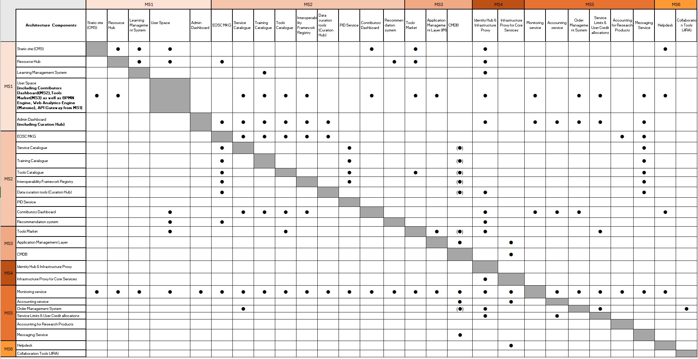

### 8.5 Additional Architectural Details

#### 8.5.1 Exchange Services Component Views

High-level Exchange architecture diagrams illustrate the principal
service components and their associated APIs. These visual artefacts
provide an aggregated representation of the infrastructure-level
services—including Container Platform, Virtual Compute, and Bulk Data
Transfer (Figure 14)—as well as the application-level services
comprising File Synchronisation and Sharing, Interactive Notebook, and
Large File Transfer (Figure 15). Detailed component breakdowns, workflow
definitions, and interface specifications are documented in subsequent
sections.

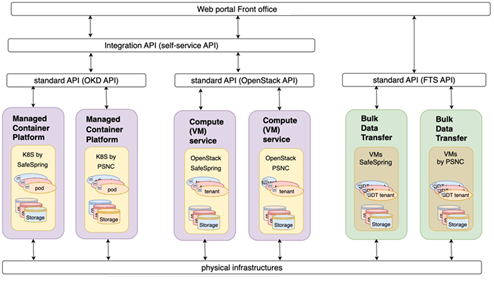

**Figure 14 - High-level architecture diagram Exchange Infrastructure
services**

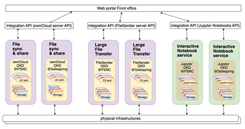

**Figure 15 - High-level architecture diagram Exchange Application
services**

#### 8.5.2 Architecture Highlights

- **Layered Architectural Layout**

The Exchange services architecture follows a structured three-layer
design model. The uppermost layer contains application-level services
that are directly consumed by end users through web interfaces, desktop
clients, or portal integrations. The intermediate layer consists of
Infrastructure-as-a-Service and Platform-as-a-Service capabilities that
provide compute, storage, and orchestration foundations. The lowest
layer represents the physical infrastructure, including data centres,
networking equipment, and storage hardware, which are abstracted through
virtualisation and containerisation technologies.

This layered separation of concerns enables modular scalability,
operational independence, and technology substitution without systemic
disruption. It also aligns with industry-standard cloud reference
architectures and facilitates distributed resource management while
maintaining logical service coherence.

- **Redundancy and Distribution**

A defining characteristic of the Exchange services architecture is its
geographically distributed redundancy model. Infrastructure-level
components are instantiated across two physically independent data
centre sites operated by distinct infrastructure providers. Each site
maintains separate orchestration clusters and service instances, thereby
ensuring fault isolation, load balancing, and service continuity.

Application-level services are deployed in active-passive
configurations, prioritising data integrity and rapid disaster recovery
while maintaining operational simplicity. This dual-site deployment
strategy enhances resilience, improves performance under variable
workloads, and supports continuity planning in the event of regional
infrastructure disruption.

- **Application Programming Interfaces**

Standard service APIs, together with specialised integration APIs,
constitute critical integration points within the architecture. Native
APIs of infrastructure and application services enable full functional
access through graphical and command-line interfaces while also
facilitating automated orchestration and portal-level integration.

A dedicated self-service API enables controlled project provisioning
without requiring privileged administrative access from the portal
layer. This API abstracts infrastructure complexity and enforces
governance boundaries while enabling automated service lifecycle
management.

#### 8.5.3 Cross-Layer Integrations and Interactions

Exchange services exhibit both vertical and horizontal integration
patterns. Vertical integrations ensure that application services consume
underlying compute and storage resources in a structured and predictable
manner. Horizontal integrations enhance user experience and operational
flexibility by enabling shared data access and inter-service
interoperability across functional domains.

Examples include bulk data transfer services supporting computational
workloads and synchronised storage services providing persistent data
access for interactive notebooks. These integration patterns
collectively enhance system coherence and minimise friction in
multi-service research workflows.

**Table 10 - Vertical integrations of the high-level components of
Exchange services**

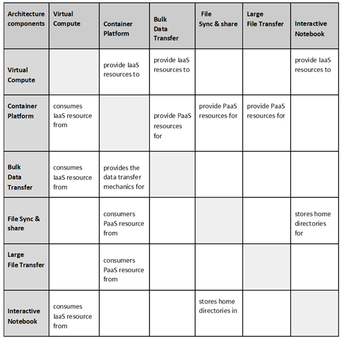

**Table 11 - Horizontal integrations of the high-level components of
Exchange services**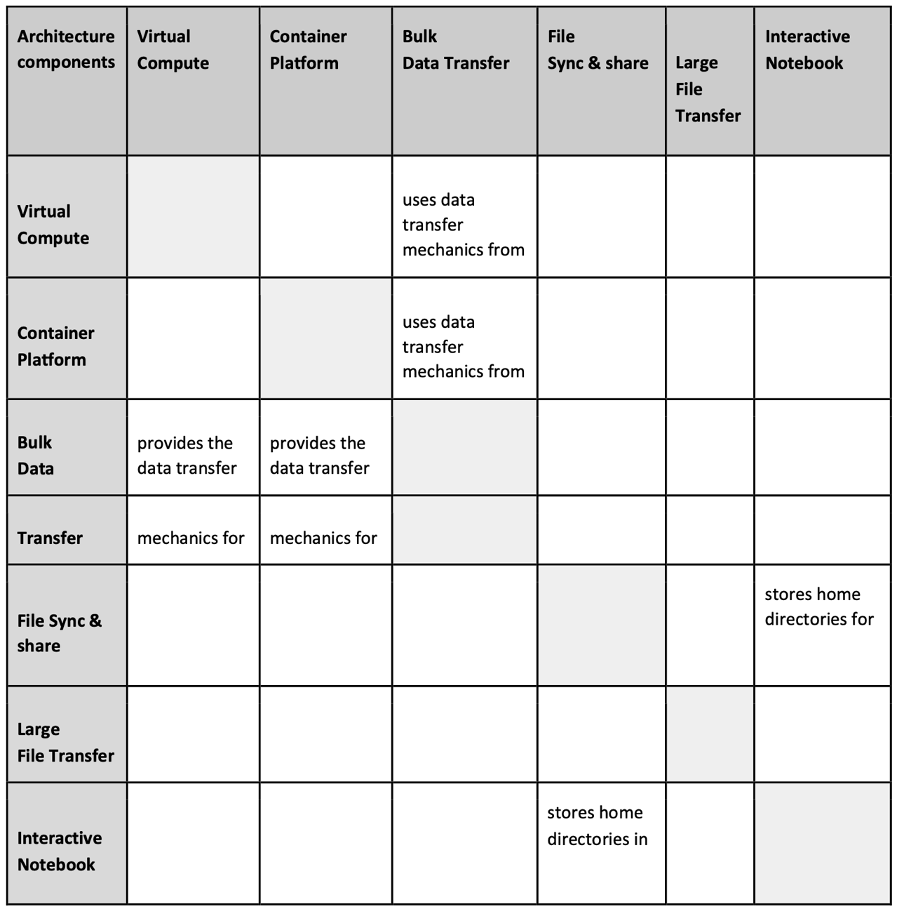

#### 8.5.4 Exchange Services Workflows

The six Exchange Managed Services collectively deliver a comprehensive
portfolio of capabilities covering cloud computing, virtualised
infrastructure provisioning, container orchestration, data storage,
high-performance data transfer, file synchronisation and sharing,
interactive data analysis, collaborative editing, and content curation.
These services are provided across multiple abstraction layers,
including Infrastructure-as-a-Service (IaaS), Platform-as-a-Service
(PaaS), and Application-level services. This layered service model
enables flexible consumption patterns, allowing users and administrators
to interact with the Exchange environment according to their technical
expertise and operational requirements.

Given the diversity of services and interaction models, four principal
workflows have been identified and formally defined. These workflows
describe the dominant interaction patterns between actors and the
Exchange services. Two of these workflows concern Exchange service
end-users, while the remaining two relate to service administration and
operational governance within the EOSC EU Node framework.

The workflows are documented and analysed to clarify the boundaries
between direct service-level interaction and integration-driven
interaction mediated by Core services, particularly the Web Portal Front
Office (WPFO).

#### 8.5.5 End-User Workflows

End-users may interact with the Exchange services through two primary
access paths:

1.  Direct access to Exchange services, using their native interfaces
    and protocols.

2.  Indirect access via the Web Portal Front Office (WPFO), where
    selected functionalities are exposed through integrated Core
    services.

Each of these access paths supports different levels of abstraction and
functionality.

- **Direct Consumption of the Service**

In the direct interaction model, users access Exchange services through
their standard service interfaces, which may include:

- RESTful APIs and protocol-specific APIs,

- Web-based graphical user interfaces,

- Command Line Interfaces (CLIs),

- Dedicated client applications,

- Graphical User Interfaces (GUIs) specific to the service,

- Automation scripts and SDK-based integrations.

This interaction model enables users to exploit the complete set of
user-oriented functionalities provided by each Exchange service. For
example, users may directly configure virtual machines within the
Managed Compute Infrastructure, manage container deployments within the
Managed Container Platform, initiate bulk data transfers using FTS
interfaces, interact with Jupyter notebooks, or manage collaborative
file-sharing environments.

Direct service access represents the most comprehensive and technically
unrestricted method of interaction. It is also the natural operational
mode for users who consume these services independently of the EOSC EU
Node integration layer. In such cases, the services operate as
standalone infrastructure or platform offerings. The only exception to
full independence concerns authentication and authorisation, which
remain federated and aligned with EOSC EU Node identity policies. For
clarity and simplicity, authentication and authorisation steps are not
depicted in the referenced workflow diagrams.

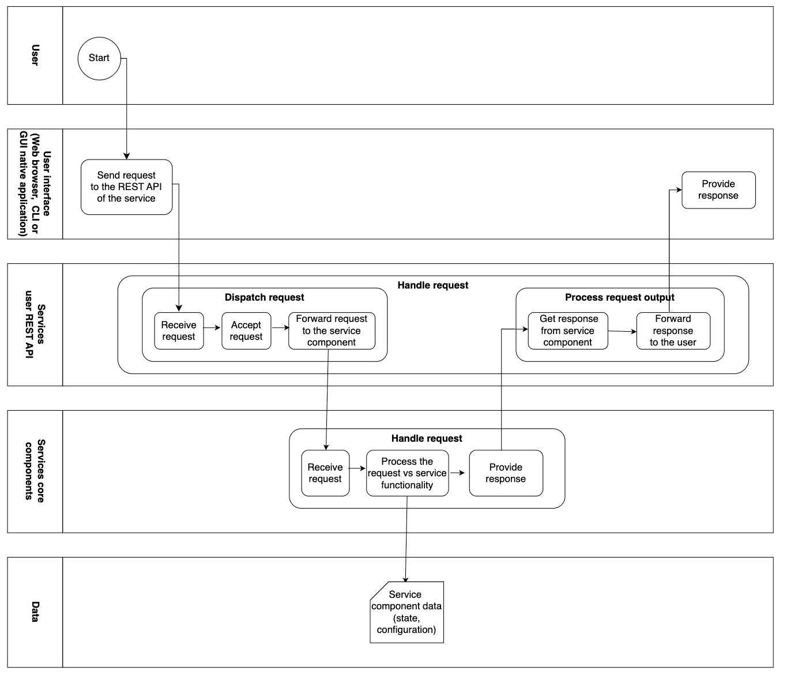

**Figure 16 - Direct interaction of the end-users with Exchange
services**

This workflow is illustrated in Figure 16, which depicts the direct
interaction between end-users and the Exchange services through their
native interfaces.

- **Accessing Services Through the WPFO Portal**

In the indirect interaction model, users access Exchange services
through the Web Portal Front Office (WPFO). In this case, service
functionality is mediated by Core services, which provide a unified and
integrated user experience.

Under this model:

- Service discovery, access initiation, and selected operational actions
  are exposed via the portal.

- Integration mechanisms abstract underlying technical complexity.

- Cross-service workflows are orchestrated centrally.

- Access policies and entitlements are enforced consistently.

However, this interaction path exposes only the subset of service
functionality that has been integrated into the Core services
environment. Advanced or highly specialised features available through
direct APIs or service-native interfaces may not be accessible via the
portal interface.

This model prioritises usability, coherence, and cross-service
interoperability. It is particularly suitable for users who require a
harmonised experience across multiple EOSC EU Node services without
engaging directly with infrastructure-level controls.

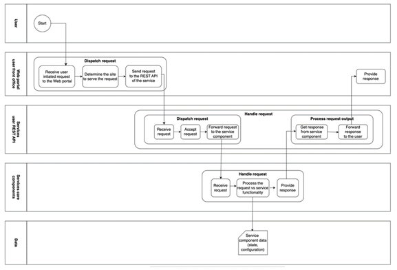

**Figure 17 - End-users interaction with Exchange services through the
WPFO portal**

Figure 17 illustrates this indirect interaction model, where end-users
interact with Exchange services through the WPFO portal. As in the
previous workflow, authentication and authorisation steps are omitted
from the diagram for clarity.

#### 8.5.6 Service Administration Workflows

In addition to end-user interaction patterns, two distinct workflows
have been defined for service administration within the EOSC EU Node
environment. These workflows address the needs of Exchange service
administrators and platform-level service governance actors.

The two primary administration workflows are:

3.  Direct administrative access to Exchange services through their
    management interfaces.

4.  Core service–triggered administration workflows initiated through
    the WPFO portal.

These workflows distinguish between full operational control at the
service layer and coordinated administrative actions mediated through
Core services.

- **Exchange Services Administrator Workflows (Direct Path)**

Exchange service administrators may interact directly with services
using their dedicated management interfaces. These include:

- Administrative APIs,

- Web-based administration dashboards,

- Command Line Interfaces (CLIs),

- Automation and orchestration scripts,

- Configuration management tools,

- Infrastructure provisioning utilities.

Through this direct path, administrators can exercise the complete set
of administrative capabilities associated with each service. These
capabilities typically include:

- Resource provisioning and decommissioning,

- Capacity management,

- Service configuration and parameter tuning,

- Security policy enforcement,

- Monitoring and performance optimisation,

- Incident response and operational troubleshooting,

- Backup and recovery management.

This direct administrative interaction model is also the standard method
for managing services that operate beyond the immediate integration
context of the EOSC EU Node platform. As with end-user workflows,
federated authentication and authorisation mechanisms apply but are not
depicted in the associated diagrams for clarity.

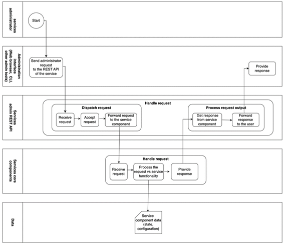

**Figure 18 - Service administration workflows (direct path)**

Figure 18 presents the direct administrative workflow, illustrating the
interaction between Exchange service administrators and the services
through their native management interfaces.

- **Core Services–Triggered Administration Workflows**

In addition to direct administrative access, selected administrative and
configuration actions are integrated into the Web Portal Front Office to
enable coordinated service governance within the EOSC EU Node.

Under this model, certain administrative functions are initiated through
Core services and propagated to Exchange services through controlled
integration mechanisms. These functions may include:

- Triggering resource allocation workflows,

- Initiating service deployment or suspension,

- Updating configuration parameters,

- Enforcing policy-driven service state transitions,

- Monitoring service status and performance indicators,

- Coordinating lifecycle events across multiple services.

This workflow supports centralised management scenarios where service
state changes are triggered by governance decisions, policy enforcement
actions, quota management processes, or automated monitoring events.

In this model, Core services act as orchestration intermediaries.
Administrative commands are validated, authorised, and then transmitted
to the relevant Exchange service interfaces. This ensures consistency of
governance, auditability, and alignment with EOSC EU Node operational
policies.

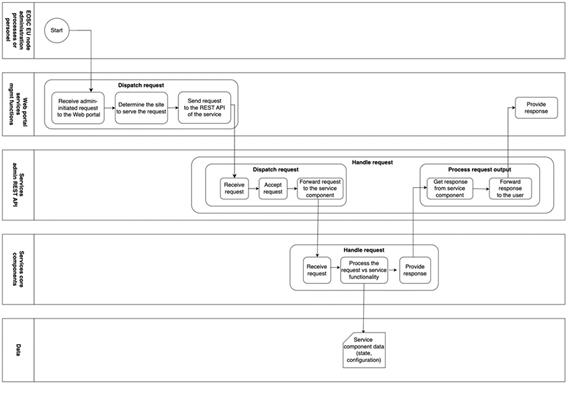

**Figure 19 - Exchange service administration workflows initiated by
portal**

Figure 19 depicts this workflow, illustrating how administrative actions
initiated at the portal level propagate to Exchange services. As in
previous diagrams, authentication and authorisation processes are
omitted for simplicity.

Together, these four workflows comprehensively describe the interaction
patterns between end-users, administrators, Core services, and the
Exchange service layer. They clarify the distinction between native
service-level interaction and integrated platform-mediated interaction,
ensuring architectural transparency and operational coherence across the
EOSC EU Node ecosystem.

### 8.6 Exchange Services in the Context of the EOSC EU Node

The previous section described the layered architecture of the EOSC EU
Node Exchange services and outlined the principal functional
characteristics of the service stack, including its interfaces (APIs),
vertical integration across abstraction layers, and horizontal
integrations between system components. It explained how
infrastructure-level, platform-level, and application-level services are
combined to form a coherent and interoperable Exchange layer within the
EOSC EU Node.

The present section provides a detailed architectural description of the
Exchange services using the C4 architectural model. In accordance with
the agreed documentation methodology, three complementary architectural
perspectives are presented: a conceptual view, a logical view, and a
physical deployment view. Together, these views contextualise the
Exchange services within the EOSC EU Node ecosystem and the broader
external environment, describe the internal decomposition and
relationships of the service components, and illustrate how those
components are deployed across the infrastructure environments operated
by PSNC and Safespring.

The following section subsequently discusses the internal architecture
of individual service components in greater detail, drawing upon the
official documentation of the open-source software projects that develop
and maintain the relevant technologies.

#### 8.6.1 Conceptual View of the Exchange Services Architecture

The conceptual view of the EOSC EU Node Exchange services positions the
six managed Exchange services within the broader ecosystem of Core
managed services, auxiliary operational services, and selected external
systems. At this level of abstraction, the focus is placed on
relationships, interaction patterns, and system boundaries rather than
internal technical decomposition.

In this view, the Exchange services are presented alongside Core managed
services such as the federated Authentication and Authorisation
Infrastructure (AAI) and the Web Portal Front Office (WPFO). The
conceptual model clarifies that the Exchange services depend on the AAI
service for authentication and authorisation of user and
service-to-service requests. It also illustrates that selected Exchange
functionalities are integrated into the WPFO in order to provide a
unified user experience across the EOSC EU Node platform.

In addition to Core managed services, the conceptual view includes
auxiliary services such as monitoring, accounting, and helpdesk
functions. These services provide cross-cutting operational capabilities
that support governance, observability, service quality management, and
user support across both Core and Exchange domains.

The conceptual architecture also recognises the role of external
systems, including Domain Name System (DNS) services and electronic mail
services. These are intentionally externalised to ensure high
availability, operational maturity, and compliance with industry
standards without extending the operational scope of the consortium
responsible for the Exchange services.

The diagram further illustrates the two primary modes of interaction
between end-users and Exchange services. In the first mode, users
consume services directly through native APIs, Web interfaces,
command-line interfaces (CLIs), and graphical user interfaces (GUIs). In
the second mode, users access selected functionalities indirectly
through the Web Portal Front Office, which integrates service APIs and
abstracts underlying technical complexity. This dual-consumption model
ensures both technical flexibility and user-oriented integration.

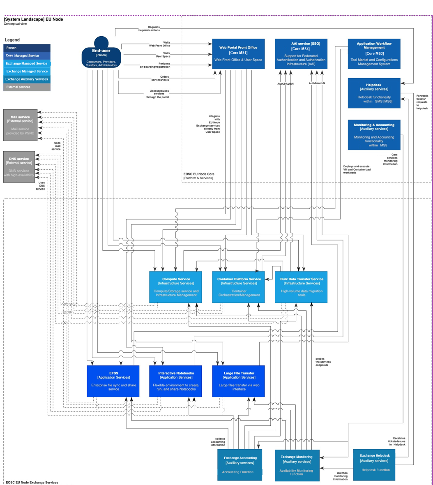

**Figure 20 – Exchange service architecture (conceptual view)**

#### 8.6.2 Exchange Managed Integrations

The Exchange managed services operate within a broader ecosystem that
includes auxiliary services, Core managed services, Core auxiliary
services, and selected external services. The following subsections
describe these integration relationships in detail.

- **Exchange Managed Services Integrations with Auxiliary Services**

All Exchange managed services are integrated with a common set of
auxiliary operational services to ensure consistent monitoring,
accounting, service management, and governance.

Each managed service is subject to continuous operational monitoring.
Monitoring data is collected to provide real-time observability for
service administrators, enabling them to detect anomalies, investigate
incidents, and assess system health and performance. In parallel,
monitoring metrics are used to collect service-level agreement (SLA)
information, including availability and performance indicators. This SLA
data is processed within the service management framework and reported
to the EOSC EU Node owner, the European Commission, in accordance with
governance and contractual obligations.

In addition to monitoring, accounting information is collected from the
Exchange managed services. A dedicated accounting module operating at
the Exchange layer gathers resource usage metrics, such as compute
consumption, storage utilisation, and transfer volumes. These metrics
are aggregated and forwarded to the Core accounting service, where they
are consolidated, analysed, and used for reporting, quota management,
and policy enforcement.

The helpdesk function is also integrated across layers. The Core
services Helpdesk acts as the first-line support interface for users.
When a user request concerns a specific Exchange managed service, the
request is forwarded to the Exchange service support function for
specialised handling. This model ensures a single user-facing support
entry point while preserving service-specific expertise at the
operational level.

**Table 15 - Integrations of the major components (services) with
auxiliary services**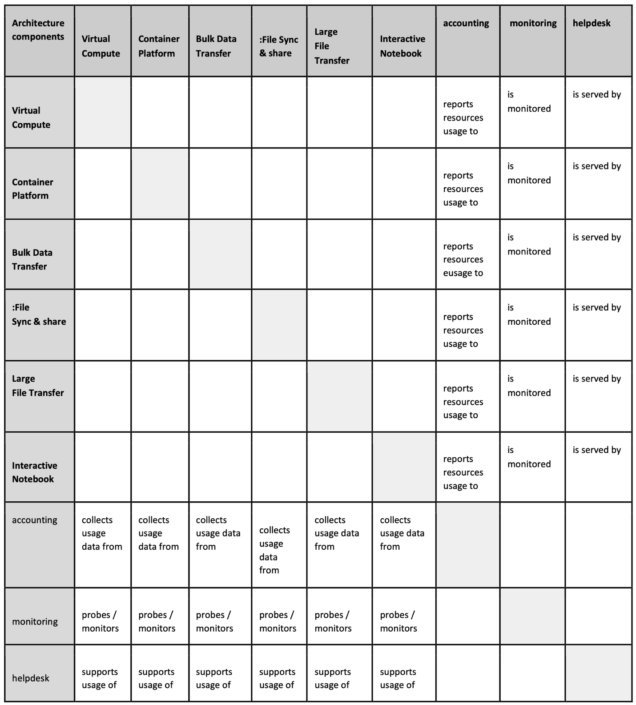

Table 15 summarises the integration relationships between Exchange
managed services and auxiliary services.

- **Exchange Services Integrations with Core Managed Services**

The Exchange managed services are closely integrated with Core managed
services that directly mediate interaction with end-users.

All Exchange services rely on the single sign-on functionality provided
by the federated AAI service. This integration is critical for ensuring
secure authentication and authorisation of all requests directed to
Exchange services. Authentication and authorisation are applied
consistently whether requests are initiated directly by users through
native APIs and interfaces or indirectly through the Web Portal Front
Office. The AAI service also validates and authorises service-to-service
requests originating from the portal when it interacts with Exchange
service APIs.

The Web Portal Front Office integrates selected Exchange service
functionalities into the EOSC EU Node user portal. Through this
integration, users can discover services, initiate selected operations,
and access specific capabilities within a unified user interface. For
example, users may upload and download files to and from the File Sync &
Share service directly from the portal’s user space. However, only a
subset of service functionality is exposed through the portal. The
complete set of capabilities remains accessible through direct
interaction with native APIs, Web interfaces, GUI clients, CLI tools,
and REST endpoints of the managed services.

**Table 16 - Integrations of the major components
(services)**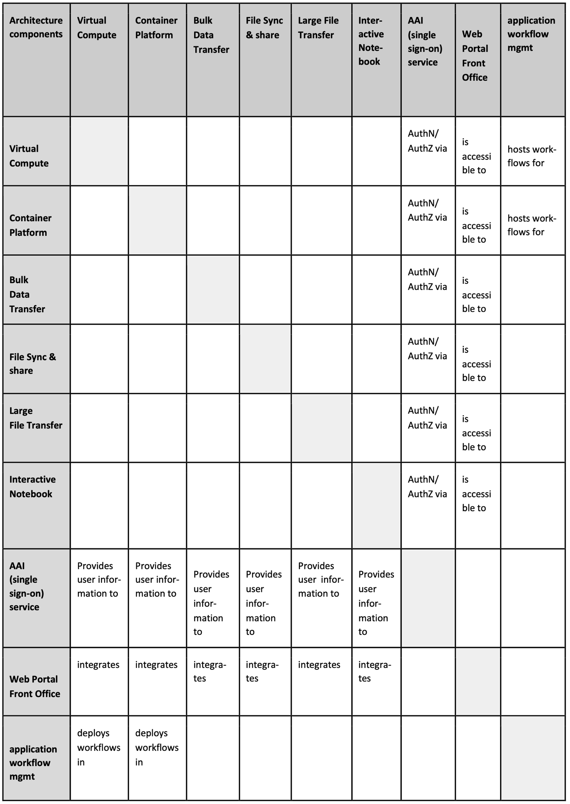

Table 16 provides a consolidated overview of the integration
relationships between the major managed components and Core services.

- **Exchange Integrations with Core Auxiliary Services**

Beyond managed service integrations, auxiliary operational functions are
also coordinated between the Exchange layer and Core auxiliary services.

An accounting agent operating at the Exchange level collects resource
usage data from the managed services and transmits this information to
the Core accounting service. This ensures consistent aggregation and
reporting across the entire EOSC EU Node ecosystem.

The Core monitoring service complements the internal monitoring
mechanisms of the Exchange services. While each Exchange service
maintains its own monitoring framework for operational control, the Core
monitoring layer operates independently to enhance redundancy and
resilience. It focuses particularly on monitoring the overall
availability and user-facing accessibility of services as presented
within the user portal. This dual monitoring model reduces the risk of
blind spots and strengthens SLA validation processes.

**Table 17 - Integrations of the auxiliary services**

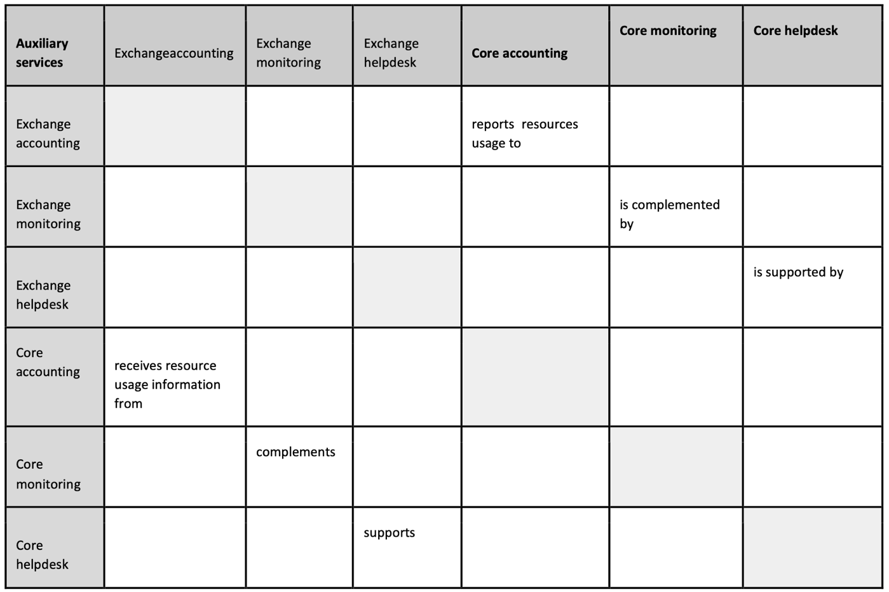

Table 17 summarises the integration relationships among the auxiliary
services.

- **Exchange Services Integrations with External Services**

The Exchange managed services also depend on selected external services
to provide foundational infrastructure capabilities.

Domain Name System (DNS) services are externalised in order to ensure
high-availability name resolution and operational robustness. Operating
a globally resilient DNS infrastructure requires specialised expertise
and infrastructure that falls outside the scope and mandate of the
consortium delivering the EOSC EU Node Exchange services.

Electronic mail services are likewise externalised. Maintaining a mail
system with appropriate levels of deliverability, anti-spam compliance,
security controls, and operational credibility is considered beyond the
intended scope of the Exchange services stack. By leveraging established
external mail service providers, the platform ensures reliability and
compliance without expanding operational complexity.

**Table 18 - Integrations of the major components (services) of Exchange
Services with selected Core
services**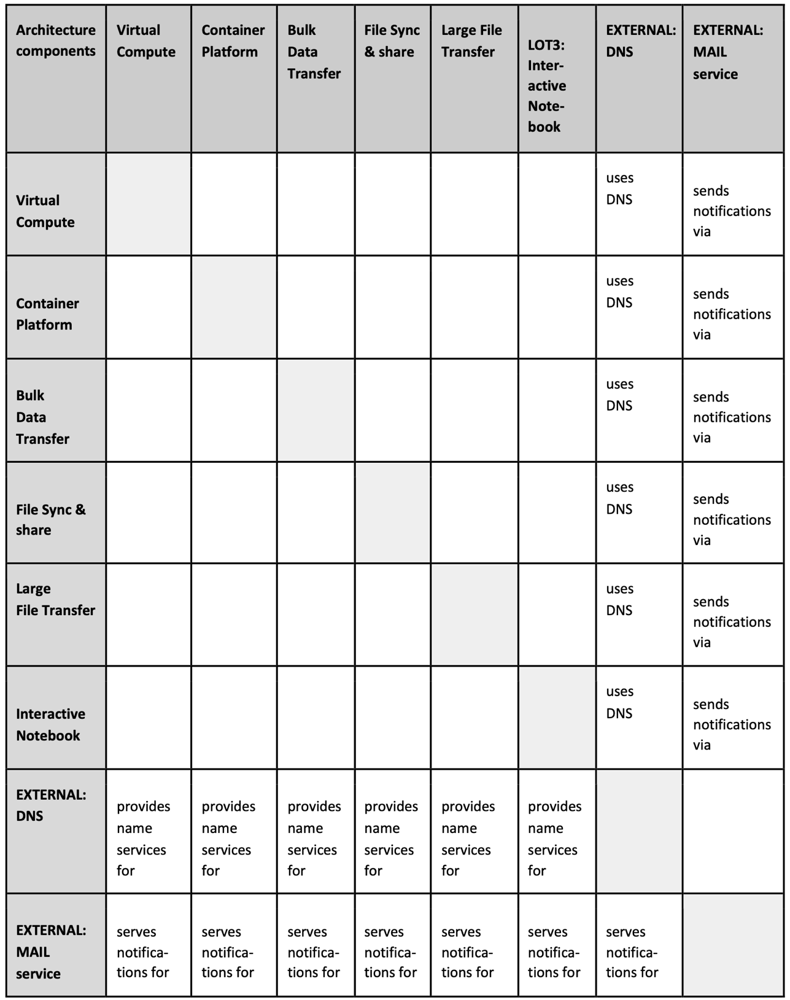

Table 18 summarises the integration relationships between Exchange
managed services and selected external systems, including DNS and mail
services.

#### 8.6.3 Logical and Physical View of the Exchange Services Architecture

The logical view of the EOSC Exchange services, presented in Figure 21,
provides a structured decomposition of each managed service into its
principal subcomponents. This view illustrates how individual service
modules interact internally and how they relate to components of other
managed services.

The logical diagram identifies the main building blocks of each service,
such as compute orchestration layers, container management subsystems,
data transfer engines, file storage modules, notebook execution
components, and large file transfer microservices. It also illustrates
communication paths and dependencies between these components, thereby
clarifying service boundaries and integration interfaces.

For clarity and readability, the logical view does not explicitly depict
relationships with external services such as DNS and mail systems.
Furthermore, interactions with accounting and monitoring services are
aggregated rather than represented as individual links, in order to
avoid visual overload and maintain diagram comprehensibility.

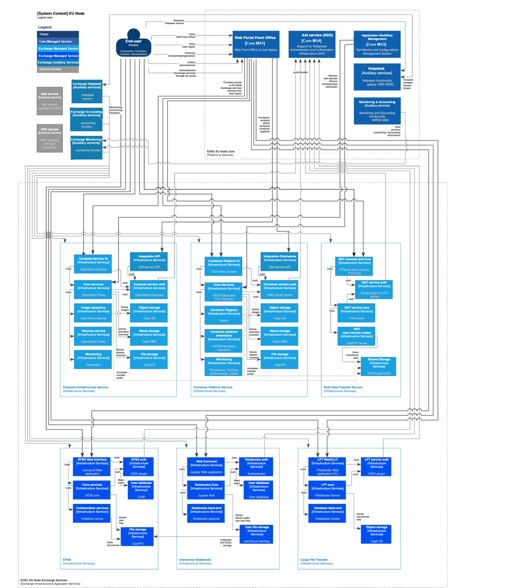

**Figure 21 – Exchange service architecture (logical view)**

The physical deployment view describes how the Exchange service
components are instantiated across the infrastructure environments
provided by PSNC and Safespring. This view maps logical components to
concrete infrastructure elements such as virtual machines, container
clusters, storage backends, and networking layers.

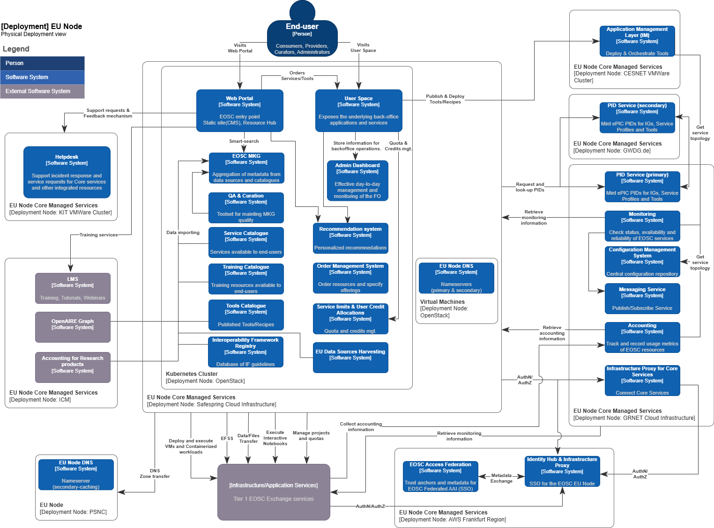

**Figure 22 - Physical Deployment diagram of the EOSC EU Node.**

Figure 22 presents the physical deployment diagram of the EOSC EU Node
Core platform services for contextual reference. Figure 23 presents the
physical deployment view specific to the Exchange services architecture.

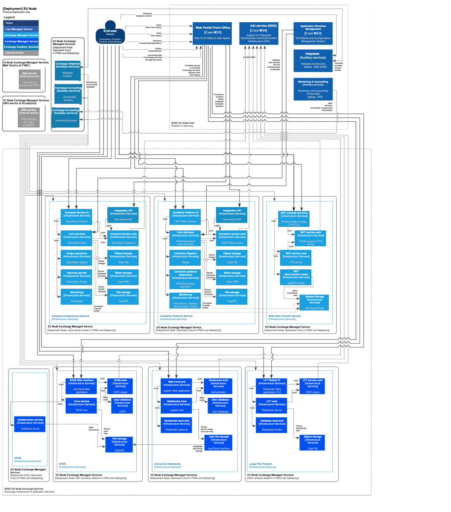

**Figure 23 - service architecture (physical deployment view)**

The deployment model reflects a multi-site, geographically distributed
infrastructure designed to ensure resilience, high availability, and
disaster recovery capability. Service components are distributed across
independent data centres, and redundancy mechanisms are implemented at
both control plane and data plane levels. Virtualisation and container
orchestration technologies are used to provide elasticity, scalability,
and isolation. Storage backends are configured to ensure data durability
and replication across sites. Network segmentation and load balancing
mechanisms are implemented to support secure and efficient traffic
management.

 

## ANNEX 1: CORE SERVICE COMPONENTS - ARCHITECTURE DETAILS

### A1.1 Managed Service 1 - Web Portal Front Office (FO)

The Web Portal Front Office (FO) constitutes the primary entry point to
the European Open Science Cloud (EOSC) EU Node platform. It frames,
organises, communicates, and recommends access to a wide range of
content, resources, and services made available through the platform.
Architecturally, it acts as the unifying front-end layer that integrates
all EOSC EU Node components into a coherent, user-centric environment.

The Web Portal FO delivers a comprehensive, intuitive, and low-effort
experience for discovering and accessing EOSC EU Node services,
resources, and training materials. It is designed to support scientific
workflows and Open Science practices across disciplines, seniority
levels, technical expertise, and geographical locations. On the one
hand, it enables efficient discovery and reuse of cross-disciplinary
research outputs. On the other hand, it provides streamlined access to
commoditised cloud storage and compute services, facilitating
collaborative research environments.

The Web Portal FO also serves as a unique visibility hub for service and
data providers, enabling them to advertise their offerings to the
broader research community. It brings together national and thematic
science clusters as well as candidate EOSC Nodes, thereby supporting
federation-building activities. As the first operational Node within the
EOSC federation, it effectively acts as a reference implementation and
blueprint for future national, regional, or thematic nodes,
progressively implementing and operationalising the European Union’s
Open Science policy and European Data Strategy.

From a technical perspective, the Web Portal FO is deployed as a
full-stack managed service based on a microservices architecture. It
integrates multiple software applications, internal components, external
services, and back-office APIs, all orchestrated through a Kubernetes
container platform. This design ensures high scalability, strong
performance characteristics, cost efficiency, and operational
flexibility. By leveraging virtualisation, containerisation, and
cloud-native infrastructure patterns, the platform achieves efficient
resource utilisation and robust network security controls. These
scalability characteristics are critical, as the Web Portal FO
represents the principal integration and traffic mediation point for all
EOSC EU Node components. It directly handles end-user traffic and
simultaneously consumes and forwards traffic to other platform services.

Logically, the Web Portal Front Office consists of two primary software
domains: the **Web Front-Office** and the **User Space**.

**Architecture Overview**

The architecture overview diagrams illustrate the principal interaction
flows between users and the Web Portal FO.

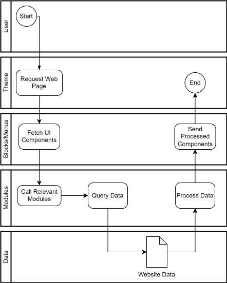

**Figure A1 - Web Front-Office (CMS-Drupal) flow to fulfil a web page
request**

Once authenticated, a user may execute a defined set of actions
depending on their assigned roles and the corresponding EU Node Access
Policy level. A typical interaction sequence begins when a user visits
the Web Front Office and selects the link to access the User Space
component. Alternatively, the user may navigate directly to the User
Space URL.

If the user is not authenticated, a login action is initiated. The
authentication process is delegated to the federated Authentication and
Authorisation Infrastructure (AAI) service. Upon successful
authentication, the user is redirected to the User Space.

Within the User Space, the functionality available to the user is
dynamically determined by the EU Node Access Policy level automatically
assigned by the platform. This policy level is derived from identity
attributes provided by the user’s Identity Provider (IdP). Based on this
policy level, users may access a range of capabilities.

One such capability is profile inspection. Any authenticated user may
navigate to the User Space profile section to inspect their account
information. If corrections are required, the user may contact the EU
Node Helpdesk to request amendments.

Selected users, as defined by the EU Node Access Policy, may create
group projects. These users can view a “Create Group Project”
call-to-action (CTA) within the Groups section of the User Space. After
selecting this option, they are prompted to provide the necessary group
metadata. Once the creation process is completed, the user receives a
notification and can view the newly created group in the list of
available groups. The group owner may then invite additional members and
request EOSC EU Node Exchange infrastructure resources for use by the
group.

Any authenticated user may also initiate the process of becoming a
service contributor. This is achieved by navigating to the Contributor
Dashboard within the User Space and executing the onboarding action. The
user is required to provide all necessary contributor information and
accept the relevant terms and conditions. Acceptance triggers the
instantiation of a Business Process Model and Notation (BPMN) workflow,
which governs the contributor onboarding lifecycle. Upon initiation of
this workflow, the user is redirected to the Contributor Dashboard.

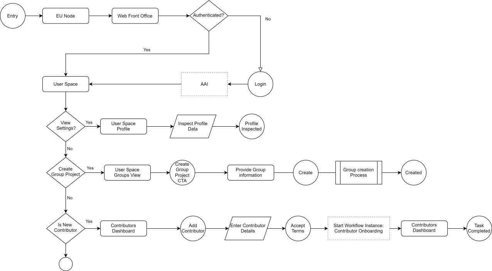

**Figure A2 - Web Front-Office Flow Diagram**

Indicatively, the below capabilities are presented:

- Inspect Profile:

  1.  Any authenticated user can inspect the account profile by
      selecting the application menu item to the User Space Profile.

  2.  The user inspects the available information to the profile view.

  3.  The account profile is inspected. For any amendments the user can
      contact the EU Node Helpdesk.

- Create Group Project:

  1.  Selected authenticated users (defined by the EU Node Access
      Policy) can create group projects on the EU Node.

  2.  These users can view the “Create Group Project” CTA in the Groups
      View menu item in the User Space.

  3.  The user selects the “Create Group Project” CTA.

  4.  The user provides all the appropriate group information that is
      needed in the displayed form and executes the Create action to
      initiate the group creation process.

  5.  When the group is created the user is notified and can view the
      group in the list of available groups.

  6.  From this point the user can invite members to the group and order
      EU Node Exchange Infrastructure resources that can be used by the
      members of the group.

- Become a Contributor:

  1.  Any authenticated user can become a service contributor by
      selecting the application menu to the Contributor’s Dashboard from
      the User Space.

  2.  The user executes the Onboard action.

  3.  The user enters all required information required for new service
      contributors.

  4.  The user accepts any required terms and conditions by selecting
      the Accept action, which initializes a BPMN workflow instance that
      implements the contributor onboarding.

  5.  The user is redirected to the Contributor Dashboard.

**Application Structure**

The application structure diagram presents the internal organisation of
the Web Portal FO components and their integration points. The Web
Front-Office layer primarily delivers structured content and navigation
capabilities, while the User Space integrates back-office services
through well-defined APIs. These components are deployed as
containerised services within a Kubernetes orchestration environment and
communicate via secure API endpoints.

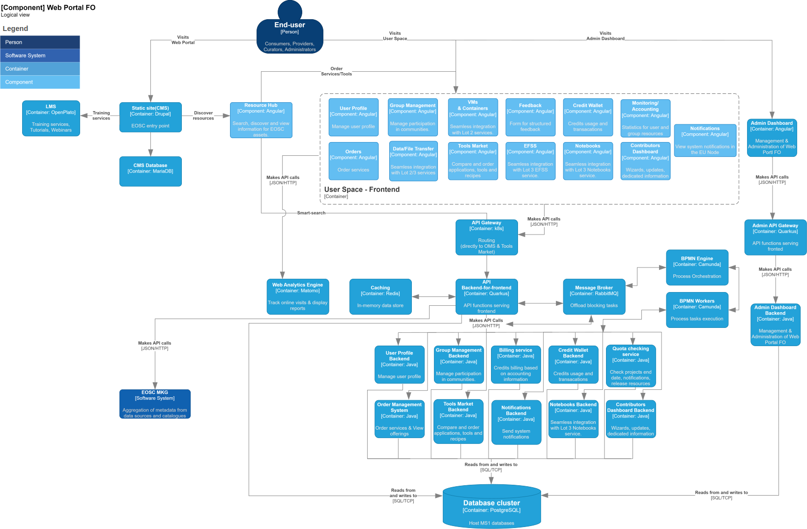

**Figure A3 - Application Structure of the Web Portal FO**

**Data and Information Flow**

The data and information flow diagram illustrates how user requests
propagate through the system. User interactions are received through the
presentation layer and forwarded to the appropriate backend services via
API calls. Backend components process requests, retrieve or manipulate
data, and return structured responses. These responses are then rendered
by the front-end components and presented to the user.

The architecture cleanly separates presentation logic from backend
business logic, ensuring maintainability, extensibility, and resilience.

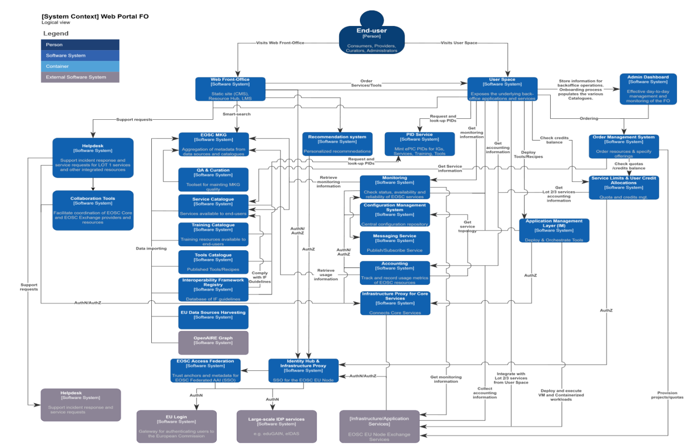

**Figure A4 - Interaction of Web Portal FO (Web Front-Office and User
Space) with other systems.**

**Deployment View**

The deployment view illustrates how the Web Portal FO components are
instantiated within the underlying infrastructure. The service is
deployed as containerised workloads managed by Kubernetes clusters. Load
balancing, high availability configurations, and network segmentation
mechanisms are implemented to ensure reliable and secure operations.
Persistent storage and database components are deployed in clustered
configurations to support redundancy and fault tolerance.

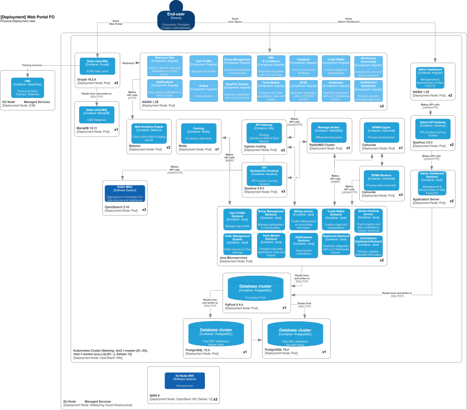

**Figure A5 - Physical Deployment Diagram of the Web Portal FO**

#### A1.1.1 Web Front-Office

The Web Front-Office is responsible for delivering static and
semi-dynamic content and acts as the main navigation layer of the
platform. It provides structured access to:

- The Learning Management System (LMS),

- The Resource Hub,

- The User Space.

The Resource Hub serves as the central discovery entry point for all
users, whether authenticated or anonymous. It allows searching and
browsing across EOSC EU Node assets, including services, datasets,
Exchange services, tools, and training materials. These resources are
exposed via the Multifaceted Resource Catalogues and Registry Services
and indexed within the EOSC Metadata Knowledge Graph (MKG).

The User Space aggregates a collection of sub-components that expose
back-office applications and services through their respective APIs. The
content and layout of the User Space are dynamically adapted according
to the authenticated user’s role and access level. This ensures that
each user type interacts with a stable and intuitive environment while
only accessing authorised functionality.

#### A1.1.2 Admin Dashboard

In addition to the User Space, an Admin Dashboard is provided for EOSC
EU Node administrators. Although architecturally similar to the User
Space, access is restricted to administrative roles. The Admin Dashboard
supports daily operational management and includes functionalities such
as:

- A Curation Hub for maintaining data quality within the EOSC MKG,

- The EOT Dashboard for managing onboarding workflows of providers and
  services,

- Tools publishing governance functions,

- BPMN workflow inspection and administrative operations,

- Handling requests for additional credits or gated service offerings,

- Releasing low-utilised provisioned resources,

- Permanently banning users in accordance with the EU Node Access
  Policy.

#### A1.1.3 Web Front-Office Technology Stack (Drupal 10)

The Web Front-Office is implemented using the Drupal 10 Content
Management System (CMS), an open-source platform built on mature
technologies such as PHP and MySQL. The implementation follows the
OpenEuropa Drupal distribution, combining Drupal Core modules,
OpenEuropa standard modules, and custom-developed modules tailored to
EOSC EU Node requirements.

Drupal 10 follows a layered architectural model composed of five
principal layers: data (nodes), modules, blocks and menus, user
permissions, and the presentation template layer.

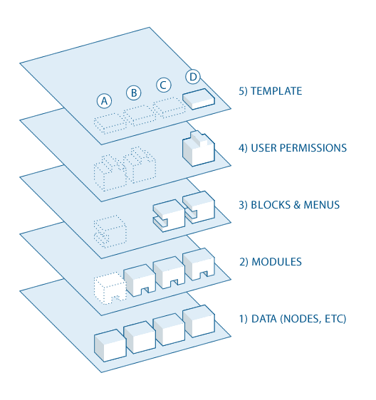

**Figure A6 - Layers of Drupal 10 Architecture**

At the base of the system is the data layer, which consists of
structured content entities known as nodes. All displayed content
originates from this data pool. Integration with external data
warehouses is achieved via GraphQL server queries and JSON-based data
exchange.

The module layer builds upon this data foundation. Core and contributed
modules extend Drupal’s native functionality and allow developers to
define custom content types, fields, filters, and business logic. Custom
modules developed for EOSC EU Node comply with Drupal and OpenEuropa
standards to ensure security, maintainability, and interoperability.

Above the module layer, blocks and menus define content placement and
navigation structures. Blocks may display module-generated output or
static information and can be configured for visibility based on page
context or user role. Menus define navigation paths and URL mappings.

The user permissions layer controls access rights by assigning
permissions to roles, which are then associated with individual users.
It is important to distinguish between Drupal administrative roles and
EOSC EU Node user roles. Drupal roles govern CMS-level content
management permissions, such as creating, editing, or deleting content,
whereas EOSC EU Node roles determine platform-level capabilities.

At the top of the architecture lies the theme layer, which defines the
visual presentation of the site. Themes are composed primarily of XHTML
and CSS, with embedded PHP variables enabling dynamic content placement.
Theme functions may override default module output to provide full
control over markup generation.

User interaction follows a defined processing flow. Users initiate
requests through the theme-rendered interface. The theme layer forwards
these requests to the relevant Drupal modules. Modules process the
request, retrieve or manipulate data, and return results, which are then
rendered by the theme layer and displayed to the user.

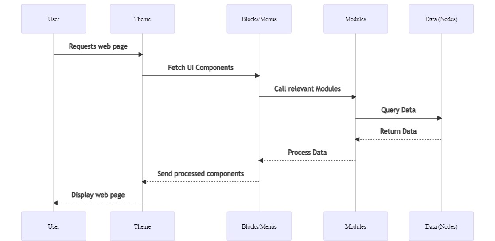

**Figure A7 - Flow from user input through the theme layer, down to the
Drupal modules and back.**

Core OpenEuropa modules provide additional editorial and compliance
features, including cookie consent management, corporate content blocks,
editorial workflows, media handling, taxonomy integration, and
structured content types. Default OpenEuropa content types such as
Event, Organisation, Page, Person, and Publication are used and extended
as necessary. Custom content fields are defined with explicit data
types, validation rules, mandatory constraints, and multiplicity
settings.

The Views core module is used extensively to generate structured
listings with filtering, sorting, and search capabilities. Dedicated
views are implemented for events, documents, persons, and organisations.
Taxonomy vocabularies provide controlled reference data such as country
lists and thematic classifications.

Administrative permissions within Drupal are defined per content type
and may include the ability to create content, edit one’s own content,
edit any content, delete one’s own content, or delete any content.

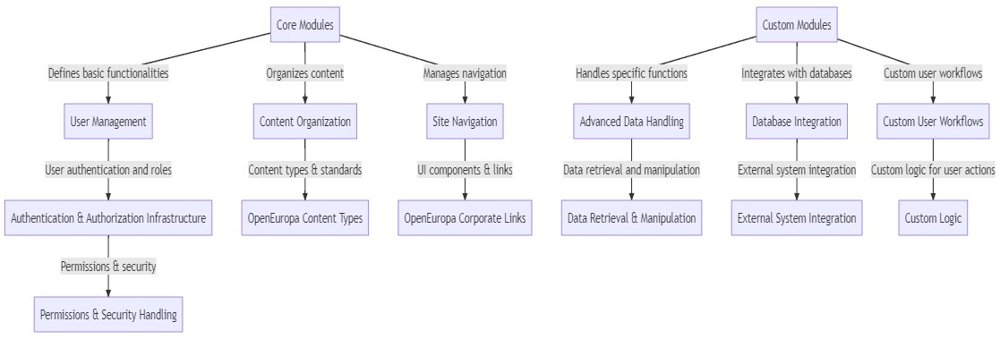

**Figure A8 - Drupal modules and custom modules structure**

All development activities adhere to the Europa Web Guide, ensuring
compliance with editorial, legal, technical, and visual standards of the
European Commission. The platform is designed to comply with WCAG 2.1 AA
accessibility requirements.

Editorial and other functionalities are be provided by
[OpenEuropa](https://github.com/openeuropa) (Europa Web Publishing
Platform) modules such as:

- **EU Cookie consent.** This module gives users the option to accept or
  reject third-party cookies.

- **OpenEuropa Content**: This component ships with corporate and
  standardised content and entity types, as well as content modelling
  and handling functionalities. Additionally, it uses the **OpenEuropa
  RDF SKOS** component to integrate the Publications Office (OP)
  vocabularies.

- **OpenEuropa Corporate Blocks**: This simple component contains the
  European Commission corporate blocks meant to display standardised
  parts of EC sites, such as the footer. It integrates with the
  OpenEuropa Theme for styling.

- **OpenEuropa Editorial**: This component provides various editorial
  features (workflow, versioning, etc), shipped as individual
  submodules.

- **OpenEuropa Link Lists**: This component provides site building
  features that allow the creation of lists of links, external and to
  internal content, dynamic and manual.

- **OpenEuropa Media**: This component provides functionality for using
  Media of various types. Things like images, remote videos and
  integration with the EC AV Portal service are included.

- **OpenEuropa Paragraphs**: This component provides various Drupal
  paragraph types that display using the ECL components via the
  OpenEuropa Theme.

#### A1.1.4 Learning Management System (LMS)

The Learning Management System used by EOSC EU Node activities is
OpenPlato, an OpenAIRE-funded platform designed to serve as a central
training hub for Research Data Management (RDM), Open Science, and FAIR
principles.

OpenPlato is built on Moodle and extends its core capabilities with
additional features. It supports synchronous and asynchronous learning
through structured activities, modular courses, and SCORM-compatible
content. It provides a catalogue environment that organises both public
and restricted resources according to metadata standards, ensuring
discoverability and long-term value preservation. It also enables the
creation of structured learning paths tailored to specific training
objectives.

The platform supports resource creation, management, certification, and
multilingual content organisation. Learning materials produced within
EOSC EU Node activities are consolidated in a dedicated training space.

Metadata descriptions comply with RDA ETHRD standards to promote
curation quality and FAIR alignment. The LMS is integrated with the EOSC
AAI single sign-on service to ensure seamless authentication. Its
operation is governed by clearly defined Terms of Service and usage
policies.

OpenAIRE’s financial commitment ensures the sustainability and
scalability of OpenPlato as a community-driven training resource,
supporting its continued evolution and central role within the Open
Science ecosystem.

### A1.2 Managed Service 2: Multifaceted Resource Catalogues and Registry Services

#### A1.2.1 Metadata Knowledge Graph (MKG)

**Architecture Overview**

The Metadata Knowledge Graph (MKG) constitutes the core metadata
aggregation and harmonisation component of the Multifaceted Resource
Catalogues and Registry Services. Its architecture supports large-scale
metadata ingestion, transformation, consolidation, quality assurance,
and exposure for search and discovery.

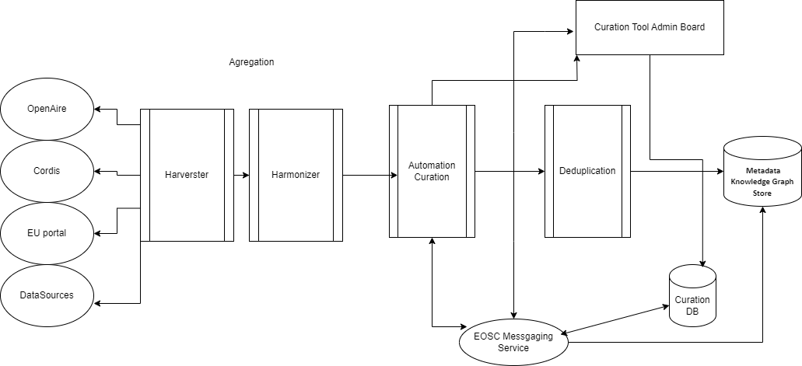

**Figure A9 - MKG harvesting workflow**

The harvesting workflow is designed as a periodic, controlled ingestion
pipeline. Metadata records are collected from multiple authoritative
upstream sources, transformed into a common internal representation,
validated against defined quality criteria, deduplicated using
persistent identifiers, and finally indexed for discovery and API
access. The workflow ensures traceability of provenance and supports
repeatable monthly production cycles.

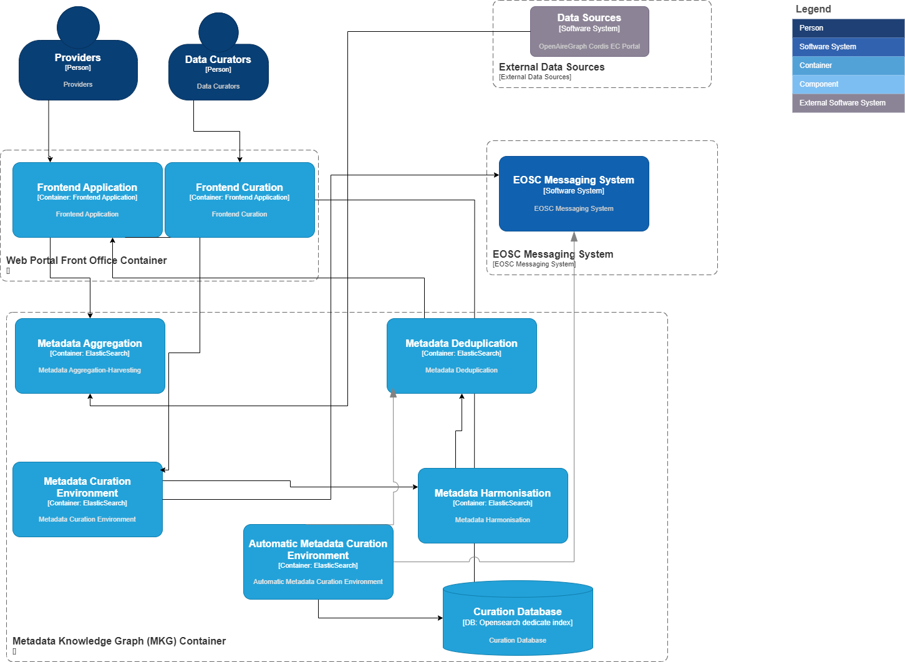

**Figure A10 - MKG Application Structure**

The application structure separates ingestion, transformation,
deduplication, curation, indexing, and API exposure into distinct
logical components. This separation ensures scalability,
maintainability, and clear operational boundaries.

The data and information flow architecture illustrates how metadata
flows from external data providers into the harvesting layer, then
through harmonisation and validation engines, and finally into the
curated Knowledge Graph and its indexed representation. Each processing
stage produces auditable outputs and status metadata.

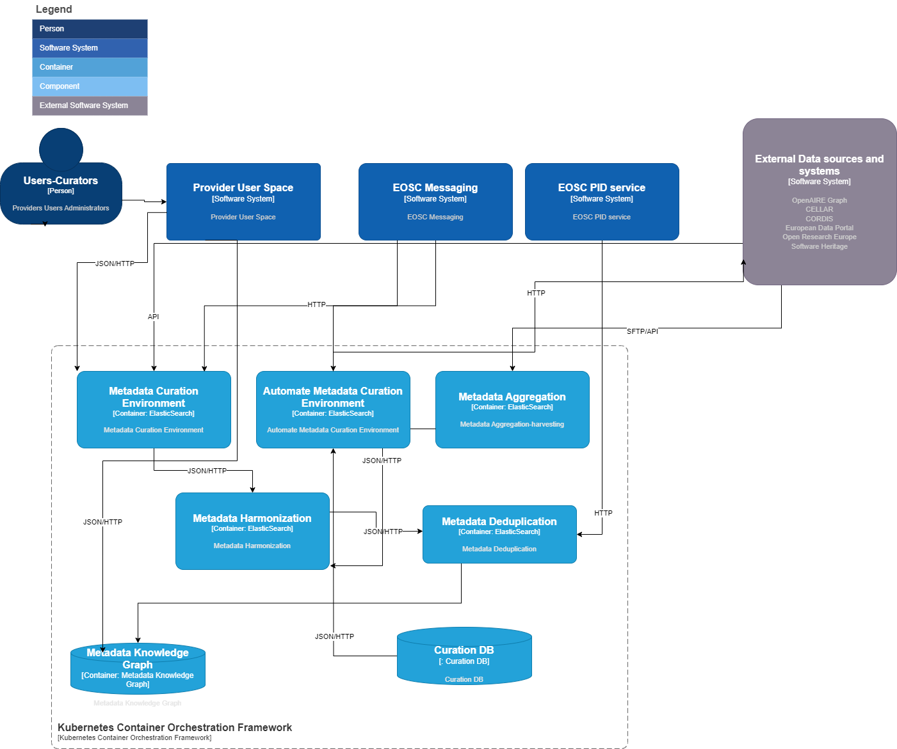

**Figure A11 - MKG interfaces with other systems**

The physical deployment of the MKG is implemented in a containerised
environment orchestrated by Kubernetes, ensuring elasticity, high
availability, controlled scaling, and operational resilience.

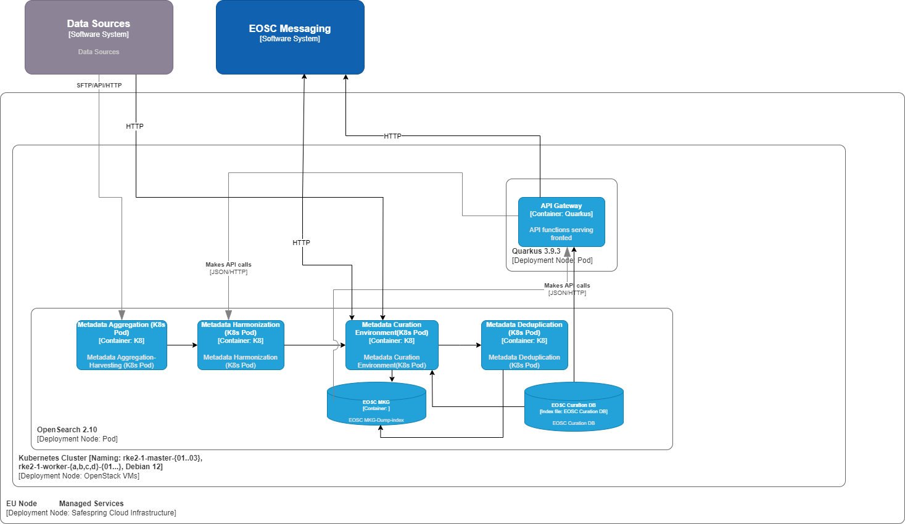

**Figure A12 - MKG Physical Deployment View**

#### A1.2.2 Core Concepts and Architectural Principles

**Metadata Management**

Metadata harvesting is the process of systematically retrieving metadata
records from heterogeneous external sources, including OpenAIRE, CORDIS,
CELLAR, the European Open Data Portal, Software Heritage, and Open
Research Europe. Harvesting is performed via standardised APIs such as
OAI-PMH and REST endpoints.

Aggregation consolidates harvested metadata into a centralised
repository, preserving source provenance and timestamps. The aggregation
layer supports incremental updates and version tracking.

Harmonisation transforms heterogeneous source metadata into a consistent
internal data model aligned with EOSC Profiles. This transformation
ensures structural consistency and semantic interoperability across
sources.

Deduplication eliminates duplicate records by resolving equivalence
based primarily on Persistent Identifiers (PIDs). Where multiple records
refer to the same digital object, a single canonical record is
maintained.

**Metadata Knowledge Graph (MKG)**

The Metadata Knowledge Graph serves as a central repository storing
harmonised and deduplicated metadata records. It supports efficient
search, filtering, and exploration of research resources across domains
and communities. The MKG enables the generation of customised views
tailored to specific scientific communities, organisations, or policy
requirements.

The EOSC Knowledge Graph aims to provide a unified entry point for
discovering research publications, datasets, software, projects, and
related outputs. It leverages harvesting from the OpenAIRE Graph,
CELLAR, CORDIS, the European Open Data Portal, Software Heritage, and
Open Research Europe. Inclusion policies and restrictions are enforced
to guarantee coherence, quality, and compliance with EOSC participation
requirements.

#### A1.2.3 Inclusion Policies and Source Governance

- **OpenAIRE Graph**

The OpenAIRE Graph aggregates metadata from global research
dissemination platforms and provides quality analytics regarding
provenance, completeness, and trustworthiness. The EOSC Knowledge Graph
relies on this quality analysis to determine eligibility for inclusion.

Only projects funded by European Commission programmes are eligible for
inclusion. Subject classification is based on the Fields of Science
ontology.

Data sources, authors, and organisations are included when they are
connected to research products that meet inclusion criteria. These
connections are determined through transitive closure analysis
originating from eligible research products.

Research products include publications, datasets, software, and related
outputs. All research products must contain at least one Persistent
Identifier, such as DOI, ArXiv ID, PubMed ID, Handle, Software Heritage
ID, or recognised accession numbers.

Minimum metadata completeness criteria are enforced. Publications must
include title, creators, publication date, and abstract. Research
datasets must include title, creators, and publication date. Research
software must include title and publication date. All records must
contain structured metadata elements such as title, creators, abstract
(where applicable), licence information, and publication date in
ISO-compliant format.

- **CELLAR**

Publications are retrieved from CELLAR via REST APIs without additional
metadata restrictions. The MKG preserves the metadata as provided by the
source while ensuring structural harmonisation.

- **Open Research Europe (ORE)**

All products exposed via ORE’s OAI-PMH APIs are harvested. Inclusion
policies follow the OpenAIRE Graph acquisition rules, as ORE is
harvested through OpenAIRE.

- **CORDIS**

Datasets and associated metadata regarding publications and deliverables
from FP7, H2020, and Horizon Europe projects are harvested via the
OpenAIRE Graph integration layer.

- **European Open Data Portal**

Metadata from data.europa.eu is harvested without additional
research-specific restrictions, provided that it meets technical
validation requirements.

- **Software Heritage**

The OpenAIRE Graph applies full-text mining techniques to identify
references to Software Heritage identifiers. The MKG relies on this
enrichment process to establish bibliographic metadata links to research
software.

**Monthly Production Workflow**

The EOSC Knowledge Graph is produced on a monthly cycle through a
structured pipeline.

The first phase consists of raw Knowledge Graph generation, during which
all configured data sources are harvested and aggregated.

The second phase applies Rules of Participation filtering. Metadata
records that do not comply with EOSC participation requirements are
excluded.

The third phase performs deduplication to ensure that records sharing
identical PIDs are consolidated into a single canonical representation.

The fourth phase generates the curated Knowledge Graph. During this
stage, curation status attributes are assigned to each record,
determining its visibility and lifecycle state.

The final phase generates the indexed representation of the EOSC
Knowledge Graph, which is exposed via APIs for the Resource Hub and
Curation User Interfaces.

**Curation Workflow and Governance**

The curation workflow combines automated validation mechanisms and human
oversight to maintain high metadata quality.

The AI-powered curation engine performs monthly validation of
non-curated records. It identifies spam products and non-research
products through rule-based and machine learning-based detection
mechanisms. Records are assigned statuses such as withdrawn, alert,
valid, or missing. Results are stored in the CurationDB.

Human curators operate through dedicated user interfaces that allow them
to evaluate metadata quality, investigate anomalies, and update record
status. Curators can restore, withdraw, alert, reset, or validate
records. All actions are recorded in the CurationDB with full audit
history.

The CurationDB data model preserves both the latest status and the full
history of decisions to ensure transparency and traceability.

An OpenAPI-compliant endpoint enables status updates. The API validates
input parameters and returns the resulting curation record upon
successful update.

**Tombstones and Transparency**

Records excluded from search results due to withdrawal or policy
violations are represented as “tombstones.” These entries preserve
transparency by indicating the rationale for exclusion while preventing
the display of invalid or inappropriate metadata.

**User Interaction Components**

The Provider User Space enables providers to upload research products,
monitor harvesting status, validate compliance and FAIRness, and receive
structured feedback.

The Metadata Curation Environment enables curators to sample the
Knowledge Graph, diagnose data quality issues, report findings to
original data sources, and directly apply corrections where authorised.

**Architectural Characteristics**

The MKG architecture enforces FAIR principles by ensuring
discoverability, accessibility, interoperability, and reusability of
research metadata.

Container orchestration through Kubernetes ensures scalability,
elasticity, performance optimisation, and cost efficiency.

The architecture supports community-specific customisation by enabling
filtered views and configurable discovery interfaces.

#### A1.2.4 Recommendation System

**Architectural Overview**

The Recommendation System provides personalised and contextualised
discovery services across the EOSC ecosystem. Its architecture supports
both synchronous inference requests and asynchronous model training
pipelines.

The operational model is structured around three primary business axes:
model training, real-time inference, and user behaviour ingestion. These
axes can operate independently, enabling decoupled scaling and
resilience.

Model training can be initialised using citation relationships extracted
from OpenSearch-indexed products or using behavioural data derived from
user interaction tracking.

**Application Structure**

The application structure defines the core runtime components of the
Recommendation System.

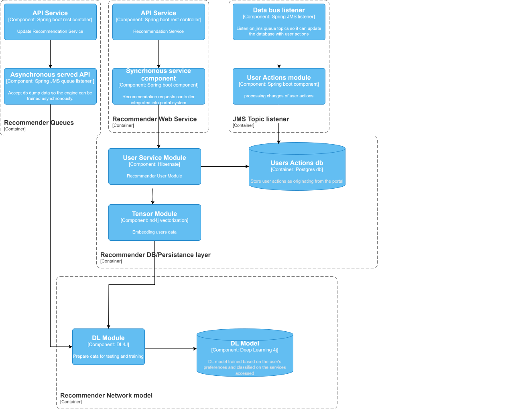

**Figure A13 - Recommendation system Application Structure**

Recommendation requests originate from the API Gateway. Each request may
include user attributes such as scientific domain, user category, and
optionally contextual resource identifiers. Based on this input, the
system performs vectorisation of relevant features and applies trained
deep learning models to generate predictions.

User interaction data collected by the Web Analytics Engine is
integrated into the feature space. The system tests inference vectors
against trained embeddings and returns a structured response containing
predicted relevant resources within synchronous request-response time.

**Data and Information Flow**

The system exposes three primary integration entry points.

The first entry point is synchronous recommendation requests from the
API Gateway.

The second entry point is an asynchronous training pipeline, where model
retraining is performed using updated citation graphs or behavioural
data.

The third entry point consists of event-driven ingestion of user
actions, enabling continuous model enrichment.

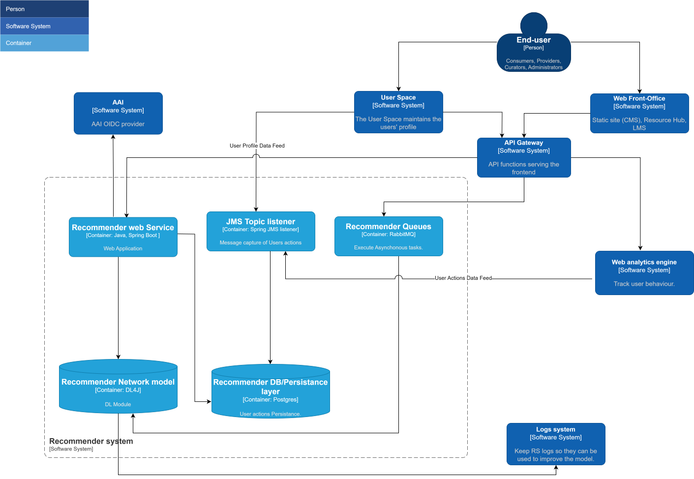

**Figure A14 - Recommendation System interfaces with other systems**

**Deployment View**

The Recommendation System is deployed in a containerised environment
with clearly separated inference and training nodes. Memory and
computational resources are dimensioned according to expected workload
patterns. Future optimisations may introduce additional features for
memory management and model reusability.

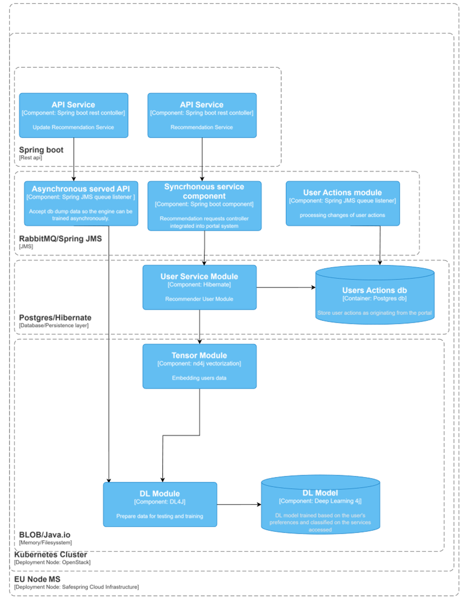

**Figure A15 - Recommendation system Physical Deployment View**

#### A1.2.5 Multifaceted Resource Catalogues and Registry Services

**Architectural Overview**

The Resource Catalogues and Registry Services provide structured
metadata management for EOSC EU Node resources, including Providers,
Services, Training Materials, Interoperability Framework Guidelines, and
Tools or TOSCA templates.

The onboarding workflow requires providers to submit onboarding
applications. Upon validation of submitted information against defined
requirements, resources can be registered in the catalogue.

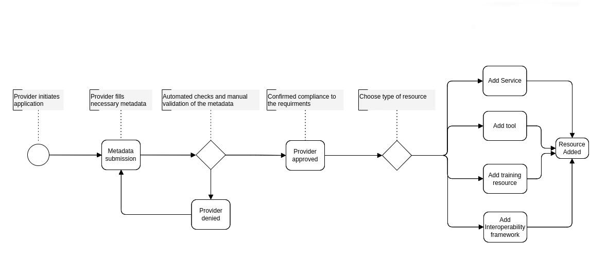

**Figure A16 - Adding a resource process workflow**

The service onboarding workflow follows a structured business process,
including validation, metadata submission, review, approval, and
publication. Other resource types follow a similar blueprint.

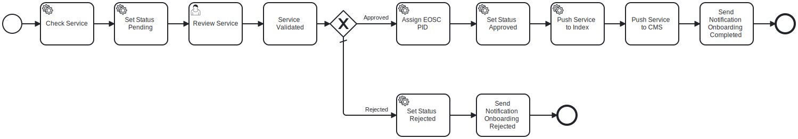

**Figure A17 - Business process workflow for onboarding a service in the
EOSC EU Node**

**Application Structure**

Each catalogue is deployed as a dedicated logical component with its own
metadata schema aligned to EOSC Profiles. Metadata schemas are based on
specifications defined during the EOSC Future project.

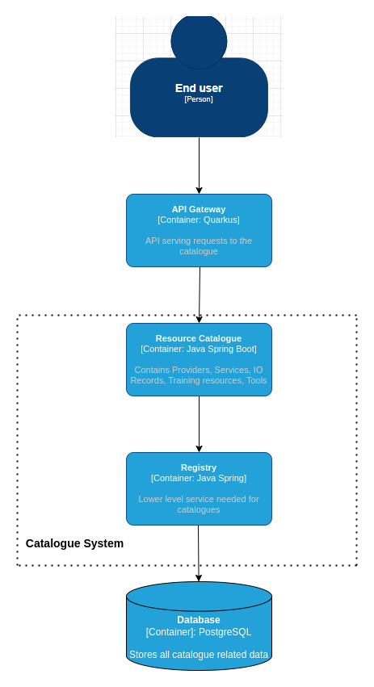

**Figure A18 - Catalogue system architecture diagram**

The data and information flow architecture illustrates integration with
the Metadata Knowledge Graph for synchronising metadata updates and with
the PID Service for minting persistent identifiers.

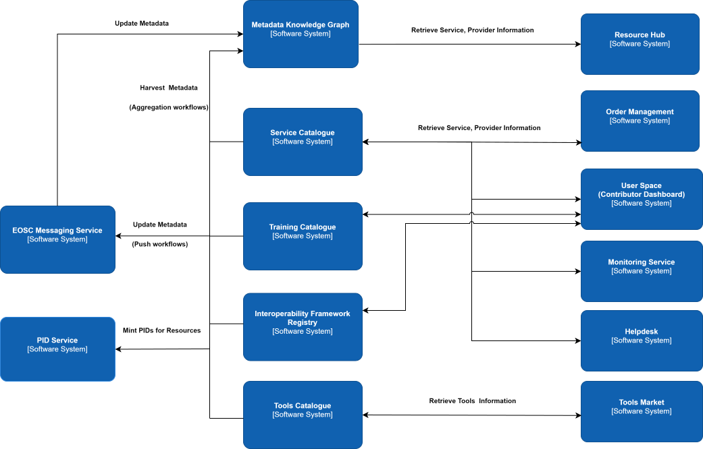

**Figure A19 - Catalogues and registries interfaces with other systems**

The Tools Catalogue communicates with the Tools Market component to
exchange metadata for tools and recipes. The Service Catalogue
integrates with the Resource Hub, Order Management System, and Helpdesk
to exchange service and provider information.

**Deployment View**

The system consists of dedicated deployment nodes for each catalogue and
a shared Database Cluster hosting metadata schemas for all registries.
The database cluster ensures high availability, transactional
consistency, and performance optimisation.

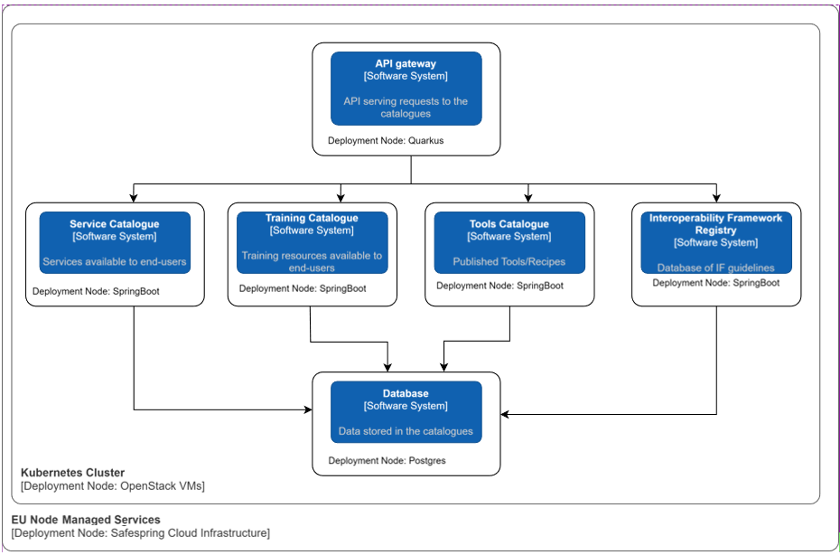

**Figure A20 - Catalogues and registries physical deployment view**

#### A1.2.6 Persistent Identifier (PID) Service

**Architectural Overview**

The PID Service operates as a federated primary-mirror deployment
between GRNET and GWDG under the ePIC Consortium Quality of Service
framework. Both providers operate high-performance data centre
infrastructures equipped with modern compute, storage, and
virtualisation capabilities.

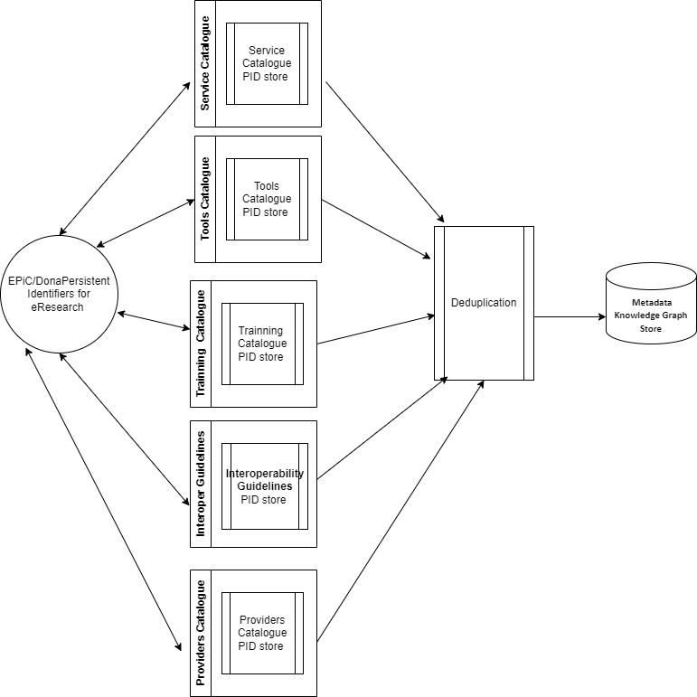

**Figure A21 - Architecture Overview Diagram of the PID Service**

The service is based on B2HANDLE technology and the Handle System
persistent identifier infrastructure. It provides both REST and native
Handle (HDL protocol) interfaces, enabling middleware, applications, and
services to reliably resolve and manage PIDs.

**System Architecture**

The architecture consists of a Primary Local Handle Service and a Mirror
Local Handle Service. Both services implement identical APIs and share
the same namespace configuration. Redundancy is achieved through
replication policies defined by the ePIC QoS framework.

Each PID consists of a Prefix and Suffix. Prefixes are acquired via ePIC
membership, and suffixes uniquely identify individual registered
objects. Global resolution is enabled through the DONA Global Handle
Registry network.

The Handle System runtime environment requires Java, with an embedded
Jetty servlet container providing the HTTP interface for REST-based
interactions.

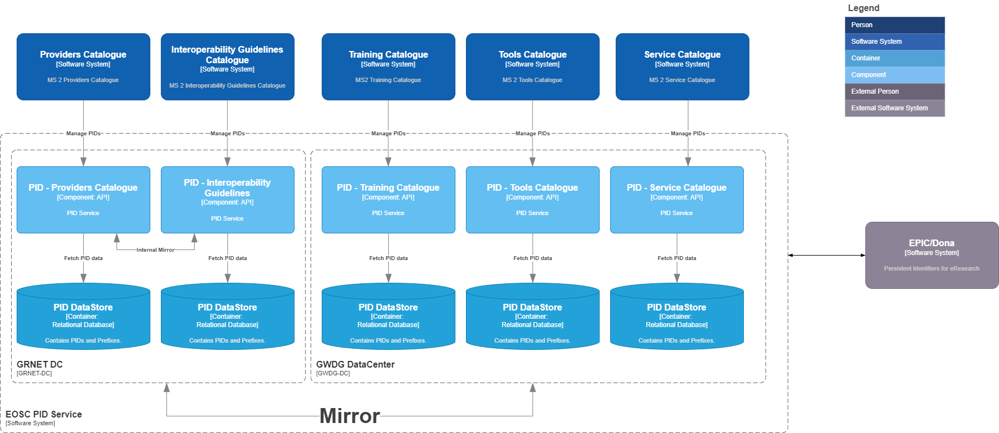

**Figure A22 - Deployment view of the PID Service**

**Service Coverage**

The PID Service supports the following catalogues and registries:

- Services and Providers

- Tools

- Training Materials

- Interoperability Framework Guidelines

Through federated redundancy and standards-based interfaces, the PID
Service ensures long-term resolvability, persistence, and reliability of
identifiers across the EOSC ecosystem.

### A1.3. Managed Service 3: Application Workflow Management

Managed Service 3, Application Workflow Management (AWM), provides the
orchestration, deployment, execution, and lifecycle management
capabilities required to operationalise deployable tools and
infrastructure blueprints within the EOSC EU Node. It enables
researchers and providers to instantiate reproducible computational
environments across heterogeneous infrastructure providers in a
controlled and policy-compliant manner.

The AWM service is composed of three principal components: the
Application Management Layer, the Tools Market, and the Configuration
Management System. Together, these components support blueprint
execution, lifecycle governance, metadata alignment, and infrastructure
traceability.

#### A1.3.1 Application Management Layer

**Architecture Overview**

The Application Management Layer constitutes the orchestration backbone
of the Application Workflow Management service. It is responsible for
interpreting, deploying, configuring, and managing infrastructure
resources defined through standardised templates, primarily expressed in
TOSCA.

The architecture enables the deployment of compute resources across
multiple cloud infrastructure providers. In particular, it supports
OpenStack-based infrastructure environments offered by EOSC
infrastructure providers, as well as containerised deployments on
container orchestration platforms such as Kubernetes. Beyond
infrastructure provisioning, the system enables post-deployment
configuration and software contextualisation through an Ansible-based
backend.

The Application Management Layer exposes a RESTful API interface that is
consumed by the Tools Market component. Through this interface,
deployment requests, lifecycle operations, and status queries are
executed programmatically.

**System Architecture and Deployment**

The Application Management Layer is deployed on top of a Kubernetes
cluster to ensure scalability, high availability, and operational
resilience.

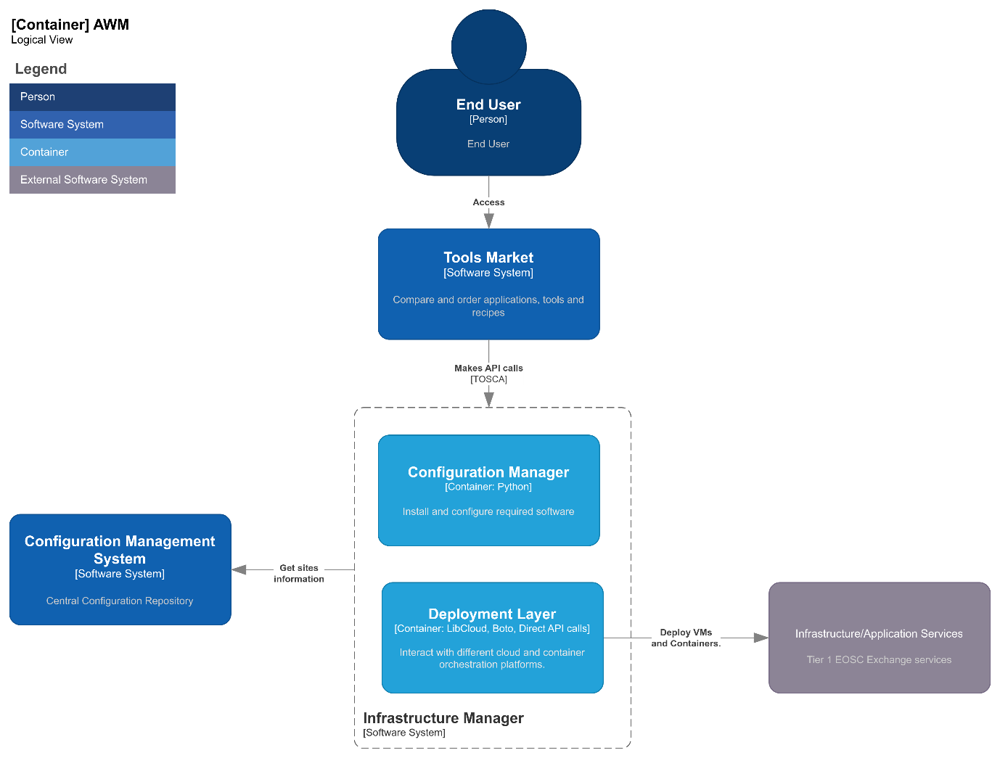

**Figure A23 - Architecture of the Application Workflow Management
service**

Multiple Infrastructure Manager (IM) server instances are deployed in
parallel to enhance performance and fault tolerance. A load balancer is
positioned in front of these instances and distributes REST API calls
across them, ensuring horizontal scalability and service continuity in
the event of node-level failures.

All Infrastructure Manager data related to the lifecycle management of
virtual infrastructures, including deployment states and orchestration
metadata, is stored in a MySQL backend. This persistent data layer
guarantees transactional consistency and traceability.

Operational logs generated by the Infrastructure Manager instances are
handled by a centralised rsyslog service and stored in persistent
storage to enable auditability and troubleshooting.

User credentials required for accessing external cloud providers are
securely managed through a Vault instance. The Vault service provides
controlled and secure retrieval of authentication material during
deployment operations, ensuring that sensitive credentials are not
persistently exposed within application components.

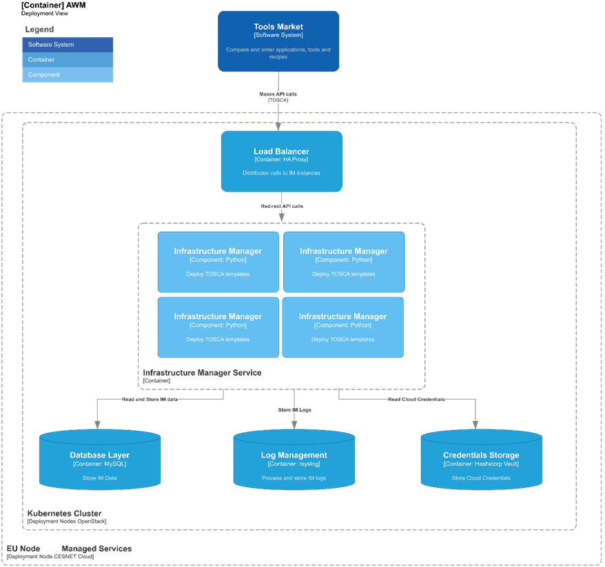

**Figure A 24 - Deployment diagram of the Application Workflow
Management service**

**Key Functional Concepts**

The Infrastructure Manager is the core deployment and orchestration
service of the Application Workflow Management layer. It enables the
execution of TOSCA templates on top of heterogeneous infrastructure
resources. Through support for OpenStack and Kubernetes environments,
the system provides flexibility across infrastructure types and supports
hybrid and multi-cloud deployment scenarios.

The contextualisation mechanism, based on Ansible, ensures that
infrastructure provisioning and application configuration are treated as
a single automated workflow. This approach promotes reproducibility,
consistency, and policy-compliant deployment patterns across
environments.

#### A1.3.2 Tools Market

**Architectural Overview**

The Tools Market is the user-facing component of the Application
Workflow Management service. It enables users within the User Space to
discover, create, modify, share, and deploy deployable tool recipes,
commonly referred to as blueprints.

The architecture supports the lifecycle of a tool from publication and
approval through configuration and eventual deployment. When a user
configures a TOSCA template and selects the deployment option, the
request is forwarded to the Application Management Layer for execution.
The deployment flow includes validation of quotas, resource allocation
checks, orchestration, and monitoring of execution status.

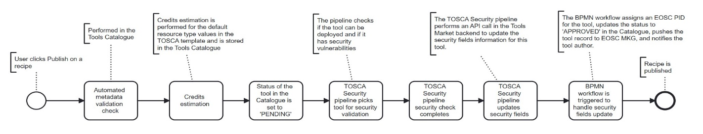

**Figure A25 - Blueprint of the Tools Publishing flow for a tool
approved to be published in the EOSC MKG**

The publishing workflow for tools intended to be included in the EOSC
Metadata Knowledge Graph follows a structured governance process.
Approved tools are registered with associated metadata, assigned
persistent identifiers where required, and made discoverable via the
EOSC ecosystem.

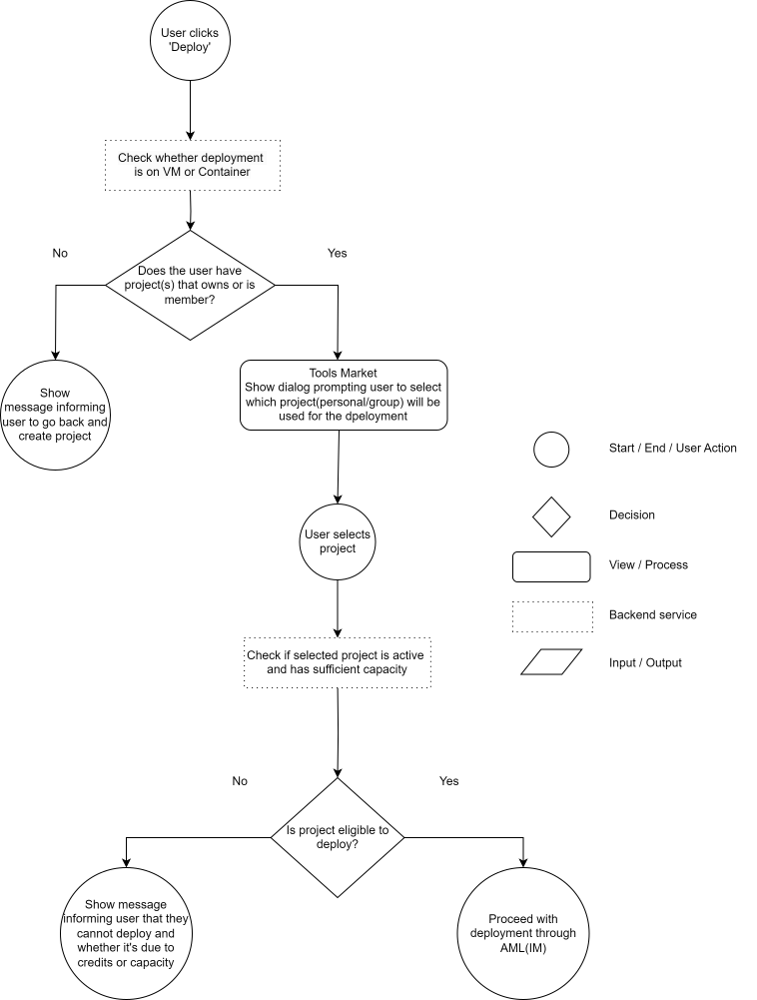

**Figure A26 - Flow in the Tools Market when a user has configured a
TOSCA template and opts to deploy it**

**Application Structure**

The Tools Market architecture consists of a presentation layer, API
management layer, business logic layer, and persistent data layer.

The front-end component is integrated into the User Space and provides
user interfaces for browsing, editing, and deploying tool recipes.

An API Gateway serves as the entry point for all front-end requests and
ensures controlled routing toward backend services.

The backend application implements the Tools Market API, handling
business logic related to tool creation, versioning, sharing
permissions, deployment initiation, and metadata management.

A dedicated Database Cluster stores metadata and configuration
information associated with tool recipes, including version history and
sharing settings.

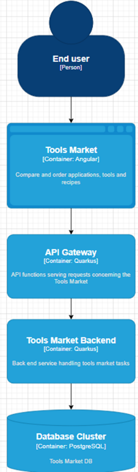

**Figure A27 - Architecture of the Tools Market**

**Data and Information Flow**

The Tools Market integrates with multiple EOSC EU Node services.

It communicates with the Application Management Layer to execute
deployment workflows. It interacts with the Service Limits and User
Credits Allocation component to verify quota availability before
deployment. It exchanges deployment-related behavioural data with the
Recommendation System to enhance personalisation capabilities. Finally,
it synchronises tool metadata with the Tools Catalogue to ensure
discoverability and metadata consistency.

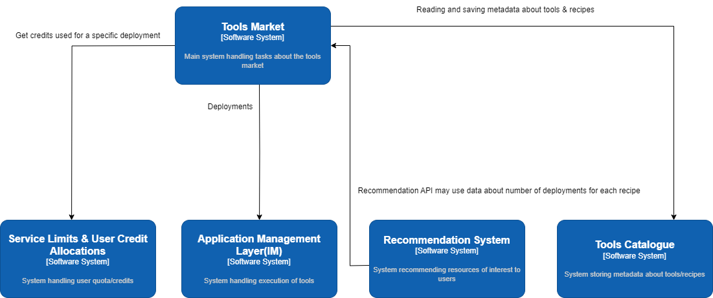

**Figure A28 - Information flow to and from the Tools Market**

Information flows in both directions. Deployment status updates,
resource consumption metrics, and execution logs are returned to the
Tools Market interface, enabling users to monitor lifecycle status in
real time.

**Deployment View**

The Tools Market is deployed as a containerised backend service behind
an API Gateway. The front-end is integrated within the broader Web
Portal User Space. The database layer is implemented as part of a
clustered database environment to ensure resilience and high
availability.

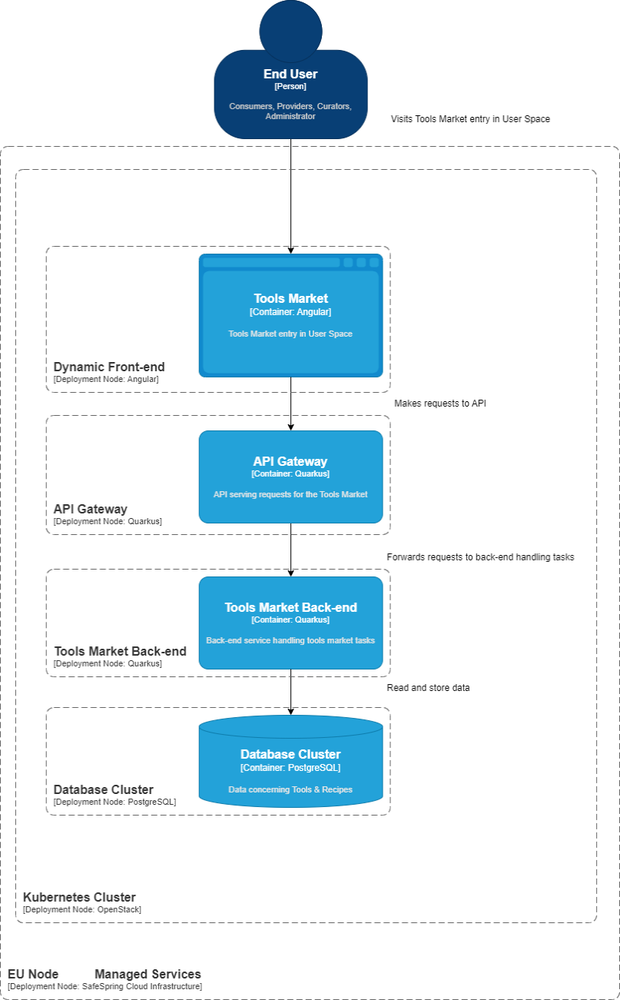

**Figure A29 - Deployment diagram for the Tools Market**

This modular deployment model allows independent scaling of the
presentation, API, and backend logic layers.

**Functional Scope**

The Tools Market enables both provider-generated and user-generated tool
recipes. These recipes describe infrastructure and application
configurations required for service integration and composability across
environments. By supporting blueprint sharing and version control, the
Tools Market facilitates collaborative reuse and reproducibility.

#### A1.3.3. Configuration Management System

**Architectural Overview**

The Configuration Management System, implemented through a Configuration
Management Database (CMDB), provides the structural backbone for
managing configuration items and service topology within the EOSC EU
Node infrastructure.

The CMDB delivers an integrated and consistent view of all entities
contributing to the IT environment. These entities, referred to as
Configuration Items (CIs), include services, service components,
endpoints, and associated assets. Each CI is described by defined
attributes and explicit relationships to other configuration items.

The service model defines the logical topology of the EOSC EU Node
environment. It establishes hierarchical dependencies between services
listed in the Service Catalogue and the underlying service assets
required to deliver these services to end users.

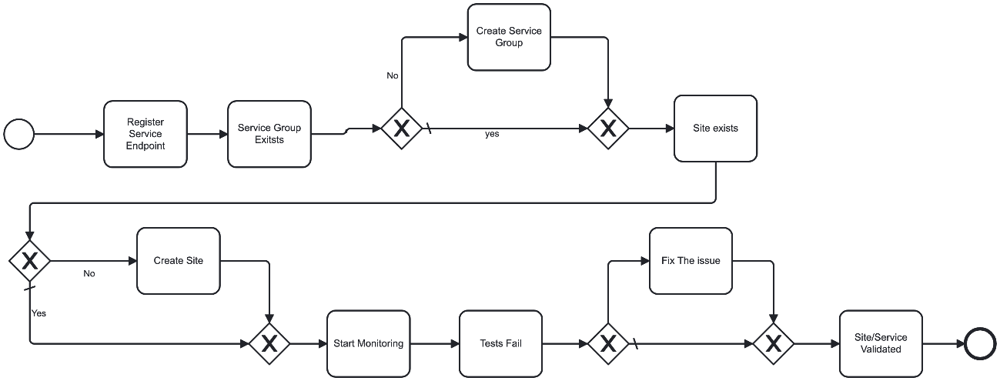

**Figure A30 - Workflow to populate the Configuration Management System
with new entries**

**Hierarchical Model**

For the EOSC EU Node CMDB, a four-level hierarchical structure has been
defined.

At the highest level, Core and Exchange Services represent top-level
functional domains.

The second level corresponds to Managed Services, grouping related
operational capabilities.

The third level represents individual Service Components, which are the
functional building blocks of managed services.

The fourth level represents Service Endpoints, which define externally
accessible interfaces or technical access points.

This hierarchical modelling approach enables structured dependency
mapping, impact analysis, and change management across the service
landscape.

**Data and Information Flow**

The Configuration Management System receives input from onboarding
workflows, service deployment processes, and catalogue updates. New
configuration items are introduced through controlled workflows that
ensure schema compliance and relational integrity.

The system exposes a REST API enabling other services to query
configuration data, retrieve topology information, and update
configuration states where authorised.

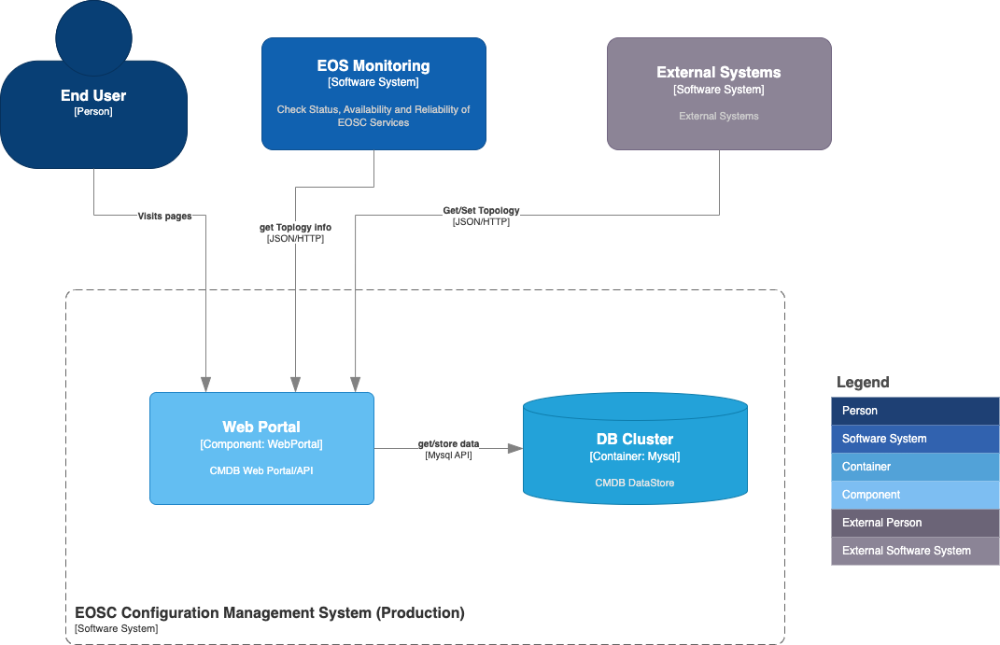

**Figure A31 - Architecture of the Configuration Management System**

**Deployment View**

The Configuration Management System consists of three principal
components: a Web Portal interface for authorised users, a REST API for
system integration, and a Database Cluster serving as the persistent
backend.

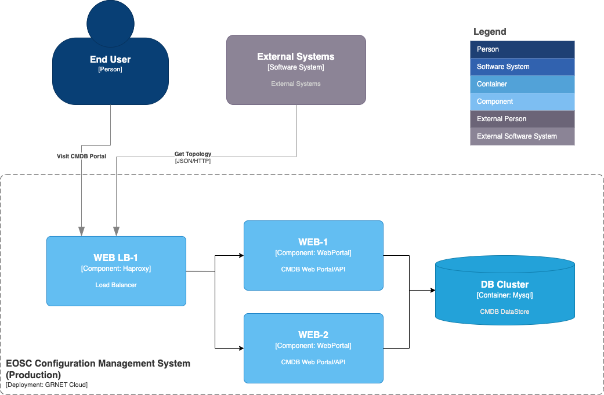

**Figure A32 - Deployment diagram for the Configuration Management
System**

The database schema is defined according to the established service
model and enforces relational consistency across configuration items and
dependencies.

**Strategic Role within AWM**

The Configuration Management System ensures traceability, governance,
and structural integrity across the Application Workflow Management
domain. By maintaining an authoritative representation of service
topology and configuration dependencies, it supports operational
control, change management, incident analysis, and compliance
verification.

### A1.4. Managed Service 4: Identity Management

Managed Service 4 provides the federated Identity and Access Management
(IAM) capabilities of the EOSC EU Node. It delivers authentication,
authorisation, identity federation, attribute management, and policy
enforcement services across Core and Exchange components. The
architecture is designed to support interoperability across multiple
protocols, ensure secure cross-service interactions, and provide a
unified Single Sign-On (SSO) experience.

The Identity Management service is structured around the EOSC Access
Federation, the Identity Hub & Infrastructure Proxy, the EOSC Core
Infrastructure Proxy, and supporting services such as token translation
and step-up authentication.

#### A1.4.1. Architecture Overview - User Authentication and Registration

**Authentication and Registration Flow**

User authentication begins when an end user attempts to access the Web
Portal Front Office (Web Portal FO). If the user does not have an active
session, the portal presents a login option.

Upon initiating login, the Web Portal FO redirects the user to the
Identity Hub & Infrastructure Proxy. This component acts as the central
authentication broker within the EOSC Federated AAI.

If the user has not previously selected an Identity Provider (IdP), the
Identity Hub & Infrastructure Proxy redirects the user to the Discovery
Service. The Discovery Service allows the user to select their preferred
home Identity Provider from the federation. Once selected, the Discovery
Service returns control to the Identity Hub & Infrastructure Proxy along
with an identifier indicating the chosen IdP.

The Identity Hub & Infrastructure Proxy then initiates an authentication
request toward the selected Identity Provider using the appropriate
federation protocol (SAML2, OpenID Connect, or OAuth2). The user
authenticates with their home IdP. Upon successful authentication, the
Identity Provider returns an authentication response containing identity
assertions and attributes.

The Identity Hub & Infrastructure Proxy validates the received assertion
and checks the Account Registry to determine whether the user is already
registered within the EOSC EU Node.

If the user is not yet registered, the system redirects them to the User
Registration Component of the Web Portal FO. During registration, the
user is required to accept the Terms of Use, the Acceptable Usage
Policy, and acknowledge the Privacy Notice. The registration component
collects the required profile attributes and submits them to the
Identity Hub & Infrastructure Proxy.

Upon completion of registration, the Identity Hub updates the Account
Registry with the user’s details and establishes the federated account.
The authenticated session is finalised, and the user is redirected back
to the Web Portal FO with an active SSO session.

**Application Structure**

The Identity Management Managed Service is logically structured into
multiple interoperating components.

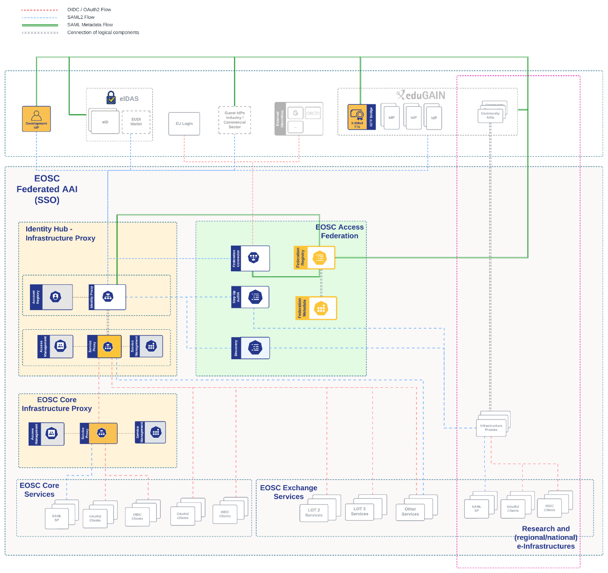

**Figure A33 - Application structure diagram for the Identity Management
Managed Service**

At the federation level, the EOSC Access Federation is responsible for
maintaining trust anchors and publishing federation metadata. It
registers and validates Identity Providers and Service Providers
participating in the federated AAI ecosystem.

The Federation Registry collects, validates, and stores metadata
describing connected services and identity providers. It exposes a
Metadata Query (MDQ) API used by the Identity Proxy and the Discovery
Service.

The Discovery Service enables dynamic selection of Identity Providers
through the SAML2 Discovery protocol. Identity Providers that do not
natively support SAML2 are integrated via the Federation Connector,
which supports OAuth2 and OpenID Connect.

The Federation Metadata component publishes and distributes signed
federation metadata used to establish trust relationships.

The Step-Up Authentication component enhances authentication assurance
levels when access to security-sensitive services is requested. It
orchestrates multi-factor authentication flows based on central
configuration or real-time service requirements.

At the core of the architecture lies the Identity Hub & Infrastructure
Proxy. This multi-protocol authentication proxy supports OAuth2, OpenID
Connect, and SAML2. It provides a consistent identity abstraction layer
to all EOSC EU Node services, ensuring protocol interoperability and
uniform attribute handling.

The Identity Hub includes several logical components. The Identity Proxy
handles user authentication flows and identity assertions. The Service
Proxy connects EOSC services to the Identity Hub and standardises
protocol interactions. The Service Management component provides a
management interface for service owners to register, configure, and
manage service lifecycle parameters. The Account Registry maintains user
accounts, attributes, personal groups, and associated metadata. The
Access Management component manages entitlements and resource
capabilities for connected services.

The EOSC Core Infrastructure Proxy connects EOSC Core Services to the
federated AAI. It includes its own Service Proxy, Access Management, and
Service Management components. It interacts with the Identity Hub via
OpenID Connect to ensure consistent authentication semantics.

The X509v3 Token Translation Service (TTS) extends the authentication
framework to support X.509 credentials. Through integration with the
IGTF Bridge, it enables authentication using X.509 certificates and can
issue certificates based on successful federated authentication,
provided policy compliance conditions are met.

**Deployment View**

The Identity Management service is deployed across multiple
infrastructure regions to ensure resilience, geographical redundancy,
and fault tolerance.

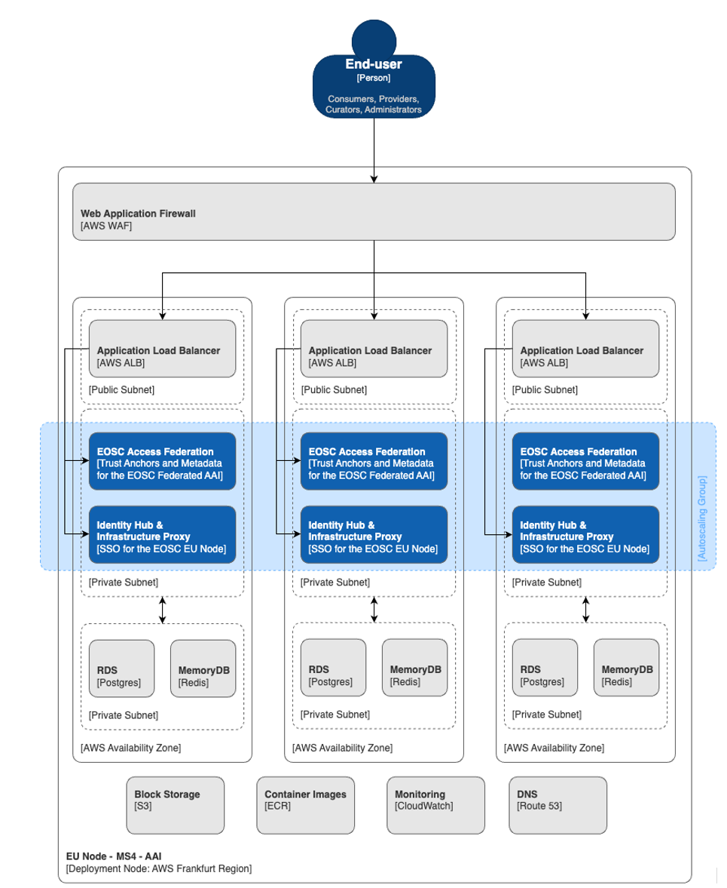

**Figure A34 - Identity Management deployment view on the "AWS Frankfurt
Region" Deployment Node**

In the AWS Frankfurt Region deployment node, the Identity Hub,
Federation components, and associated services are deployed in a
containerised environment with managed load balancing and high
availability configurations.

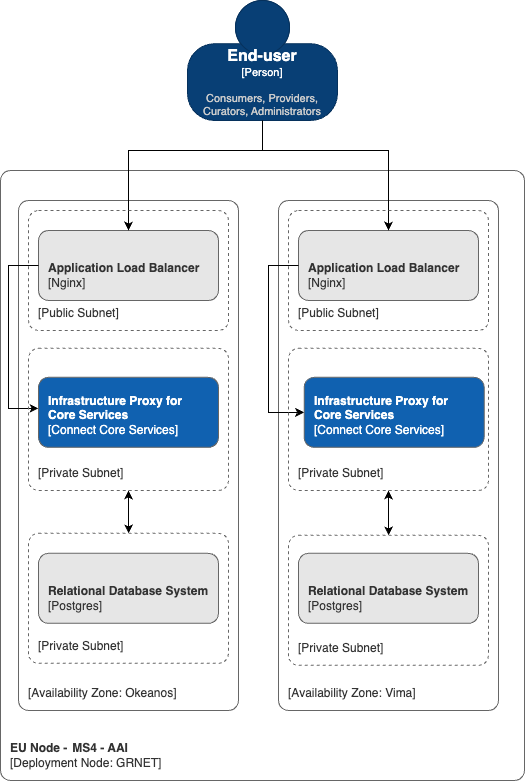

**Figure A35 - Identity Management deployment view on the "GRNET Region"
Deployment Node**

In the GRNET Region deployment node, equivalent components are deployed
to provide redundancy and cross-region failover capabilities. Federation
metadata distribution and token validation mechanisms ensure trust
consistency across regions.

This dual-region deployment model ensures operational continuity,
scalability, and compliance with availability requirements.

#### A1.4.2. Key Concepts

**Attributes and Claims**

After successful authentication, EOSC EU Node services receive identity
information in the form of claims (for OpenID Connect and OAuth2) or
attributes (for SAML2). For consistency, the term “claims” is used to
refer to both.

Claims are categorised as mandatory or optional. Mandatory claims are
always provided for authenticated sessions and include essential
identifiers and core attributes required for service operation.

Optional claims are provided subject to conditions such as the policies
of the user’s home Identity Provider, user consent settings, requested
scopes, and applicable data sharing agreements. Services must be
designed to handle the absence of optional claims gracefully while
leveraging them when available.

##### Subject Identifier (sub)

- Globally unique, never reassigned user identifier (mandatory).

- Types: *public* (same for all clients) and *pairwise* (different per
  client).

- Single-valued, always available.

- Must be used by clients to uniquely identify users.

- Test account test@eosc-federation.eu must not be authorised for real
  resources.

##### Community User Identifier – Experimental (voperson_id)

- Opaque, non-revocable community identifier.

- Single-valued, always available when requested.

- Experimental (AARC Blueprint); not for production use yet.

- Scope currently eosc-federation.eu, may change in future.

##### Display Name (name)

- User’s full name (first + last).

- Single-valued, available when requested.

- Not unique.

##### Given Name (given_name)

- User’s first name.

- Single-valued (OIDC supports one value only).

- Available when requested.

- Not unique.

##### Family Name (family_name)

- User’s surname.

- Single-valued (OIDC supports one value only).

- Available when requested.

- Not unique.

##### Email Address (email, email_verified)

- User’s email (always verified in EU Node AAI).

- Single-valued, available when requested.

- Not unique.

##### Home Organization (schac_home_organization)

- Domain name of user’s home organisation.

- Single-valued.

- May be available when requested.

- Not unique.

##### Affiliation within Home Organization (voperson_external_affiliation)

- User’s affiliation(s) (e.g., faculty, member, affiliate).

- Multi-valued.

- May be available when requested.

- Requires federated login via home organisation.

- Values refreshed every 12 months.

##### Assurance (eduperson_assurance)

- Identity assurance level (REFEDS Assurance Framework).

- Multi-valued.

- Always available when requested.

- Covers identity assurance (authentication assurance via OIDC acr).

##### Resource Capabilities (entitlements)

- Defines resources and actions user is authorised to access.

- Multi-valued.

- May be available when requested.

- URN-based structure; namespace may evolve with new domains/RIs.

**Information Model and Account Registry**

Each user maintains a personal account stored in the Account Registry.
The account is created during registration and updated upon profile
modification.

The Account Registry centrally manages projects, groups, roles, and
resource capabilities. These entities are administered through the Web
Portal Front Office.

The hierarchical model includes Personal Projects and Group Projects. A
Personal Project is owned and operated by a single user. A Group Project
has a single owner and multiple members who join through an
invitation-based workflow.

Projects function as logical containers for resource allocation and
authorisation. Resource allocation may include service-specific quotas
or budget-based allocations.

The Web Portal FO manages project creation, membership management, and
resource allocation mappings via the AAI API and Credits Management API.
Provisioning information is transmitted to Exchange services. Services
must not pre-create user accounts locally. Instead, accounts and
mappings must be established on a just-in-time basis during
authentication, using project and group information conveyed in identity
tokens.

**User Profile Management**

Users access their EOSC EU Node Profile via the Web Portal FO, which
aggregates information from multiple backend components, including the
AAI.

Through the portal, users can view and modify profile data, update
contact information, request and manage projects, enforce logout across
sessions, and close their accounts.

Federated logout is exclusively managed by the Web Portal FO. Individual
services must perform local logout operations only, as federated logout
from a service would terminate sessions across the entire ecosystem.

**Authorisation Model**

All EOSC EU Node services are integrated with the AAI as OpenID Connect
clients and/or OAuth2-protected services, with limited SAML-based
exceptions.

Each authenticated user receives a unique identifier that services must
use as the canonical user reference.

End-user authorisation is based on project membership and resource
allocation. A user is authorised to access a service if they are a
member of an active project with allocated resources for that service.

In OpenID Connect flows, project membership is conveyed via the
entitlements claim through the userinfo endpoint. For protected APIs,
entitlements are retrieved via the OAuth2 Token Introspection endpoint.

Administrative authorisation is based on membership in designated admin
groups, conveyed similarly through entitlements claims.

**Service-to-Service Authorisation**

Inter-service communication within the EOSC EU Node relies exclusively
on token-based mechanisms issued by the AAI. Static API keys or
passwords are not permitted.

Services such as the Web Portal FO are registered as OAuth2 clients
using appropriate grant types, including the Client Credentials Grant.
When accessing protected APIs, services present tokens that are
validated using OAuth2 Token Introspection.

**Capability-Based Authorisation**

Advanced authorisation mechanisms support capability-based access
control. A capability expresses fine-grained permissions over resources
or sub-resources and may include permitted actions.

Capabilities are conveyed in entitlements or scope claims and are
available via userinfo or introspection endpoints. Services requiring
fine-grained authorisation must register their capabilities with the
AAI. Capability-based authorisation is optional but recommended for
complex services.

**Recommended OpenID Connect Configuration**

Services integrating with the EOSC EU Node AAI must select appropriate
client types and grant types based on their architecture.

Confidential clients authenticate using client credentials and are
suitable for server-side applications. Public clients, typically
browser-based applications without secure backend storage, must
implement PKCE to mitigate authorisation code interception risks.

The AAI supports multiple grant types, including:

- authorization_code

- refresh_token

- device_code

- token_exchange

- client_credentials.

Most services should request the authorization_code grant, optionally
combined with refresh_token. Public clients requesting
authorization_code must support PKCE. Service owners are advised to
request only the grant types necessary for their use case.
Over-provisioning grant types is discouraged and may introduce security
risks.

### A1.5. Managed Service 5: Monitoring and Accounting

Managed Service 5 provides the operational observability, accounting,
messaging, and order lifecycle management capabilities required to
ensure transparency, reliability, and policy compliance across the EOSC
EU Node ecosystem. It integrates usage accounting for research products
and services, real-time event messaging, infrastructure and service
monitoring, and a workflow-driven Order Management System.

The service is structured into five principal components: Accounting for
Research Products, Accounting for Services, Messaging Service,
Monitoring Service, and the Order Management System.

#### A1.5.1. Accounting for Research Products

**Architectural Overview**

The Accounting for Research Products component provides continuous and
standards-compliant tracking of usage metrics for research outputs made
available through the EOSC EU Node ecosystem. The architecture supports
automated collection of view and download statistics, anonymisation of
user-related network data, integration with the EOSC EU Node Metadata
Knowledge Graph (MKG), and generation of downloadable usage reports.

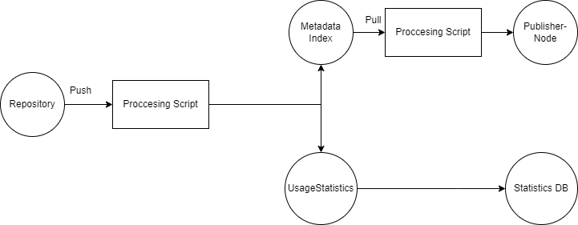

**Figure A36 - Accounting for research Products behaviour**

The behavioural architecture defines event tracking workflows that
capture user interactions with research products. These interactions are
validated, filtered, anonymised where required, and stored in structured
form for aggregation and reporting. The system ensures adherence to the
COUNTER Code of Practice for usage statistics, thereby guaranteeing
methodological transparency and consistency.

**Application Structure**

The application structure separates data collection, aggregation,
compliance validation, and reporting functionalities.

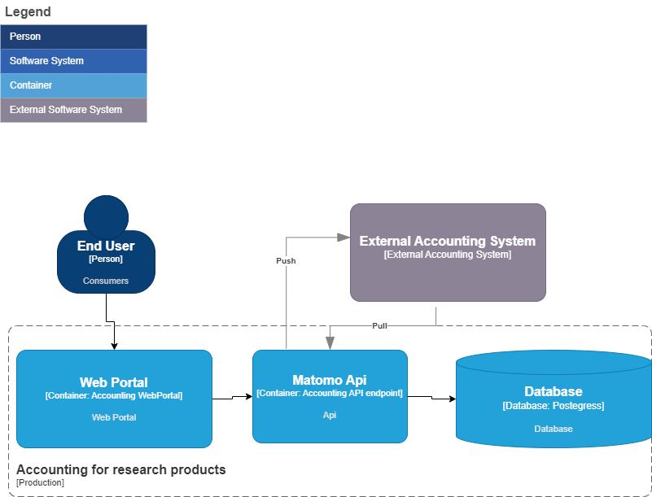

**Figure A37 - Application Structure Diagram**

Usage tracking components capture views and downloads in real time. A
processing layer validates events, enforces IP anonymisation policies,
and ensures COUNTER compliance rules are applied before persistence.

An aggregation layer consolidates usage data over defined time periods,
enabling the generation of consolidated statistics for reporting
purposes. Reporting modules allow authorised content providers to
download usage reports in structured formats.

Integration interfaces ensure synchronisation with the EOSC EU Node MKG
so that accounting records remain aligned with metadata records and
persistent identifiers.

**Deployment View**

The Accounting for Research Products service is deployed across
containerised infrastructure components. Tracking services are exposed
via scalable endpoints capable of handling large volumes of usage
events.

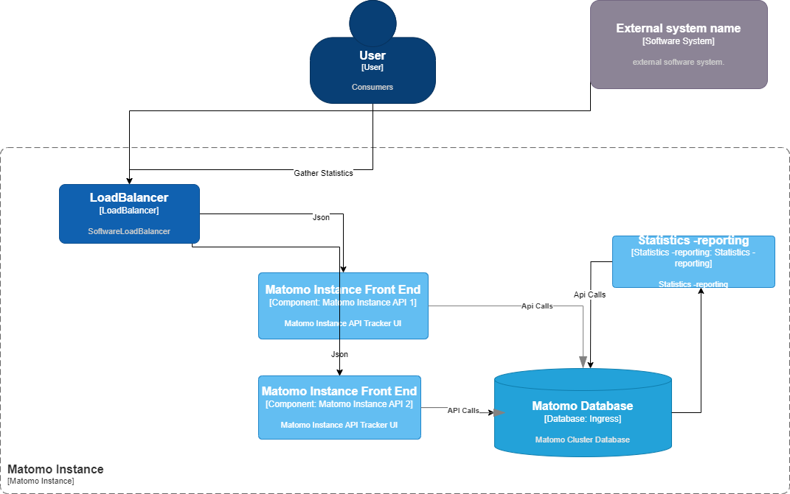

**Figure A38 - Deployment view**

Data storage is implemented using persistent database backends designed
for high write throughput and efficient aggregation queries. Reporting
components are deployed as stateless services behind load balancers to
ensure availability and performance.

The deployment architecture ensures secure access for registered content
providers and enforces authentication for all reporting interfaces.

#### A1.5.2. Accounting for Services

**Architectural Overview**

The EOSC Accounting Service for Services is designed to collect,
aggregate, and exchange operational and consumption metrics across
infrastructures, providers, and projects.

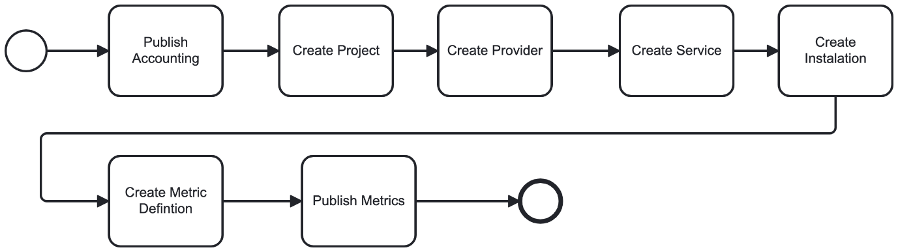

**Figure A39 - Architecture Diagram for Service Accounting**

The system exposes a RESTful API that accepts accounting data
submissions from diverse resources. Submitted metrics are validated,
stored in a structured database, and aggregated according to predefined
reporting dimensions such as time period, project, service, or provider.

An intuitive user interface enables authorised clients to access
accounting data for selected time intervals and operational scopes.

**Data and Information Flow**

Service providers submit accounting metrics through authenticated API
endpoints. Incoming data is validated and stored in the accounting
database. Aggregation processes compute summarised views that are made
available via both API responses and dashboard interfaces.

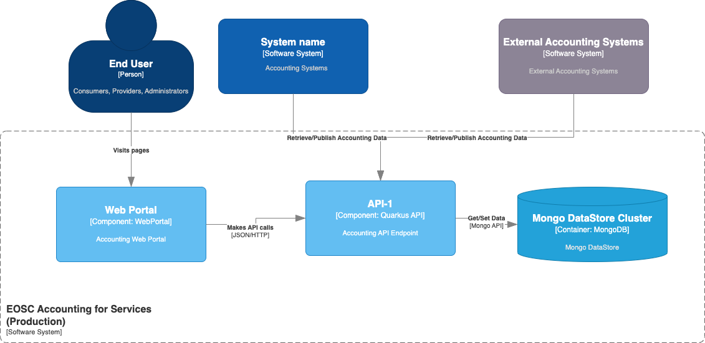

**Figure A40 - Data and Information flow Diagram for Service
Accounting**

Access to all API resources is restricted to authenticated clients.
Token-based authentication ensures secure transmission of sensitive
usage and consumption data.

**Deployment View**

The Service Accounting component is deployed as a scalable backend
application behind secure API gateways. A database cluster ensures
durability and performance for incoming metrics.

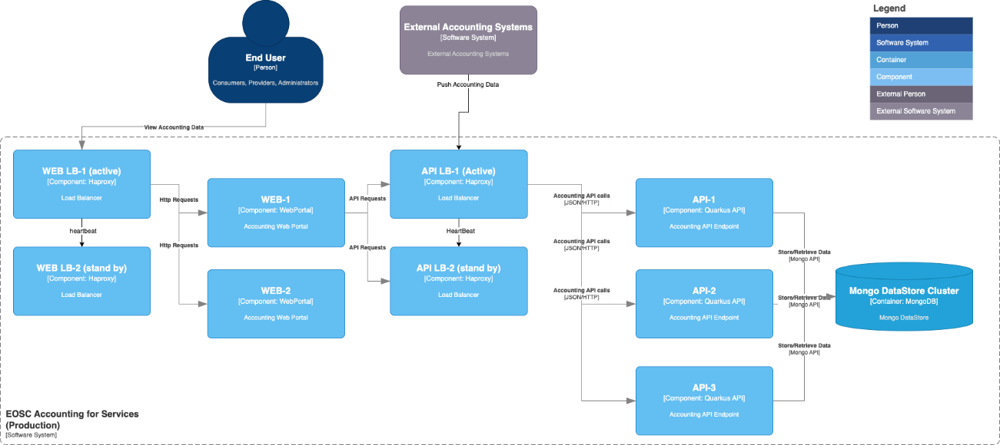

**Figure A41 - Deployment diagram for Service Accounting**

The user interface layer is deployed as a web-based dashboard connected
to the backend through secure API calls. Horizontal scaling is supported
to accommodate varying metric ingestion volumes.

#### A1.5.3. Messaging Service

**Architectural Overview**

The EOSC Messaging Service enables real-time, event-driven workflows
across the EOSC EU Node ecosystem. It provides a simplified REST API
that abstracts the complexity of underlying messaging protocols while
ensuring high reliability and scalability.

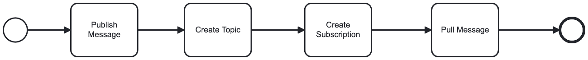

**Figure A42 - Publishing a message workflow with the Messaging
Service**

The architecture supports publishing and subscribing workflows, enabling
services to exchange event notifications, state changes, and operational
signals in near real time.

**Core Reliability Characteristics**

The Messaging Service ensures durability by storing replicated copies of
messages across multiple servers, thereby guaranteeing at-least-once
delivery semantics.

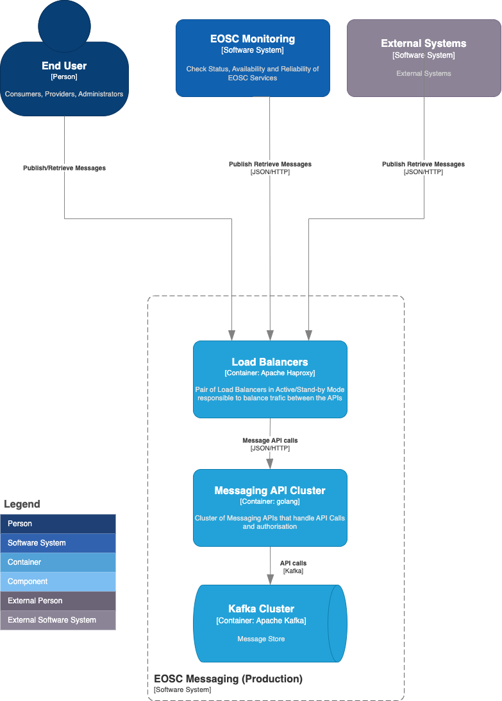

**Figure A43 - Data and information flow of the Messaging service**

Scalability is achieved through distributed architecture capable of
handling increasing workloads without significant latency degradation.
The system is dimensioned to process more than one billion messages per
year.

Latency is optimised through high-performance messaging clusters capable
of sustaining high throughput with minimal processing delay.

Availability is maintained through automated failover mechanisms that
address hardware, software, or load-related failures in a manner
transparent to end users.

**Core Components**

The architecture depends on three foundational components.

A ZooKeeper cluster provides distributed coordination, configuration
management, naming services, and synchronisation across messaging nodes.

A Kafka cluster implements the distributed publish-subscribe messaging
backbone. Kafka ensures high throughput, durability, and fault
tolerance.

A distributed metadata store, based on MongoDB, maintains messaging
configuration and tenancy metadata.

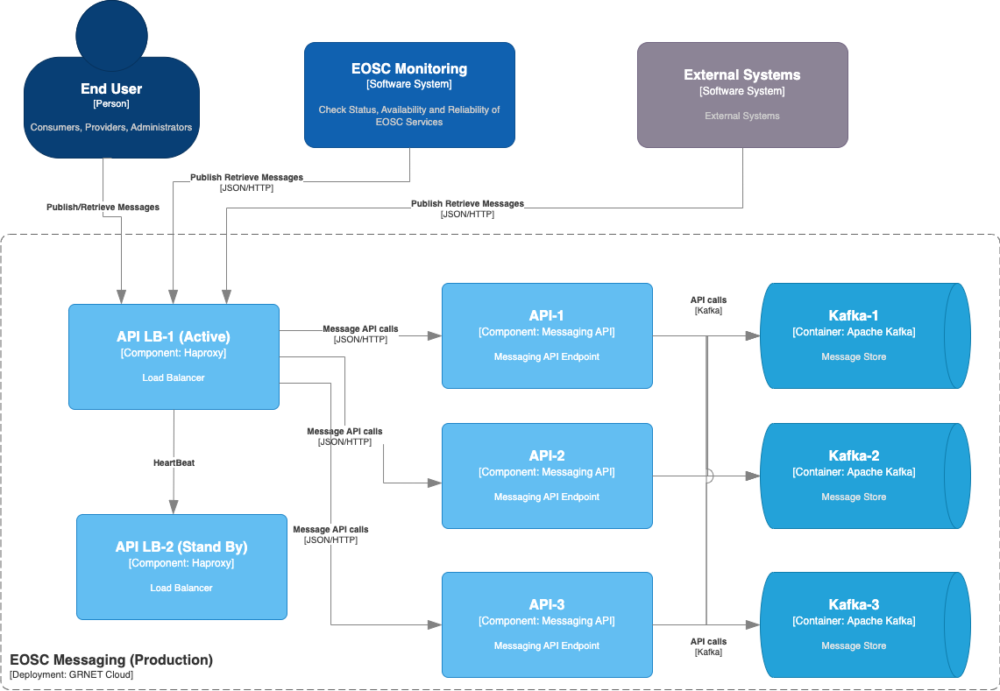

**Figure A44 - Deployment of the Messaging service**

**Multi-Tenancy and Namespacing**

The Messaging API supports logical segregation through project-based
namespacing. Each tenant is associated with one or more projects, which
may contain multiple topics, subscriptions, and users.

A typical deployment includes load balancers, such as HAProxy,
positioned in front of the messaging cluster to distribute incoming API
traffic and maintain availability.

#### A1.5.4. Monitoring Service

**Architectural Overview**

The Monitoring Service provides continuous observability across
EOSC-Core and EOSC-Exchange services. It enables infrastructure
operators, service providers, and management stakeholders to monitor
availability, reliability, SLA conformance, and operational health.

Monitoring workflows collect endpoint health data, service metrics, and
performance indicators. Results are aggregated and visualised through
dashboards tailored to both providers and end users.

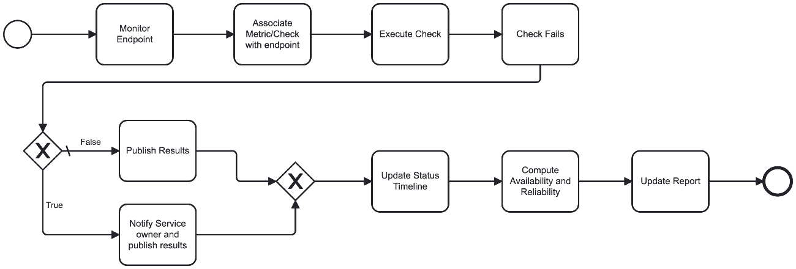

**Figure A45 - Monitoring endpoint workflow and results reporting**

**Functional Scope**

The Monitoring Service supports monitoring of EOSC-Core services as well
as EOSC-Exchange services integrated via defined onboarding options.

It provides availability and reliability reporting, service status
visualisation, and configurable dashboards.

The system supports real-time alerting to providers and EOSC-Core
operators. Alerting policies may range from basic availability
notifications to complex conditions, such as resource profile
inconsistencies or SLA breaches.

APIs enable third-party systems to retrieve monitoring data
programmatically.

**Architectural Characteristics**

The Monitoring Service is designed to support multiple entry points and
heterogeneous monitoring integrations. It operates with high
availability across distributed components.

Multi-tenancy support allows segmentation of monitoring views and
configurations. Flexible metric and profile configuration enables
customisation according to service type and operational needs.

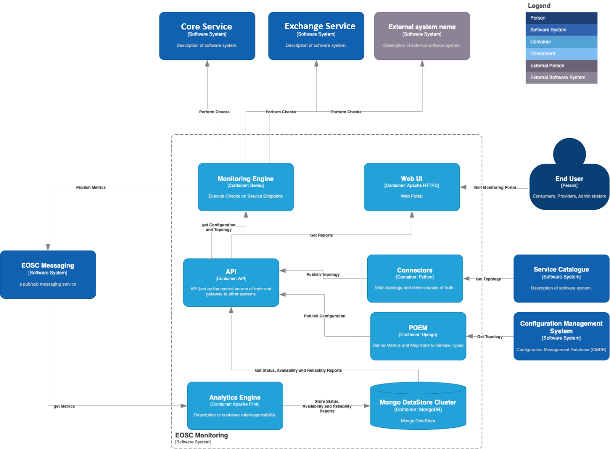

**Figure A46 - Architecture of the Monitoring service**

The Monitoring Service integrates both EOSC-Core and EOSC-Exchange
monitoring under a unified operational model. The implementation adopts
ARGO technology as the underlying monitoring framework.

**Deployment View**

Monitoring components are deployed in high-availability configurations
with redundant data collection nodes, aggregation engines, and dashboard
front-ends. Persistent storage backends retain historical metrics for
trend analysis and reporting.

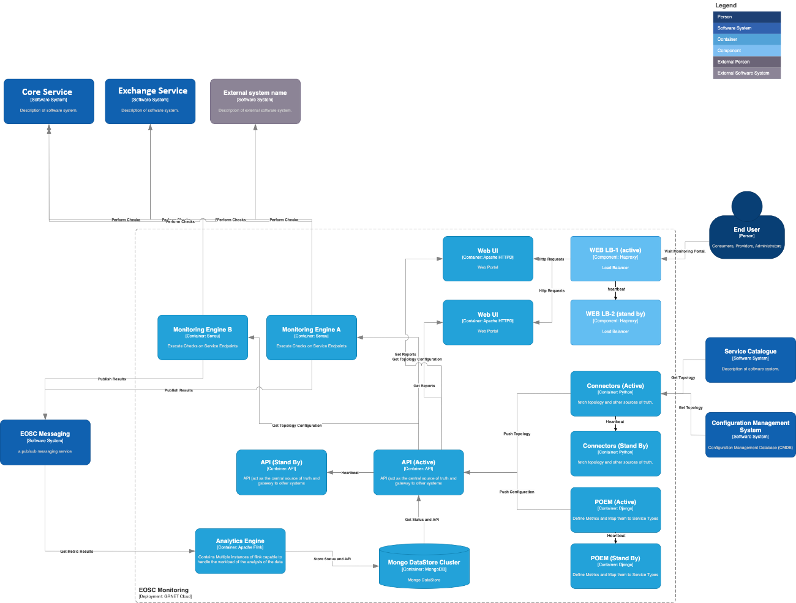

**Figure A47 - Deployment diagram for the Monitoring service**

#### A1.5.6. Order Management System

**Architectural Overview**

The Order Management System (OMS) orchestrates the lifecycle of resource
orders within the EOSC EU Node. It supports ordering of both internal EU
Node resources and externally onboarded provider offerings.

The order-process workflow governs validation, approval, provisioning,
and completion steps while continuously updating order status. The
workflow performs prerequisite checks, enforces policy requirements,
and, where necessary, incorporates additional approval stages.

Provisioning is executed either by invoking internal Exchange service
provisioning APIs or, for external services, through a JIRA adapter that
facilitates communication with external provider systems.

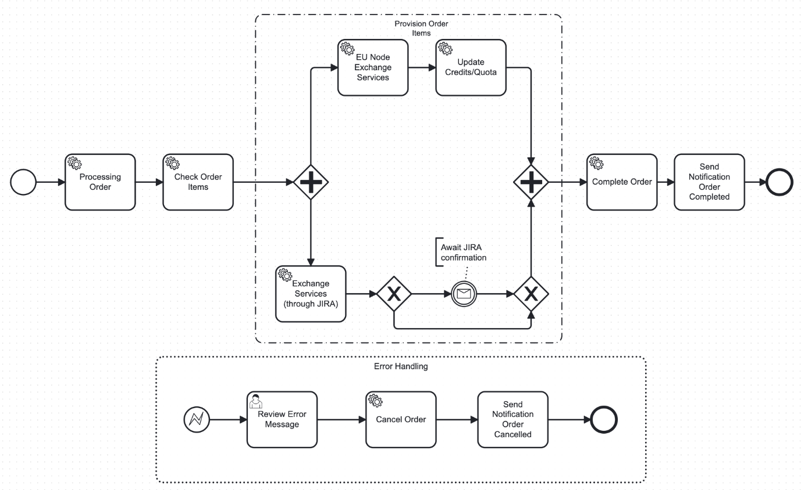

**Figure A48 - Order process diagram**

**Application Structure**

The OMS consists of a backend application implementing service APIs, a
BPMN engine responsible for executing asynchronous workflows, and a
Database Cluster storing ordering and offering schemas.

The BPMN system manages state transitions, approval flows, and
asynchronous integration steps. Message brokers facilitate event-driven
coordination between workflow stages.

The JIRA adapter provides a structured integration channel with external
providers, enabling ticket-based provisioning processes where direct API
integration is not available.

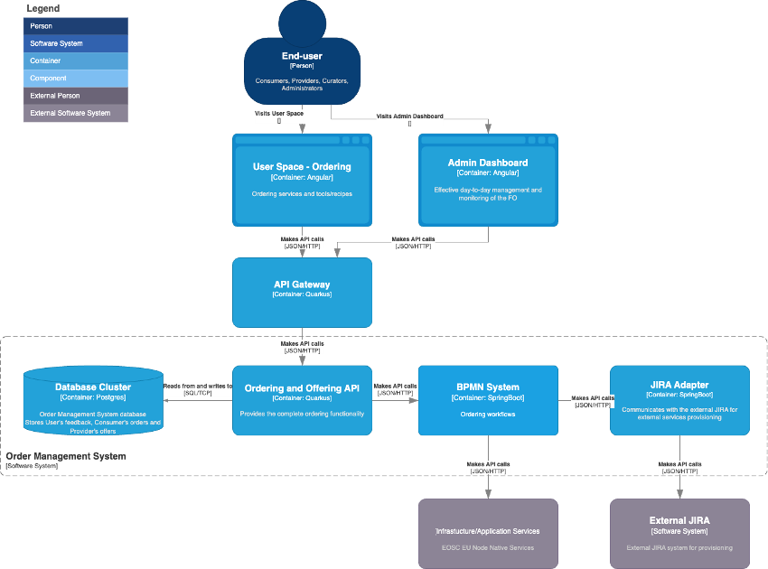

**Figure A49 - Interfaces of the Order Management system**

**Data and Information Flow**

Users initiate orders via the User Dashboard. The backend validates user
entitlements, resource availability, and quota allocation. Workflow
instances are triggered in the BPMN engine.

Provisioning status updates are propagated back to the user interface.
Integration with the Credits Management System ensures automated
verification of budget and quota allocations.

Exchange services receive provisioning instructions via secure APIs.
External providers receive structured requests through the JIRA adapter.

**Deployment View**

The OMS backend is deployed as a containerised application behind API
gateways. The BPMN engine operates as a dedicated workflow runtime
service.

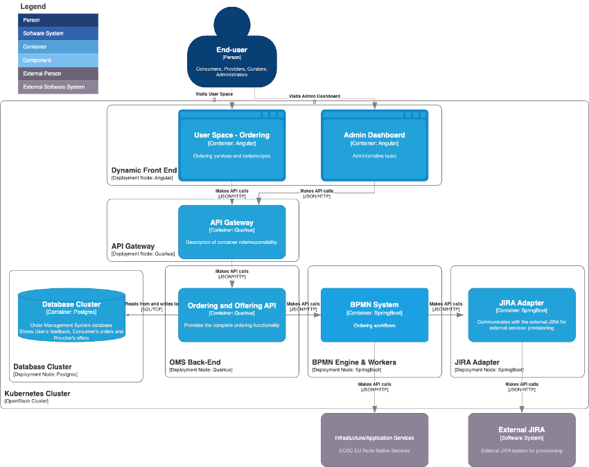

**Figure A50 - Deployment diagram for the Order Management system**

The Database Cluster ensures transactional integrity of order records
and offering definitions. High availability configurations protect
workflow continuity and order state persistence.

### A1.6 Managed Service 6: Service Management System

Managed Service 6 encompasses the organisational, procedural, and
tooling framework required to ensure that EOSC EU Node services are
delivered, supported, secured, and continuously improved in a
production-grade environment. It includes the EOSC Service Management
System (SMS), the EOSC EU Node Helpdesk, internal collaboration tooling,
security coordination mechanisms, and quality verification and
validation processes.

While the SMS defines the overarching governance and operational
framework, the Helpdesk represents the primary operational interface for
end users and service providers. As such, particular emphasis is placed
on the Helpdesk architecture and its integration within the federated
EOSC environment.

#### A1.6.1. Service Management System

**Overview**

The EOSC Service Management System (SMS) constitutes the formal
management framework governing the delivery of EOSC Core services. It
ensures that services are provided at production quality and in
accordance with agreed service levels.

The SMS is structured according to FitSM principles, a widely adopted
family of lightweight IT Service Management (ITSM) standards. It defines
roles, responsibilities, processes, policies, documentation artefacts,
and supporting tools necessary to operate and govern the EOSC Core and
Exchange services.

**Functional Scope**

The SMS performs several critical governance and operational functions.

It captures and maintains essential information about all managed
services within a structured Service Portfolio. Each service portfolio
entry defines ownership, operational responsibilities, service scope,
dependencies, and lifecycle status.

The SMS coordinates the EOSC Helpdesk across all managed services,
ensuring consistent incident and request management practices.

It defines, establishes, monitors, and reports on agreed service levels.
This includes capacity planning, availability targets, and
stakeholder-oriented reporting. Through these mechanisms, the SMS
ensures that services meet agreed performance and reliability
objectives.

Security coordination is embedded within the SMS framework. It
establishes security policies, defines security responsibilities, and
ensures consistent adoption of security practices across managed
services. This coordination function supports trust establishment within
the EOSC EU Node ecosystem.

Continuous improvement is a core SMS function. Feedback is collected
from multiple sources, including operational reviews, stakeholder
consultations, incident analysis, and end-user satisfaction surveys.
Identified improvement actions are assessed, prioritised, and
implemented in a structured manner, ensuring iterative enhancement of
both services and the SMS itself.

**Data and Information Flow**

The Service Management System interacts bidirectionally with all Managed
Services. Operational metrics, SLA reports, incident statistics, and
improvement proposals are collected from services and consolidated
within SMS governance processes.

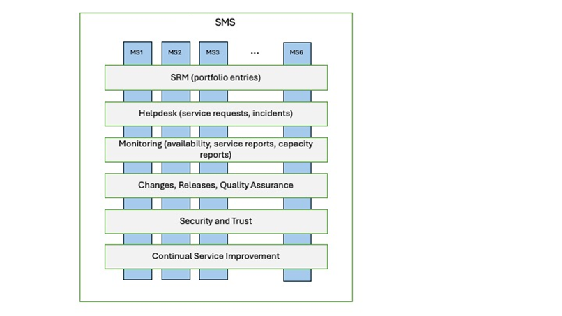

**Figure A51 - Information flow for the Service Management System**

Conversely, the SMS distributes policies, procedures, service level
definitions, and improvement actions to service owners and operational
teams. The information flow ensures alignment between governance
requirements and operational execution.

#### A1.6.2. Helpdesk

**Overview**

The EOSC EU Node Helpdesk serves as the central support entry point for
users and service providers. It provides incident management, service
request handling, and communication workflows necessary to support EOSC
services in a federated environment.

In the context of EOSC, the Helpdesk must accommodate multiple
communities, service providers, and support structures while maintaining
coherent operational processes. The architecture therefore supports
scalability, multi-tenancy, role differentiation, and integration with
federated authentication mechanisms.

The Helpdesk is implemented using open-source software, enabling
extensibility, transparency, and long-term sustainability.

**Operational Model**

The Helpdesk supports two primary actor categories: users and service
providers.

Users submit incidents and service requests through the Helpdesk
interface. Service providers, acting as helpdesk agents or supporters,
manage, triage, and resolve assigned tickets. These categories are not
mutually exclusive; service supporters may also act as users when
submitting requests to other services or support units.

Supporters may operate under multiple sub-roles within the Helpdesk
system. These roles enable differentiated responsibilities such as
resolving service malfunctions, addressing feature requests, providing
consultancy, or managing escalations.

The architecture supports an unlimited number of service provider
accounts and agents. This scalability requirement ensures that the
Helpdesk can grow alongside the expanding EOSC ecosystem without
structural limitations.

**Application Structure**

The Helpdesk system is structured into a user interface layer, a ticket
management backend, and integration interfaces.

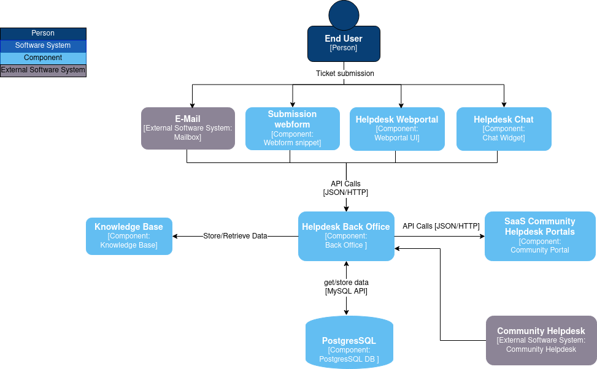

**Figure A52 - Application structure of the Helpdesk system**

The user-facing portal enables ticket submission, ticket tracking, and
knowledge base access. It integrates with the EOSC Portal AAI to provide
federated authentication.

The backend application manages ticket lifecycle states, role-based
access control, routing workflows, and notification mechanisms.

Integration interfaces allow ticket creation via web forms and email
gateways. Automatic routing rules distribute tickets from the central
EOSC Helpdesk to dedicated community support units based on predefined
workflows.

The system supports multiple support units with hierarchical nesting,
enabling the creation of structured support divisions. Tickets can be
reassigned or escalated between units as required.

**Data and Information Flow**

Users can submit tickets for any EOSC resource, service, process, or
procedure. Before submitting a ticket, users can search the integrated
Knowledge Base to identify existing solutions.

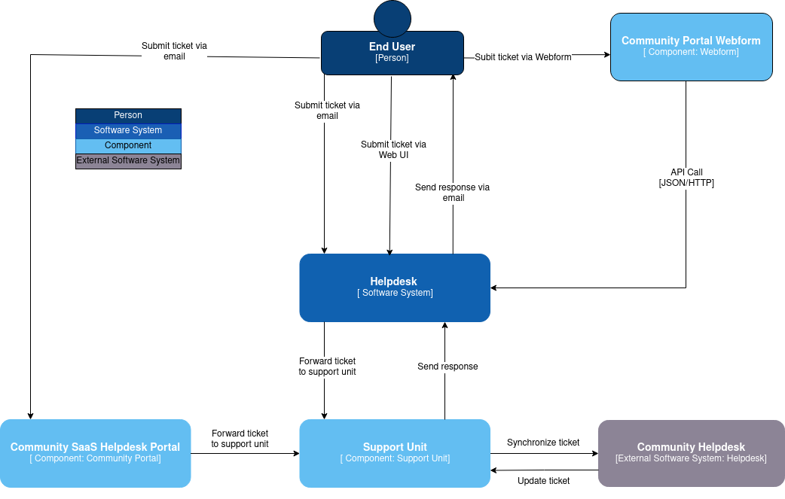

**Figure A53 - Helpdesk interfaces**

Tickets are created either through the web portal or via email
submission. Upon creation, tickets are assigned to appropriate support
units based on routing rules. Supporters manage ticket resolution
through structured workflows.

Notification mechanisms inform users and agents of status updates.
Notifications are configurable at the support unit level, allowing
communities to define tailored communication policies.

Statistical data and key performance indicators are collected for
reporting purposes. Metrics such as first-contact resolution rate,
average time to first response, average resolution time, and user
satisfaction scores are available for service quality assessment.

**Community and Provider Requirements**

From the perspective of service providers and EOSC communities, the
Helpdesk must support decentralised yet coordinated operations.

The system enables ticket generation through community-specific portals
and general email addresses. It supports multiple support units,
hierarchical structures, and granular role management.

Communities can configure automated responses, email templates, and
notification preferences. Dedicated community Helpdesk portals allow
branding and contextualisation while maintaining central governance
alignment.

Automatic ticket routing ensures that tickets submitted to the central
EOSC Helpdesk are redirected to the appropriate community support unit
based on defined rules.

**Technical Constraints and Architectural Considerations**

The current Helpdesk implementation does not include a native
Configuration Management Database (CMDB). Consequently, direct
association of tickets with configuration items and historical incident
tracking at the CI level is limited. Where required, integration with an
external CMDB must be implemented to enable configuration-aware incident
management.

Security is a core architectural requirement. The Helpdesk enforces
federated user authentication via AAI, role-based access control, data
encryption in transit, and logging of access activities, including login
history from different locations.

Scalability is a key design criterion. The system must support
increasing volumes of tickets, support units, and agents without
performance degradation.

Multi-tenancy support enables the Helpdesk to operate as a service for
multiple communities integrated within the EOSC EU Node. Logical
segregation ensures data isolation while preserving central operational
governance.

### A1.7 Software Products in use

<table>
<colgroup>
<col style="width: 27%" />
<col style="width: 22%" />
<col style="width: 27%" />
<col style="width: 22%" />
</colgroup>
<thead>
<tr>
<th style="text-align: left;">Layer</th>
<th style="text-align: left;">Component</th>
<th style="text-align: left;">Software</th>
<th style="text-align: left;">Licence</th>
</tr>
</thead>
<tbody>
<tr>
<td rowspan="5">Identity Hub &amp; Infrastructure Proxy</td>
<td>Identity Proxy</td>
<td><a
href="https://github.com/IdentityPython/SATOSA"><u>SATOSA</u></a></td>
<td>Apache 2.0</td>
</tr>
<tr>
<td>Service Proxy</td>
<td><a
href="https://github.com/IdentityPython/SATOSA"><u>SATOSA</u></a></td>
<td>Apache 2.0</td>
</tr>
<tr>
<td>Access Management</td>
<td><a
href="https://github.com/IdentityPython/SATOSA"><u>SATOSA</u></a></td>
<td>Apache 2.0</td>
</tr>
<tr>
<td>Service Management</td>
<td><a
href="https://github.com/IdentityPython/SATOSA"><u>SATOSA</u></a></td>
<td>Apache 2.0</td>
</tr>
<tr>
<td>Account Registry</td>
<td><a href="https://github.com/CESNET/perun"><u>Perun</u></a></td>
<td>BSD-2-Clause</td>
</tr>
<tr>
<td rowspan="5">EOSC Access Federation</td>
<td rowspan="2">Metadata</td>
<td><a
href="https://github.com/IdentityPython/pyFF"><u>pyFF </u></a></td>
<td>BSD-2-Clause</td>
</tr>
<tr>
<td><a
href="https://github.com/TheIdentitySelector/thiss-mdq"><u>ThissMDQ</u></a></td>
<td>BSD-2-Clause</td>
</tr>
<tr>
<td>Discovery</td>
<td><a
href="https://github.com/TheIdentitySelector/thiss-js"><u>ThissJS </u></a></td>
<td>BSD-2-Clause</td>
</tr>
<tr>
<td>StepUP AuthN</td>
<td><a
href="https://github.com/IdentityPython/SATOSA"><u>SATOSA</u></a></td>
<td>Apache 2.0</td>
</tr>
<tr>
<td>Federation Connector</td>
<td><a
href="https://github.com/IdentityPython/SATOSA"><u>SATOSA</u></a></td>
<td>Apache 2.0</td>
</tr>
<tr>
<td rowspan="3">EOSC Infrastructure Proxy for Core Services</td>
<td>Service Proxy</td>
<td><a
href="https://github.com/eosc-kc/keycloak"><u>Keycloak</u></a></td>
<td>Apache 2.0</td>
</tr>
<tr>
<td>Access Management</td>
<td><a
href="https://github.com/eosc-kc/keycloak"><u>Keycloak</u></a></td>
<td>Apache 2.0</td>
</tr>
<tr>
<td>Service Management</td>
<td><a
href="https://github.com/rciam/rciam-federation-registry"><u>RCIAM
Federation Registry</u></a></td>
<td>Apache 2.0</td>
</tr>
<tr>
<td>X509v3 Token Translation Service (TTS)</td>
<td>IGTF Bridge</td>
<td><a
href="https://github.com/simplesamlphp/simplesamlphp"><u>SimpleSAMLphp</u></a></td>
<td>LGPL-2.1</td>
</tr>
<tr>
<td> </td>
<td>Session Store</td>
<td><a href="https://github.com/redis/redis"><u>Redis. (Amazon
ElastiCache and on-premise)</u></a></td>
<td>The Redis Engine of Amazon ElastiCache is based on Redis. Redis is
licensed under BSD-3-Clause</td>
</tr>
<tr>
<td> </td>
<td>Database Store</td>
<td><a href="https://www.postgresql.org/"><u>PostgreSQL (Amazon RDS and
on-premise)</u></a></td>
<td>The PostgreSQL Engine of Amazon RDS is based on PostgreSQL.
PostgreSQL is distributed under a licence similar to BSD and MIT. It
allows users to do anything they want with the code, including reselling
binaries without the source code.</td>
</tr>
</tbody>
</table>

## ANNEX 2: EXCHANE SERVICE COMPONENTS - ARCHITECTURE DETAILS

This annex provides a comprehensive architectural overview of the six
managed Exchange Services of the EOSC EU Node. For each service, it
presents a C4 model–compliant description covering logical architecture
views, application structure, and deployment architecture. In addition,
it highlights the distinguishing architectural characteristics of each
service and explains the specific deployment patterns adopted within the
EOSC EU Node environment.

The Exchange Services build upon shared infrastructure foundations while
maintaining service-specific design considerations. Together, they form
a cohesive, scalable, and federated cloud service ecosystem.

### A2.1. Managed Compute (Virtual Machine) Infrastructure Service

The Managed Compute Infrastructure Service delivers virtualised compute
and storage capabilities through a joint implementation by Safespring
and PSNC. The service is designed to provide scalable, reliable, and
policy-compliant infrastructure resources suitable for research and
innovation workloads.

**Architecture**

The logical architecture is based on a software-defined infrastructure
stack built upon open-source technologies. Virtualisation is implemented
using KVM as the hypervisor layer, enabling efficient abstraction of
physical resources into virtual machines. Cloud orchestration and
resource lifecycle management are provided by OpenStack, which governs
compute, networking, identity, and image services. Storage services are
delivered through Ceph, which provides distributed, fault-tolerant
object, block, and file storage capabilities.

The architectural design separates control plane and data plane
components. OpenStack services manage provisioning, scheduling, and
orchestration, while Ceph ensures resilient data storage across
distributed nodes. The architecture supports multi-tenancy, resource
isolation, and API-driven infrastructure provisioning.

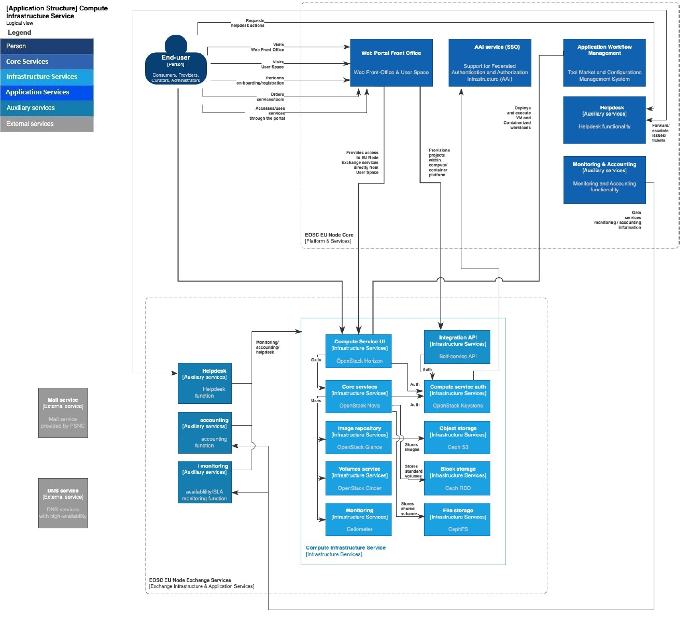

**Figure A54 - Logical architecture view of Virtual Machine Service**

**Deployment**

The service is deployed across geo-distributed data centre facilities
operated by PSNC and Safespring. Each site provides independent
infrastructure capacity, enabling geographical redundancy and
operational resilience.

Compute nodes host virtual machine workloads, while dedicated controller
nodes manage orchestration services. Ceph storage clusters are deployed
across multiple nodes to ensure redundancy and data durability.
Networking components enforce segmentation and secure interconnection
between tenants and services.

### A2.2 Managed Container Platform Service

The Managed Container Platform Service provides a Kubernetes-based
container orchestration environment built on top of the Managed Compute
Infrastructure Service. It is jointly delivered by Safespring and PSNC.

**Architecture**

The logical architecture is based on OKD, the community distribution of
Kubernetes, which provides orchestration, scaling, and lifecycle
management for containerised workloads.

The platform is deployed across geo-redundant data centres and follows
an active-passive model to ensure service continuity. Control plane
components manage cluster state, while worker nodes execute container
workloads. Integrated networking, ingress routing, and persistent
storage mechanisms support secure and scalable application deployment.

The container platform inherits infrastructure resilience from the
underlying OpenStack and Ceph layers while adding orchestration-level
fault tolerance and elasticity.

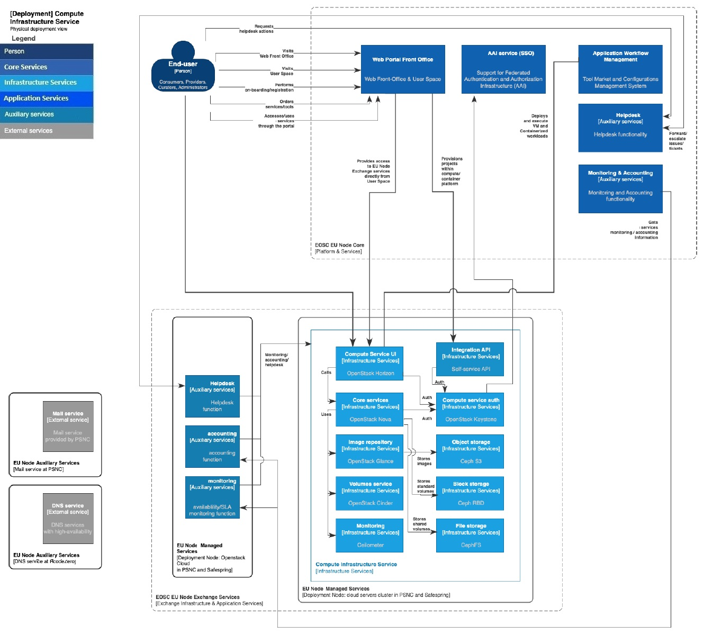

**Figure A55 - Logical architecture view of Cloud Container Platform
Service**

**Deployment**

Clusters are deployed independently at PSNC and Safespring sites. In
normal operation, one site serves as the active production environment,
while the secondary site maintains synchronised standby capacity. In
case of failure, workloads can be re-established at the secondary site.

Persistent storage is provisioned via Ceph-backed volumes. Ingress
controllers expose services through secure HTTPS endpoints compliant
with EOSC EU Node certificate policies.

### A2.3 Bulk Data Transfer Service

The Bulk Data Transfer Service provides high-volume data movement
capabilities within and beyond the EOSC EU Node. It is designed as an
infrastructure-oriented extension of compute and container services.

The current implementation is based on the File Transfer Service (FTS),
a mature solution for large-scale, long-distance data transfers.

**Architecture**

The logical architecture consists of a control plane and distributed
data transfer workers.

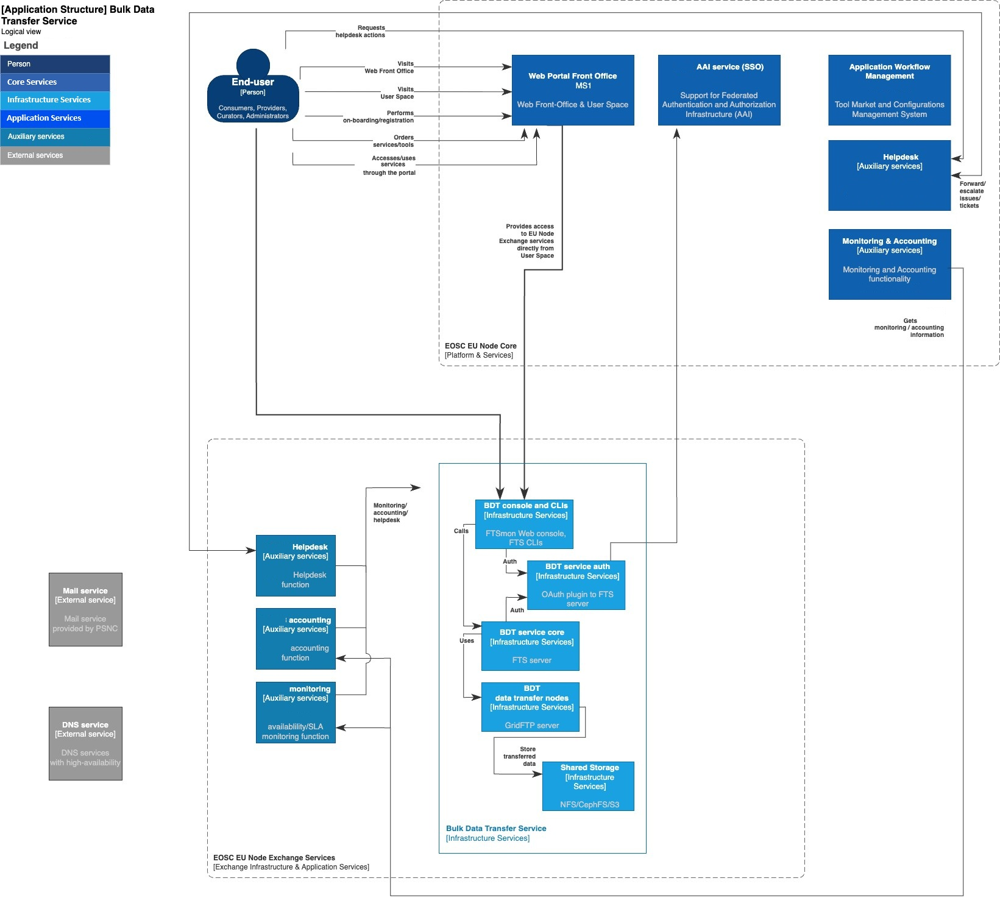

**Figure A56 - Logical architecture view of Bulk Data Transfer service**

The FTS server acts as the central control component. It receives
transfer requests from users or automated agents, manages transfer
scheduling, monitors progress, and handles retries and optimisation.

GridFTP servers execute the actual data transfers. The GridFTP protocol
supports parallel, multithreaded data streams to mitigate latency
effects on long-distance links and to optimise throughput.

The architecture supports third-party transfers, status monitoring,
transfer restarts, and built-in optimisation mechanisms. It is
historically proven in large scientific collaborations handling data
volumes in the petabyte range.

**Deployment**

FTS is deployed within the virtual compute infrastructure provided by
PSNC and Safespring OpenStack environments. Multiple FTS control
instances operate across both sites to enhance resilience. GridFTP
servers are instantiated at both locations to provide distributed data
transfer capacity.

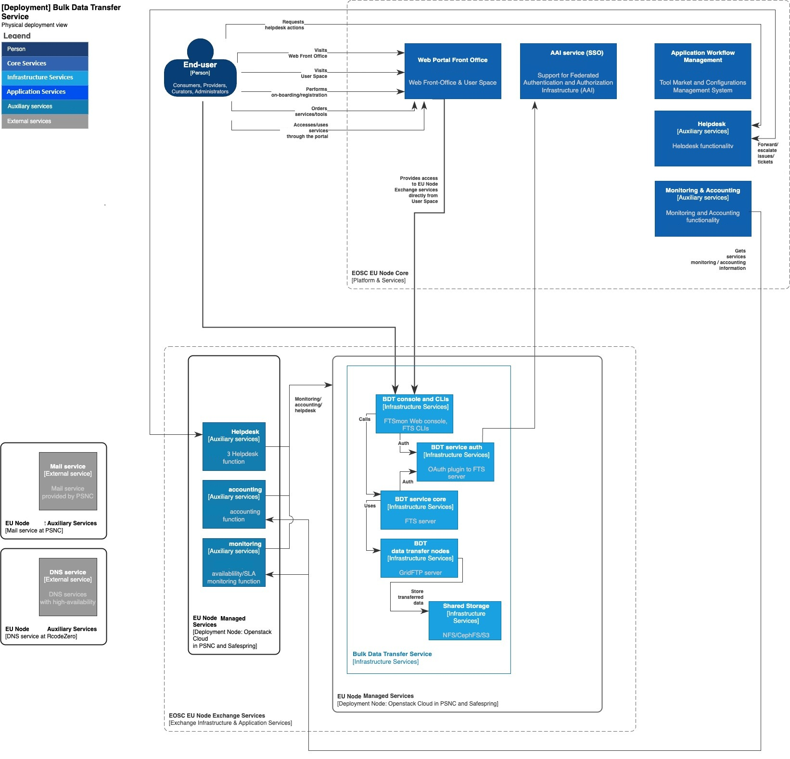

**Figure A57 - Deployment view of Bulk Data Transfer service**

Ceph storage serves as the storage backend for transferred data. Once
data is transferred into the infrastructure, it becomes locally
accessible to virtual machines and container workloads running within
the EOSC EU Node.

The architecture ensures that transferred datasets are immediately
available for in-cloud processing without requiring additional
replication steps.

### A2.4 Managed File Synchronisation and Sharing Service

The Managed File Synchronisation and Sharing Service provides a
cloud-based file storage and collaboration environment based on ownCloud
Infinite Scale (OCIS).

**Architecture**

The logical architecture is centred on ownCloud Infinite Scale, which
provides scalable file storage, synchronisation, and sharing
functionalities.

Core services include file storage management, user authentication
integration, sharing controls, and collaboration capabilities. The
service supports secure file access, versioning, and cross-device
synchronisation.

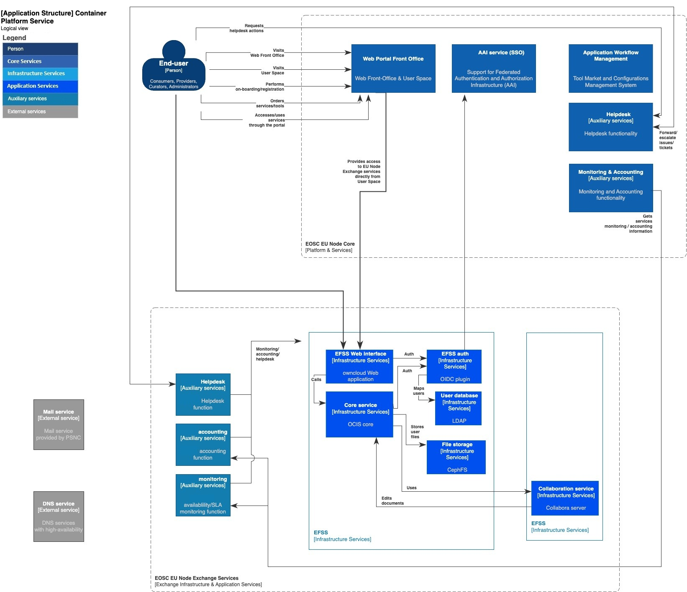

**Figure A58 - Logical architecture view of Managed File Synchronisation
and Sharing Service**

**Deployment**

The service is deployed as a software-only application within the OKD
container platform. Three distinct environments—Testing, Staging, and
Production—are maintained and operated by ownCloud GmbH’s DevOps team.
Monitoring is conducted by the EOSC EU Node Network Operations Centre
(NOC).

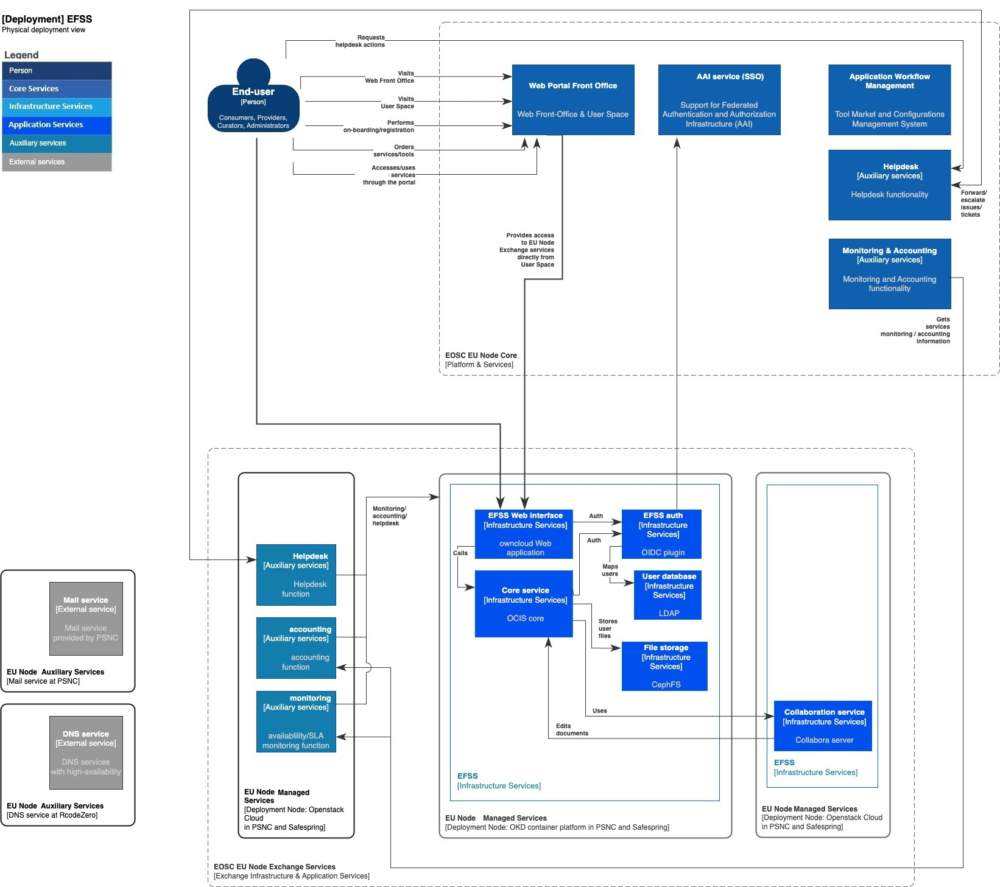

**Figure A59 - Deployment view of Managed File Synchronisation and
Sharing Service**

Deployment automation is implemented through GitOps practices.
Configuration is maintained in PSNC’s GitLab repository and deployed
automatically to OKD using ArgoCD. This ensures consistency,
reproducibility, and traceability of configuration changes.

All core ownCloud services operate within OKD. Collabora, which provides
document editing capabilities, is currently hosted on OpenStack due to
existing security limitations within OKD. This deployment model ensures
compliance with security requirements while maintaining full
collaboration functionality. Migration of Collabora to OKD is
anticipated once security constraints are resolved.

The architecture provides full auditability, as all configuration
changes are version-controlled and logged.

### A2.5 Managed Interactive Notebook Service

The Managed Interactive Notebook Service delivers a comprehensive data
analysis and visualisation environment based on interactive notebooks.

**Architecture**

The service is built upon JupyterHub and JupyterLab, which together
provide a multi-user notebook platform. JupyterHub manages user
authentication, environment selection, and resource allocation, while
JupyterLab provides the interactive notebook interface.

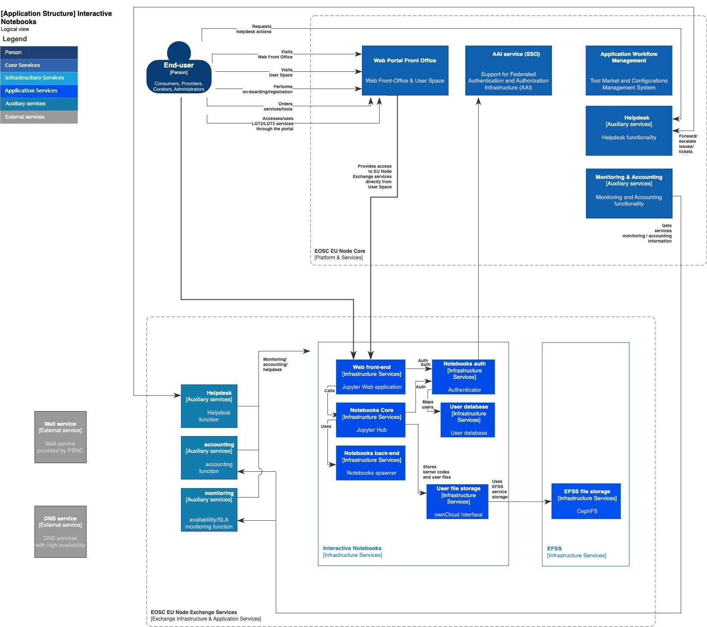

**Figure A60 - Logical architecture view of Managed Interactive Notebook
Service**

The architecture integrates with the EOSC Portal AAI, enabling federated
authentication and single sign-on access to the broader EOSC ecosystem.

Users can select customised notebook environments tailored to their
computational needs, including CPU, GPU, and memory configurations.
Notebook servers are dynamically spawned within the container
orchestration environment.

**Deployment**

Notebooks are deployed as containers within the OKD platform. Each user
session runs in an isolated container, ensuring security and resource
isolation.

The infrastructure layer is provided by PSNC and Safespring sites, each
operating as independent geographical zones. The EOSC Node Portal
selects the appropriate service instance based on availability and
operational considerations.

Within each Kubernetes cluster, master nodes manage cluster state,
ingress controllers handle HTTPS routing, and worker nodes host
JupyterHub and notebook containers. Deployment is automated via Helm
charts.

Persistent storage for user home directories is provided by the Managed
File Synchronisation and Sharing Service (ownCloud). The architecture
supports horizontal scaling by adding worker nodes as demand increases.

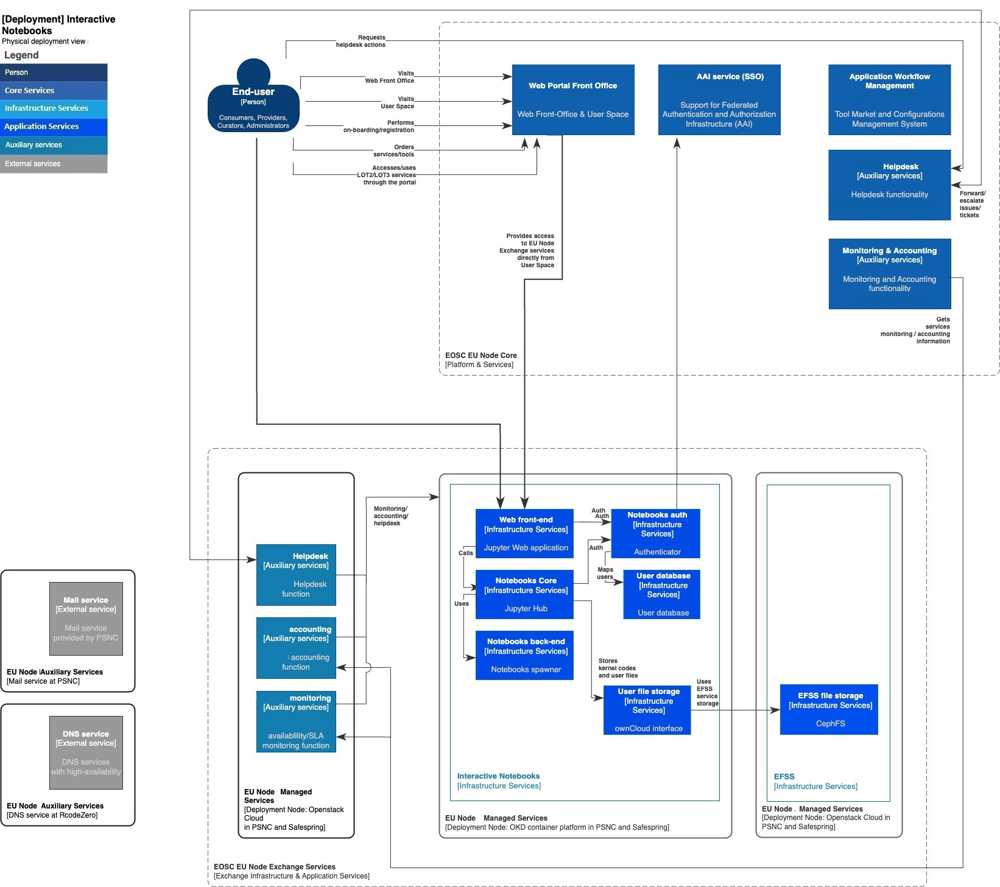

**Figure A61 - Deployment view of Managed Interactive Notebook Service**

The environment operates on Ubuntu virtual machines without specialised
hardware requirements and relies exclusively on secure HTTPS
communication.

### A2.6 Managed Large File Transfer Service

The Managed Large File Transfer Service provides secure transfer of
large files via a web-based interface. It is implemented using
FileSender, an open-source application designed for secure, time-limited
file distribution.

**Architecture**

The architecture follows a microservices design pattern. Individual
service components are containerised using Docker and orchestrated
through Kubernetes (OKD).

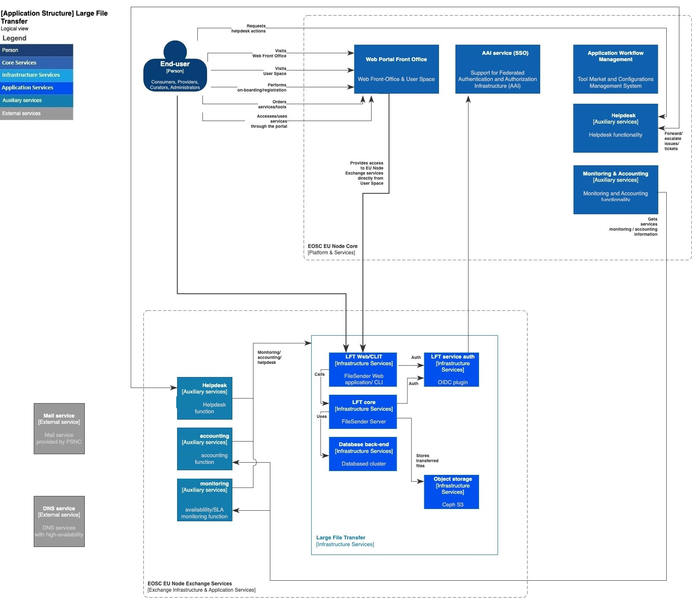

**Figure A62 - Logical architecture view of Managed Large File Transfer
Service**

Worker transfer nodes handle file upload and download operations. A
PostgreSQL database cluster stores metadata and user information. Load
balancers distribute traffic across FileSender instances. The storage
backend is implemented using S3-compatible object storage.

This modular architecture allows independent scaling of components based
on demand.

**Deployment**

The service is deployed across two sites: Safespring in Sweden and PSNC
in Poland. One site operates as the primary production environment,
while the second acts as a standby secondary site.

The secondary site operates at reduced capacity but can be scaled up in
the event of a disaster affecting the primary site. This failover
configuration ensures business continuity.

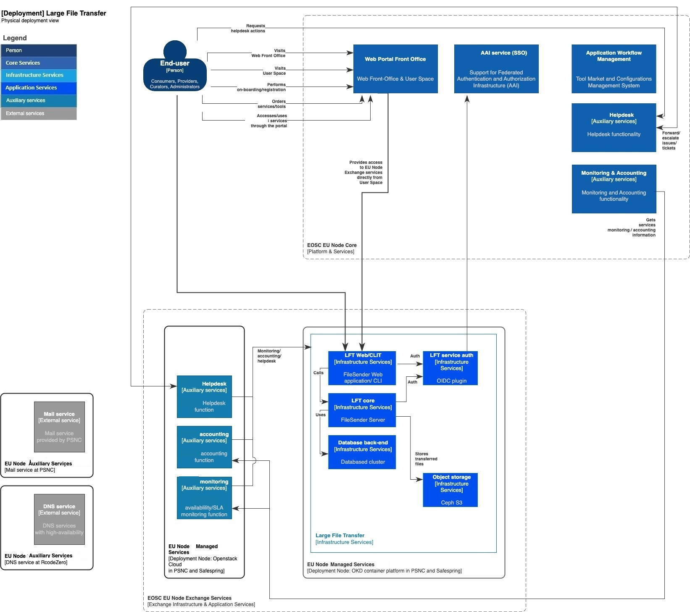

**Figure A63 - Deployment view of Managed Large File Transfer Service**

The service leverages the Managed Compute and Managed Container Platform
Services for its infrastructure foundation, including OKD for
orchestration and OpenStack S3 for storage.

### A2.7 Software Products in use

<table style="width:99%;">
<colgroup>
<col style="width: 25%" />
<col style="width: 22%" />
<col style="width: 28%" />
<col style="width: 21%" />
</colgroup>
<thead>
<tr>
<th style="text-align: center;">Service</th>
<th style="text-align: center;">Site</th>
<th style="text-align: center;">Component Full Name</th>
<th style="text-align: center;">IPR / License</th>
</tr>
</thead>
<tbody>
<tr>
<td rowspan="9" style="text-align: center;"><strong>Virtual
Machine</strong></td>
<td style="text-align: center;"><strong>PSNC</strong></td>
<td style="text-align: center;">Openstack</td>
<td style="text-align: center;">Apache License 2.0</td>
</tr>
<tr>
<td style="text-align: center;"></td>
<td style="text-align: center;">kolla-ansible</td>
<td style="text-align: center;">Apache License 2.0</td>
</tr>
<tr>
<td style="text-align: center;"> </td>
<td style="text-align: center;">MariaDB</td>
<td style="text-align: center;">GPL2</td>
</tr>
<tr>
<td style="text-align: center;"> </td>
<td style="text-align: center;">PSNC: Proxmox backend for
controllers</td>
<td style="text-align: center;">AGPLv3</td>
</tr>
<tr>
<td style="text-align: center;"> </td>
<td style="text-align: center;">Self-service API (Openstack
operator)</td>
<td style="text-align: center;">EUPL v1.2</td>
</tr>
<tr>
<td style="text-align: center;"><strong>Safespring</strong></td>
<td rowspan="2" style="text-align: center;">OpenStack</td>
<td rowspan="2" style="text-align: center;">Apache License 2.0</td>
</tr>
<tr>
<td style="text-align: center;"></td>
</tr>
<tr>
<td style="text-align: center;"><strong> </strong></td>
<td style="text-align: center;"> Self-service API (the core, and the OKD
operator)</td>
<td style="text-align: center;">EUPL v1.2</td>
</tr>
<tr>
<td style="text-align: center;"><strong> </strong></td>
<td style="text-align: center;">MariaDB</td>
<td style="text-align: center;">GPL2</td>
</tr>
<tr>
<td rowspan="20" style="text-align: center;"><strong>Managed Container
Platform</strong></td>
<td style="text-align: center;"><strong>PSNC</strong></td>
<td rowspan="2" style="text-align: center;">OKD </td>
<td rowspan="2" style="text-align: center;">Apache License 2.0</td>
</tr>
<tr>
<td style="text-align: center;"></td>
</tr>
<tr>
<td style="text-align: center;"> </td>
<td style="text-align: center;">Harbor</td>
<td style="text-align: center;">Apache License 2.0</td>
</tr>
<tr>
<td style="text-align: center;"> </td>
<td rowspan="3" style="text-align: center;">PostgreSQL packaged by
Percona</td>
<td style="text-align: center;">PostgreSQL License</td>
</tr>
<tr>
<td style="text-align: center;"> </td>
<td style="text-align: center;">Apache License 2.0</td>
</tr>
<tr>
<td style="text-align: center;"> </td>
<td style="text-align: center;"> </td>
</tr>
<tr>
<td style="text-align: center;"> </td>
<td style="text-align: center;">Self-service API (the core, and the OKD
operator)</td>
<td style="text-align: center;">EUPL v1.2</td>
</tr>
<tr>
<td style="text-align: center;"> </td>
<td style="text-align: center;">Self-service Harbor Operator</td>
<td style="text-align: center;">PSNC</td>
</tr>
<tr>
<td style="text-align: center;"> </td>
<td style="text-align: center;">Self-service OKD Disable Operator</td>
<td style="text-align: center;">PSNC</td>
</tr>
<tr>
<td style="text-align: center;"> </td>
<td style="text-align: center;">NVIDIA GPU Operator</td>
<td style="text-align: center;">Apache License 2.0</td>
</tr>
<tr>
<td style="text-align: center;"> </td>
<td style="text-align: center;">Cert-utils-operator</td>
<td style="text-align: center;">Apache License 2.0</td>
</tr>
<tr>
<td style="text-align: center;"><strong>Safespring</strong></td>
<td rowspan="2" style="text-align: center;">OKD </td>
<td rowspan="2" style="text-align: center;">Apache License 2.0</td>
</tr>
<tr>
<td style="text-align: center;"></td>
</tr>
<tr>
<td style="text-align: center;"> </td>
<td style="text-align: center;">Harbor</td>
<td style="text-align: center;">Apache License 2.0</td>
</tr>
<tr>
<td style="text-align: center;"> </td>
<td style="text-align: center;">PostgreSQL</td>
<td style="text-align: center;">PostgreSQL License</td>
</tr>
<tr>
<td style="text-align: center;"> </td>
<td style="text-align: center;">Self-service API (the core, and the OKD
operator)</td>
<td style="text-align: center;">EUPL v1.2</td>
</tr>
<tr>
<td style="text-align: center;"> </td>
<td style="text-align: center;">Self-service Harbor Operator</td>
<td style="text-align: center;">PSNC</td>
</tr>
<tr>
<td style="text-align: center;"> </td>
<td style="text-align: center;">Self-service OKD Disable Operator</td>
<td style="text-align: center;">PSNC</td>
</tr>
<tr>
<td style="text-align: center;"> </td>
<td style="text-align: center;">NVIDIA GPU Operator</td>
<td style="text-align: center;">Apache License 2.0</td>
</tr>
<tr>
<td style="text-align: center;"> </td>
<td style="text-align: center;">Cert-utils-operator</td>
<td style="text-align: center;">Apache License 2.0</td>
</tr>
<tr>
<td rowspan="8" style="text-align: center;"><strong>Bulk Data
Transfer</strong></td>
<td style="text-align: center;"><strong>PSNC</strong></td>
<td style="text-align: center;">FTSserver core</td>
<td rowspan="2" style="text-align: center;">Apache License 2.0</td>
</tr>
<tr>
<td style="text-align: center;"></td>
<td style="text-align: center;">FTSmon</td>
</tr>
<tr>
<td style="text-align: center;"><strong> </strong></td>
<td rowspan="2" style="text-align: center;">GridFTP server</td>
<td rowspan="2" style="text-align: center;">Apache License 2.</td>
</tr>
<tr>
<td style="text-align: center;"> </td>
</tr>
<tr>
<td style="text-align: center;"><strong>Safespring</strong></td>
<td style="text-align: center;">FTSserver core</td>
<td rowspan="2" style="text-align: center;">Apache License 2.0</td>
</tr>
<tr>
<td style="text-align: center;"><a
href="https://docs.psnc.pl/display/~maciekb"><u> </u></a></td>
<td style="text-align: center;">FTSmon</td>
</tr>
<tr>
<td style="text-align: center;"><strong> </strong></td>
<td rowspan="2" style="text-align: center;">GridFTP server</td>
<td rowspan="2" style="text-align: center;">Apache License 2.</td>
</tr>
<tr>
<td style="text-align: center;"> </td>
</tr>
<tr>
<td rowspan="4"
style="text-align: center;"><strong>FileSender</strong></td>
<td style="text-align: center;"><strong>PSNC</strong></td>
<td rowspan="2" style="text-align: center;">FileSender</td>
<td rowspan="2" style="text-align: center;">BSD-3-Clause license</td>
</tr>
<tr>
<td style="text-align: center;"></td>
</tr>
<tr>
<td style="text-align: center;"><strong> Safespring</strong></td>
<td rowspan="2" style="text-align: center;">FileSender</td>
<td rowspan="2" style="text-align: center;">BSD-3-Clause license</td>
</tr>
<tr>
<td style="text-align: center;"></td>
</tr>
<tr>
<td rowspan="4" style="text-align: center;"><strong>Jupyter
Notebook</strong></td>
<td style="text-align: center;"><strong>PSNC</strong></td>
<td style="text-align: center;">JupyterHub</td>
<td rowspan="2" style="text-align: center;"> </td>
</tr>
<tr>
<td style="text-align: center;"></td>
<td style="text-align: center;">JupyterLab</td>
</tr>
<tr>
<td style="text-align: center;"><strong>Safespring</strong></td>
<td style="text-align: center;">JupyterHub</td>
<td rowspan="2" style="text-align: center;"> </td>
</tr>
<tr>
<td style="text-align: center;"></td>
<td style="text-align: center;">JupyterLab</td>
</tr>
<tr>
<td rowspan="2"
style="text-align: center;"><strong>ownCloud</strong></td>
<td style="text-align: center;"><strong>PSNC</strong></td>
<td style="text-align: center;">Infinite Scale </td>
<td style="text-align: center;"> Apache License 2.0 &amp; AGPL-3.0</td>
</tr>
<tr>
<td style="text-align: center;"></td>
<td style="text-align: center;">Collabora Online </td>
<td style="text-align: center;">Mozilla Public License, v. 2.0</td>
</tr>
</tbody>
</table>

## Copyright Notice

© European Union, 2026

The Commission’s reuse policy is implemented by Commission Decision
2011/833/EU of 12 December 2011 on the reuse of Commission documents (OJ
L 330, 14.12.2011, p. 39
– [<u>https://eur-lex.europa.eu/eli/dec/2011/833/oj</u>](https://eur-lex.europa.eu/eli/dec/2011/833/oj)).

Unless otherwise noted, the reuse of this document is authorised under
the Creative Commons Attribution 4.0 International (CC BY 4.0) licence
([<u>https://creativecommons.org/licenses/by/4.0/</u>](https://creativecommons.org/licenses/by/4.0/)).
This means that reuse is allowed, provided appropriate credit is given
and any changes are indicated.

For any use or reproduction of elements that are not owned by the EU,
permission may need to be sought directly from the respective right
holders. **The EU does not own the copyright in relation to the
following elements:**

[Figure 1](#Figure_1) **-** **OpenStack conceptual architecture**, source:
<https://docs.openstack.org/install-guide/get-started-conceptual-architecture.html>
, licence information:

<table style="width:95%;">
<colgroup>
<col style="width: 24%" />
<col style="width: 70%" />
</colgroup>
<thead>
<tr>
<th><blockquote>

</blockquote></th>
<th><blockquote>

Except where otherwise noted, this document is licensed under <a
href="https://creativecommons.org/licenses/by/3.0/">Creative Commons
Attribution 3.0 License</a>. See all <a
href="https://www.openstack.org/legal">OpenStack Legal
Documents</a>.

</blockquote></th>
</tr>
</thead>
<tbody>
</tbody>
</table>

[Figure 2](#Figure_2) **-** **Ceph architecture**, source:
<https://docs.ceph.com/en/latest/architecture/> , licence information:

<table style="width:96%;">
<colgroup>
<col style="width: 95%" />
</colgroup>
<thead>
<tr>
<th><blockquote>

© Copyright 2016, Ceph authors and contributors. Licensed under
Creative Commons Attribution Share Alike 3.0 (CC-BY-SA-3.0).

</blockquote></th>
</tr>
</thead>
<tbody>
</tbody>
</table>

[Figure 3](#Figure_3) **-** **OKD architecture overview**, source:
<https://docs.okd.io/3.11/architecture/index.html> , licence
information:

<table style="width:96%;">
<colgroup>
<col style="width: 95%" />
</colgroup>
<thead>
<tr>
<th><blockquote>

Copyright © 2026 OKD Contributors &amp; Red Hat. OKD, including its
documentation, is released under the Apache 2.0 License.

</blockquote></th>
</tr>
</thead>
<tbody>
</tbody>
</table>

[Figure 4](#Figure_4) **-** **FTS architecture overview**, source:
<https://pos.sissa.it/239/028/pdf> , licence information:

<table style="width:96%;">
<colgroup>
<col style="width: 26%" />
<col style="width: 69%" />
</colgroup>
<thead>
<tr>
<th><blockquote>

Corresponding author

</blockquote></th>
<th><blockquote>

A. Kiryanov*, A. Alvarez Ayllon, M. Salichos and O. Keeble

</blockquote></th>
</tr>
</thead>
<tbody>
<tr>
<td><blockquote>

Open Access

</blockquote></td>
<td></td>
</tr>
<tr>
<td><blockquote>

</blockquote></td>
<td><blockquote>

Copyright owned by the author(s) under the term of the <a
href="https://creativecommons.org/licenses/by-nc-sa/1.0/">Creative
Commons Attribution-NonCommercial-ShareAlike</a>.

</blockquote></td>
</tr>
</tbody>
</table>

[Figure 8](#Figure_8) **-** **ownCloud OCIS architecture overview** - in
comparison with OC10, source:
<https://doc.owncloud.com/ocis/next/architecture/architecture.html> ,
licence information:

<table style="width:96%;">
<colgroup>
<col style="width: 26%" />
<col style="width: 69%" />
</colgroup>
<thead>
<tr>
<th><blockquote>

© Copyright 2011-2026, The ownCloud developers.

</blockquote></th>
<th><blockquote>

Copyright © 2026 ownCloud GmbH, a Kiteworks company.

</blockquote></th>
</tr>
</thead>
<tbody>
<tr>
<td><blockquote>

Content Usage

</blockquote></td>
<td></td>
</tr>
<tr>
<td style="text-align: center;"><blockquote>

Reproduction:

</blockquote></td>
<td><blockquote>

Reproduction, editing, or distribution of content from ownCloud
websites requires written permission.

</blockquote></td>
</tr>
<tr>
<td><blockquote>

Copyright Ownership

</blockquote></td>
<td></td>
</tr>
<tr>
<td><blockquote>

Copyrighted Content:

</blockquote></td>
<td><blockquote>

Contents, compilations, and software developed by ownCloud GmbH are
subject to German copyright laws.

</blockquote></td>
</tr>
<tr>
<td><blockquote>

Third-Party Rights:

</blockquote></td>
<td><blockquote>

ownCloud respects third-party intellectual property and requires
users to respect its own.

</blockquote></td>
</tr>
<tr>
<td><blockquote>

Copyright

</blockquote></td>
<td><blockquote>

Contents and compilations published on these websites by the
providers are subject to German copyright laws. Reproduction, editing,
distribution as well as the use of any kind outside the scope of the
copyright law require a written permission of the author or originator.
Downloads and copies of these websites are permitted for private use
only.

The commercial use of our contents without permission of the
originator is prohibited.

Copyright laws of third parties are respected as long as the contents
on these websites do not originate from the provider. Contributions of
third parties on this site are indicated as such. However, if you notice
any violations of copyright law, please inform us. Such contents will be
removed immediately.

</blockquote></td>
</tr>
</tbody>
</table>

[Figure 9](#Figure_9) **-** **Jupyter Hub architecture overview**, source:
<https://jupyterhub.readthedocs.io/en/latest/reference/technical-overview.html>
, licence information:

<table style="width:96%;">
<colgroup>
<col style="width: 95%" />
</colgroup>
<thead>
<tr>
<th><blockquote>

© Copyright 2026, Project Jupyter Contributors.

Distributed under the terms of the 3-Clause BSD License.

<a
href="https://jupyter.org/governance/projectlicense/">https://jupyter.org/governance/projectlicense/</a>

</blockquote></th>
</tr>
</thead>
<tbody>
</tbody>
</table>
